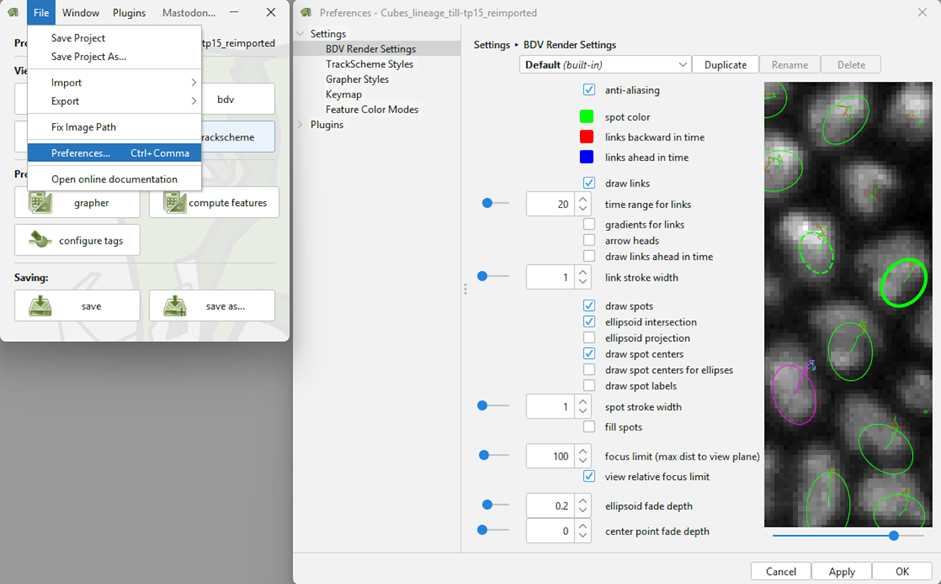
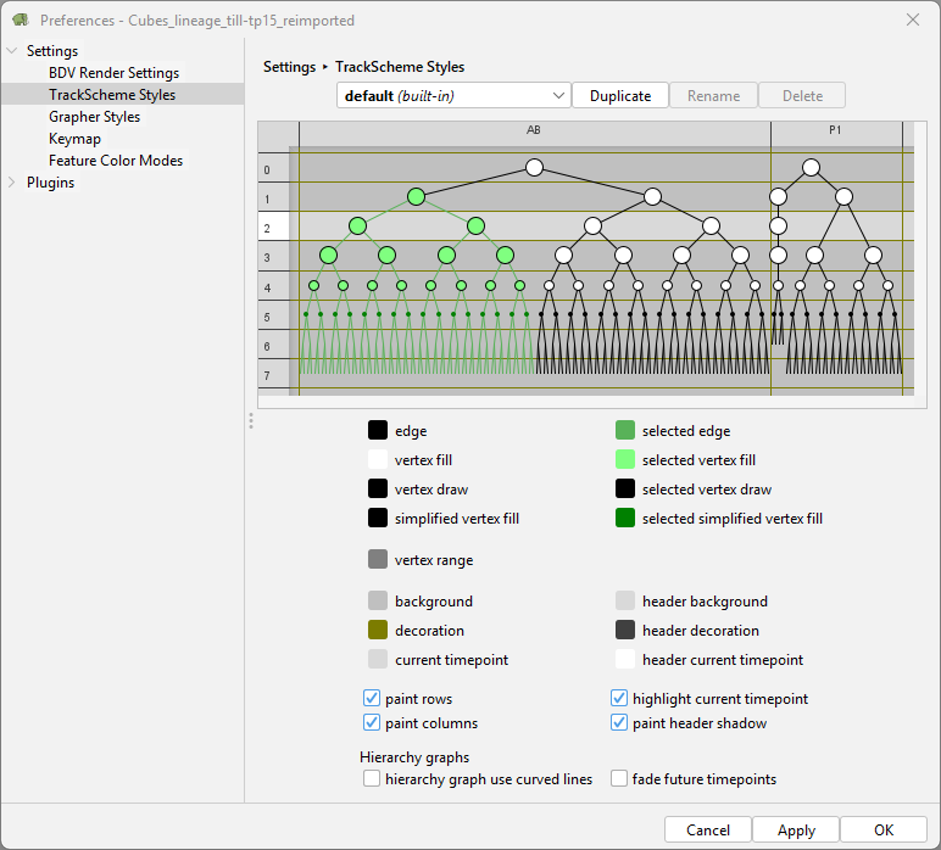
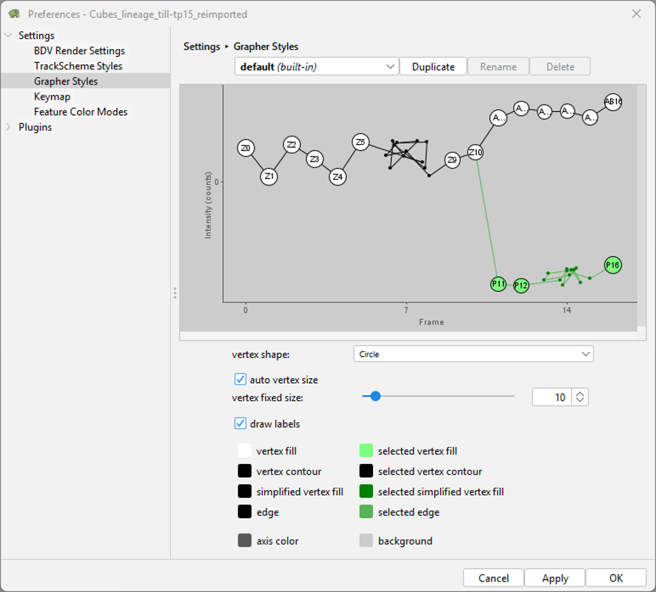
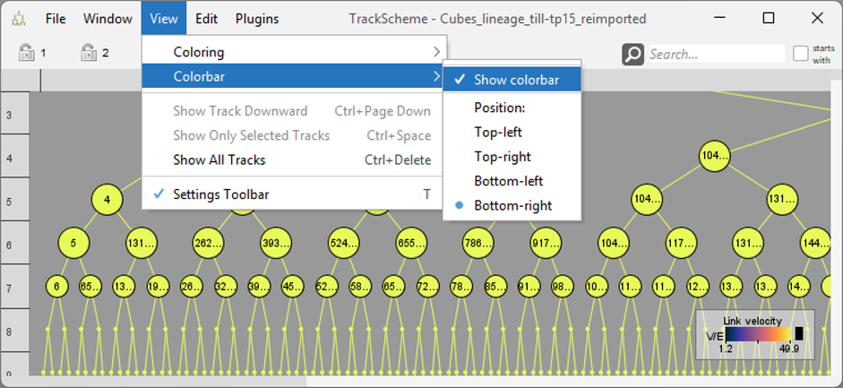

# Customizing Mastodon’s main GUI windows

All important GUI windows (BigDataViewer, TrackScheme, Grapher) are highly customizable.

Settings for rendering the BigDataViewer window, adjusting the TrackScheme appearance, and
customizing Grapher styles can be accessed from any Mastodon window via `File > Preferences > Settings`.

Preferences for the BigDataViewer window:

Preferences for the TrackScheme window:

Preferences for the Grapher window:

## Colorbar

Additionally, a colorbar that also serves as a legend, displaying relevant information for the BDV, TrackScheme, and
Grapher, can be toggled via `View > Colorbar > Show Colorbar`.

## Color Views by Numerical Features

There is also the option to color the views (BDV, TrackScheme, Grapher view) based on numerical features,
as detailed in Part C of our online documentation,
cf.: [Coloring views by numerical features](../partA/numerical_features_tags_the_table_and_grapher_view.md#coloring-views-by-numerical-features).

