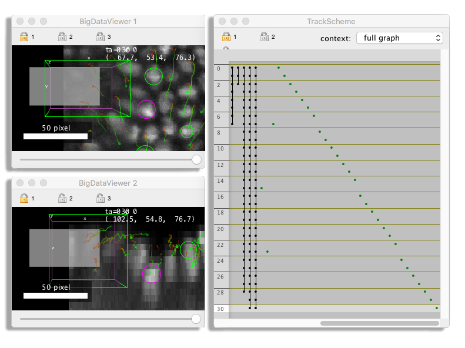
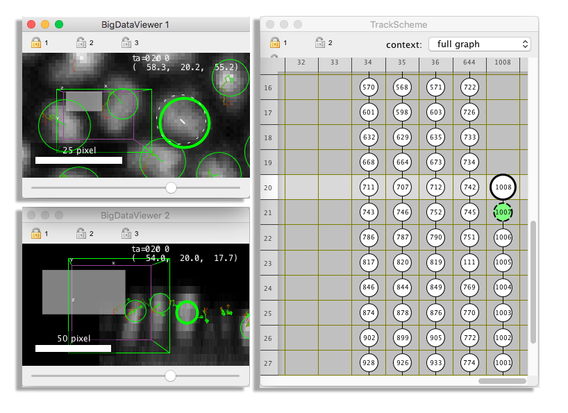

# Manually editing tracks in Mastodon. TrackScheme.

One of the key feature of Mastodon, the implementation of which made our lives extremely hard and rich, is the ability to edit manually at any time any spot or link within an annotation that can contains billions of them, while retaining a good and pleasant response time from the software. 

In this tutorial, we will show how to do just that, from existing tracking data, the one we generated in the previous section. 
We will use it as an opportunity to present **TrackScheme** , the track visualizer of Mastodon, as well as introduce several useful editing features such as the undo/redo mechanism. 
We will also introduce the various visual hints that help the user knowing what spot or link is currently edited or inspected, such as the **focus**, the **highlight** and the **selection**.

Manual editing is often **not desirable**, first because it is not objective which might be detrimental in situations where the performance of an algorithm is evaluated, or when an unknown motion characteristics is investigated.
Second, because it does not look like a realistic solution when *e.g.* thousands of cells are to be followed over thousands of time-points.
Regarding the latter however, several courageous individuals sacrificed their time, energy and sometimes sanity in doing so, for the sake of finally a scientific answer, or curating the results of an automated analysis, when there was no other working solutions. 
See for instance [Wolff, Tinevez, Pietzsch et al, 2018](https://elifesciences.org/articles/34410)
or [McDole et al, 2018](https://www.cell.com/cell/fulltext/S0092-8674(18)31243-1).
If you are going this way, Mastodon aims at providing tools to do so, in the hopefully fastest and least painful way possible.
Also, you can combine the fully automated approach of the previous chapter with manual editing to correct hopefully a few numbers of mistakes. 
Finally, there is also a semi-automated tracking tool, that we will introduce later.

This tutorial will start by presenting you the manual editing tools of Mastodon, as well as and the focus, highlight and selection tools.
Because this catalogue of actions can be a bit dry and long to swallow we will in the last paragraph use the techniques presented here to remove and rebuild some tracks from the results of the last tutorial.

## TrackScheme, the lineage view and editor.

First, load or retrieve the tracking data of the [previous tutorial](getting_started.md). 
You should have a few hundreds of tracks.
To open a TrackScheme view window, press the `trackscheme` button on the main window.

{width="400px" align="center"}

The TrackScheme view offers a special way of displaying tracks. If you are familiar with TrackMate, you will see that we brought the same kind of features here, but scaled to large data. 
You can think of TrackScheme as a workbench for tracks, where you will edit, cut, stitch and rename them.
It displays a kind of "track map", where a track is laid on a panel, arranged vertically over time, as a Parisian subway train map.
Tracks are displayed hierarchically, discarding the spatial location of each spot.
Each track is laid out going through time from top to bottom.
One horizontal line corresponds to a single time-point in the movie. 
One vertical column corresponds to a single track, that is all the spots that are connected by links over time, including divisions and merges.
It is a great tool in particular when studying and editing cell lineages.

When opened, the view in TrackScheme is scaled so that the full data is shown, all tracks over all time-points. 
Even on our small dataset, most of the tracks and spots appear as single lines or dense boxes. 
To see the details of each track, you need to zoom in and navigate around the data.
The navigation actions their mappings are listed in the [TrackScheme keyboard shortcuts table](../partB/table_trackscheme_navigation_keys.md).

Try to zoom in until you can see the label of a few spots.
TrackScheme implements adaptive level of details depending on the zoom level, so that we can accommodate plotting a large amount of data without compromising the responsiveness of Mastodon.
On the finer level of details, spots are plotted as circles, with the spot label shown. 
As you zoom out, they becomes just empty circles, then points, then they disappear to only show the track as a line. 
When the zoom level is so low that several tracks coalesce, they are drawn as a gray box.

{width="300px"}
{width="300px"}
{width="300px"}
{width="300px"}
{width="300px"}
<figcaption><i>TrackScheme displays spots and links differently depending on the zoom level. From left to right then top to bottom: 1. At low zoom level tracks that coalesce are shown as gray boxes. 2. Zooming in, the individual tracks appear first as black lines. 3. When they are separated enough, spots appear as black dots. 4. With an even higher zoom level they are shown as empty circles. 5. Until they grow big enough so that the spot labels can be painted. Notice the size of the sliders at the bottom and at the right of the view.</i></figcaption>

## The focus and the spot labels.

You probably noticed that some spots are painted differently from their neighbors.
Mastodon manages three special collections of spots and links to facilitate making sense of the data across views:

-   the **selection**, painted in green, that manages a classical selection of spots and links;
-   the **highlight**, used to highlight the spot or link currently under the mouse;
-   the **focus**, particularly used in TrackScheme, to indicate what spot is currently focused on by the keyboard interaction.

We will first present the focus.

### Moving the focus.

The spot that has the focus is painted with a dashed contour (see figure below).
Only one spot can have the focus and it is set by mouse or keyboard interaction. 
Click on one spot in TrackScheme when fully zoomed, and move across track and time with the arrow cursor keys.
If the focus reaches the border of the window, the view will be moved to follow it. 
You can think of the focus as the caret in a text editor.
It is meant to facilitate keyboard interaction.
See the [focus navigation keyboard shortcuts](../partB/table_focus_navigation.md).

You can also jumps across branches. 
A branch in a track is a linear section of the track between divisions, fusions or the track end or start. `Alt ↑` and `Alt ↓` will move the focus to the branch start and end. 
In the case where you could navigate to several branches, for instance you are currently at a cell division and you can go the end of either daughter cells branches, you can navigate to one or the other with or `Alt ↓` or `Control Alt ↓`.

{width="300px"}
{width="300px"}
<figcaption><i>Focused spots are painted in TrackScheme (top) and in BDV (bottom) views as ellipses with a dashed-contour.</i></figcaption>

### Editing the spot labels.

By the way, the focus is used to rename individual spots. 
Zoom in so that we can see the label of the spots and move the focus to a spot.
Press `Enter`. 
A small editing box appears inside the spot and lets you change its label.

{align="center"}

By default the spot label display the spot ID. 
If you edit the label then it shows the new label you entered.
Editing the label of a spot does not affect its ID or any other properties. 
The spot label is just a convenient text field that you can use to annotate cells and search them later. 
Only the spots have a label. The links don't.

### The order of tracks in TrackScheme.

The spot labels also control how the tracks are ordered in TrackScheme.
We said before that in TrackScheme all the spatial information is discarded.
However the tracks are laid out in a deterministic order.
This order is set by the label of of a track.

There is no special structure to follow individual tracks in Mastodon.
For this, we simply use the first spot of a track.
So when we speak of the label of a track, we simply means the label of the first spot (in
time) in the track. 
The tracks are arranged from left to right following the alphanumerical order of the track labels. 
So you can change the tracks arrangement by editing theirs first spot's label. 
For instance a track named `A` will be laid out to the left of a track named `B`, and a track named `D9` will be put to the left of a track named `D10`.

{align="center"}

If you change the track labels now, the tracks will not move immediately in TrackScheme.
For the new arrangement to happen, you need to either open another TrackScheme window, or to edit the data, which we will see soon.

### The focus in BDV views.

The focus also works in the BDV views.
In these views, the spot that has the focus is also painted with a thick dashed circle. 
Parenthetically, notice that the focus is shared across all opened views.
If you have a TrackScheme view and a BDV view opened, and that they both contain a display of the same spot, setting the focus in one view will update this very spot display in the other views.

When you are in a BDV view and have set the focus, you can also navigate with the arrow keys. After clicking inside a cell, you can navigate in time and follow a cell lineage through the movie with `↑` and `↓` . 
If you reach the border of the view or if the cell moves in Z, the view will be translated to keep the cell in focus. 
However, you cannot edit the spot labels in a BDV view nor jump from one track to another with the arrow keys.
Navigating across branch with `Alt ←` and `Alt →` however works.

## Synchronizing several views together. 

You probably noticed that both BDV and views have a toolbar on the of the view itself. 
This toolbar can be hidden and shown by a press of the `T` key.
In both view types, the toolbar contains 3 gray locks , that are used to link several views together for navigation. 
For instance, if you click on the lock 1 on a BDV view and the same lock on a view, they will be synchronized. 
If you move with the focus in the view, the BDV view will be translated to show the focused spot. 
If you `Double click` on a spot in any view, all views in sync will translate to show the spot. 
This is very handy to navigate around in TrackScheme, for instance following a cell over time while the BDV view displays where it is in the sample. 
You can even combine several BDV views in sync at different magnification to have both an overview of the cell position in the sample and a close view of the cell itself.

{width="35%"}
{width="25%"}
{width="35%"}
<figcaption><i>Three views of the same dataset in sync. Notice that the lock number 1 is activated on the three views (in yellow). The second view is zoomed in a XY plane. The third view is dezoomed and align with the XZ plane.</i></figcaption>

## The highlight.

The highlight is the second visual hint we will introduce.
You probably already noticed it and used it: the display of spots and links that are just below the mouse cursor changes. 
Highlighted spots and links are painted with a thick continuous line.
To highlight a spot or link you just have to lay the mouse over it. As for the focus, the highlight is common to all views, and if you highlight a spot or a link in a view, its display is changed in all the views that show it.

{width="45%"}
{width="45%"}
{width="45%"}
{width="45%"}
<figcaption><i>The highlight in Mastodon. The highlighted spot or link will appear painted with a thicker line, both in the BDV and TrackScheme views.</i></figcaption>

## Deleting individual spots and links.

The highlight is especially important for track editing. 
The commands that delete a single object are actually applied to the highlighted spot or link.
For instance, to delete a spot or a link, simply move the mouse cursor over it so that it is highlighted and press `D`. 
You should see the tracks being rearranged following the deletion. 
In a BDV view, the highlight and deletion mechanism is the same.

## Linking spots.

Creating links between existing spots happens in a similar way, except that you have to point to a source spot and another target spot for a single link.
In TrackScheme , move inside a spot until it is highlighted (no mouse-click). 
You must be at a zoom level large enough so that a spot is at least painted as a dot or a circle.
Then press and hold the `L` key.
Without releasing the key, move the mouse out of the spot. 
You should see a red line representing the link to create.
Move the mouse to the desired target spot, until it becomes highlighted. 
The red line should snap to it and become thicker. 
If you now release the key now, a new link between the source and target spot is created and in TrackScheme it should cause a rearrangement of the tracks. 
Notice that you cannot add a link between spots in the same frame.
Also notice that you can toggle links this way.
If you draw a link between two spots that are already connected, their link will be removed.

{width="32%"}
{width="32%"}
{width="32%"}
<figcaption><i>Manually creating links in TrackScheme. Press and hold </i><code>L</code><i> while hovering the mouse over a spot. Then drag the link in red to the target spot. A new link will be created between the two spots when you release </i><code>L</code><i>. Doing this between two spots that are already connected removes the link between them.</i></figcaption>

In BDV views, it is again very similar.
Move the mouse over a spot until it is highlighted then press and hold the `L` key.
The view will automatically move to the next frame. 
The link to create will be painted as a white line, and the ghost shape of the source spot is painted as a dashed white ellipse.
Move the mouse to the target spot in this frame until it is highlighted, then release the key. 
The link is created. If you press `Shift L` in a spot, the BDV view will move to the **previous** frame, and create a backward link.

{width="32%"}
{width="32%"}
{width="32%"}
<figcaption><i>Manually creating links in BDV views. Press and hold </i><code>L</code><i> while hovering the mouse over a spot. 
The viewer moves to the next frame and paints the source spot as a dashed, white outline, and the link to create as a white line.
Then drag the white link to the target spot. 
A new link will be created between the two spots when you release </i><code>L</code><i>. 
As for TrackScheme, doing this between two spots that are already connected removes the link between them.</i></figcaption>

You cannot move in Z while creating a link this way.
You must orient the BDV view so that the source and target spot are roughly in the same  displayed slice.
However you can move in time. 
While still holding the key, press the or and or key to navigate backward and forward in time.
This way you can create links between spots separated by more than one time-point.

## The selection. 

The selection is the third visual cue of Mastodon and probably the most important one. 
It behaves and has the role of a classical selection tool you would find in another software that manages a collection of data items.
It is meant to select a subset of spots and links and apply operations to this subset.
Contrary to the focus and the highlight, any number of spots and links can be put in the selection.

The selection in TrackScheme is built in a classical way. 
Click and drag from an empty part of the view.
A red box appears to let you select an area of the view.
Release it when it contains the part of the tracks you want to select, and selected items should now be painted in green.
All spots and tracks in the selection box are put in the selection, even if the zoom level is too small for them to be painted. 
`Control A` selects the whole data. 
There are variants to select only all the spots (`Control Alt A`) or only all the links (`Control Shift A`).

`Shift click` on a spot or a link to toggle it in the selection.
To clear the selection, click on an empty part of the TrackScheme view.
In you can also add spots - but not links - to the selection using the focus.
For instance, if you combine navigating with the focus while holding the `Shift` key, spots that you navigate to will be added to the selection. 
`Shift Alt ↓` will add all the
spots from the focused spot to the end of the branch it belongs to.
Finally there are commands to add a full track from the currently focused spot.
`Shift space` will select the whole track of the focused spot. 
`Shift ⇞` selects all the spots and links in the track that are forward in time relative
to the focused spot, and `Shift ⇟` does  the converse backward in time.

{width="48%"}
{width="48%"}

The selection is shown in BDV views as red or magenta spots and links by default.
In BDV views you can only edit the selection via `Shift click`. 
The interaction with the focus also work as described above. 
These default key-bindings are recapitulated in the [table of shortcuts for the selection actions](../partB/table_mastodon_selection_keys.md).

## Editing spots and links with the selection.

The selection actions are all applied in bulk. 
You can delete all the spots and the links currently in the selection with `Shift ⌫`. 
If your selection includes spots that are not linked, pressing will `Shift K` link them sequentially. 
If the selection contains more than one spot per frame, only one of them, picked randomly, will be linked.

## Manually adding spots and linking them.

Adding new spots requires specifying where to add them. 
Since does not include spatial information you cannot use it to add spots. 
You can only add spots in the BDV views.

To add a new spot, simply hover the mouse in a BDV view where you want the spot to be created, and press `A`.
A new spot will appear, with a radius given by the last radius value you used. 
You can respectively decrease or increase the radius of a spot by pressing `Q` and `E` . Modifiers affect the amount of radius changes. 
`Shift Q` and `Shift E` change the radius by a larger amount and `Control Q` and `Control E` by a finer amount.

Spots created this way are not linked.
It might not be the quicker way to follow manually a cell over several frames. 
To do so, you can use a little trick.
When you want to add a spot, and link it to an existing one, arrange the BDV view so that this source spot is visible in the displayed time-point. 
Then place the mouse cursor *inside* the source spot, and press and hold `A`. 
Like for creating links, the BDV moves to the next time-point, paint the source spot and link with white, dashed lines, and let you position the new target spot. 
While you keep pressed, you can move the target spot around. 
When it is placed in the desired position, release `A`. 
The new spot is created and linked to the source spot. 
This way, you can quickly follow a cell or an object and manually creates a track for it by just positioning the mouse with a few presses of `A`.
If you press `Shift A` while in the source spot, the new spot will be added in the **previous** frame.

Another equivalent possibility is to use the **auto-linking mode**. 
To toggle this mode on or off, press `Control L` (the viewer will display a message stating whether it is on or off).
When the auto-linking mode is on, everytime a spot is added (`A`), it is _automatically linked to the previously selected spot_, **if** there is exactly one spot in the selection.
The newly created spot then becomes selected so that all spots added in succession while in this mode are linked to together.
The links are created whether new spots are forward of backward in time, which can be difficult to visualize sometimes.
It is wise having a TrackScheme window opened linked to the BDV in which you are doing the editing.

## Moving spots around.

To move an existing spot we use a similar interaction with the spots.
In a BDV view, place the mouse cursor inside the spot you want to move, then press and hold `space`.
While you hold `space` pressed the spot will move where you move the mouse.
Release the `space` key at the desired location.

## The undo/redo mechanism.

One of the most useful actions is undoubtedly undo and redo. 
To undo just press `Control Z` and to redo use `Control Shift Z` .
There is no limit to the number of undos you can do.
And everything can be undone in Mastodon, even tag definitions.
In our humble opinion, this is one of the nice reasons for Mastodon to exits: a tracking and lineaging software that aims at combining automated and manual approaches, in a very efficient way..

## Putting things in practice.

<figcaption><i>Manual tracking in Mastodon. From top to bottom: 1. After selecting the spots we added to each time-point. 2. After linking them with </i><code>Shift+K</code><i> 3.  Backtracking a cell with </i><code>Shift+A</code><i>.</i></figcaption>

Make sure you have one BDV view and one view open, and that both are linked using the same lock. 
In TrackScheme, select one of the spot or link that belongs to one of the long tracks; the ones that extend from the first time-point to the last.
Press `Shift space`.
You selected the whole track to which the spot or link you selected belong to. 
Press `Shift ⌫`. 
The track has been removed.

Let's remove a couple of other tracks another way. 
Click and drag in to draw a selection box around some long tracks. 
Then press `Shift ⌫`. 
Our model should now lack several good tracks we will try to put back manually.
For clarity, also remove all the tracks on the right part of the view, that do not start at the first time-point.

In the BDV view, go to the first time-point, and look for a cell whose spot has been removed. 
Pan the view (right-click and drag), adjust the zoom (`Control Shift Mouse-wheel`) and the Z position (`Mouse-wheel` with or without `Shift` ) so that the cell is well in view.
Then put the mouse cursor over it and press `A`. 
A spot has been added on the cell.
The fine adjustment of the spot position in 3D can be made easier with a second BDV view. 
Open another BDV view, zoom and rotate it so that it is aligned with the XZ plane by pressing `Shift Y`. 
Add it to the lock group by toggling the right lock in the toolbar.
Go back to the first BDV view, and align it with the XY plane by pressing `Shift Z`. 
You must now find the spot we just added. 
If you cannot find it in any of the two BDV view, look for it in TrackScheme. 
It will be in the rightmost column at the first line, since we added the spot to the first time-point.
Double-clicking on it in TrackScheme  will center the two BDV views on it.
Now that the two BDV views are centered on the spot, you can adjust its XY and Z positions over the cell using the two views. 
In any of the two BDV views, put the mouse cursor, then press and hold `space`. 
Move the spot the desired location and release `space`.
The spot might not have the right diameter to encompass the cell. 
Change its radius by pressing `Shift Q` and `Shift E` (without `Shift` for finer adjustments) until you are happy with it.

You must now do it for the same cell in the subsequent time-points.
Press in a BDV view to move to the next time-point. 
Again, put the mouse cursor roughly at the center of the cell and press . 
Adjust its position with and move to the next time-point.

We have to repeat this for all the time-points of the movie.
This might be tedious but does not have to be too long.
When I need to do this I adopt a posture similar to what I have when I play PC video-games: the right hand on the mouse, the left hand over the left side of the keyboard, over the `A`, `D` , `Q`  and `E`.
The `Shift` key can be accessed with the little finger, the `space` key with the thumb. 
The `N` and `M` keys to navigate over time are accessible with the left thumb also.

We created a bunch of spots, but they are not linked. 
Move to the TrackScheme view.
You will find the spots you last created there always at rightmost part of the view.
Since they are not linked, they should appear each in their separate column, in a stairway manner. 
Select them all by dragging a selection box around them and press `Shift K`.
They should now link together into a new track.
With one of the spot of this newly created track selected, press to jump to the first spot in the track.
Then press to edit its name into something like _My first track_.

We can create a track directly. 
Let's do this by backtracking a cell from the last time-point to the first. 
In a BDV view, move to the last time-point, and place the mouse cursor over an annotated cell. 
Create a spot over it by pressing and center and resize it until satisfaction.
Now keep the mouse cursor inside this spot, and press and hold `Shift A`.
The BDV view moves to the previous time-point and creates a new spot there, already linked to the other one.
By repeating this you can create a track that will backtrack the cell until it appears in the movie.

We have now restored two of the tracks we removed at the beginning of this paragraph. 
Hopefully now you feel enough at ease to do these manipulations quickly, efficiently and without too much hassle. 
But one of the concluding beauty of this tutorial is that you can restore the data as we had it at the beginning by roughly 100 presses of the `Control Z` keys.
