# Mastodon file format and cell tracking on remote images.

The goal of Mastodon is to make tracking in large images feasible and convenient.
Given that image files can be very large, it makes sense to think about data management if you have a project with large images.
So far in this section of the documentation we have been dealing with images stored in a local file on your computer.
However Mastodon can visualize and analyze images stored remotely and stream them to your computer. 
Mastodon is compatible with two main technologies for handling large images stored remotely:
- BDV servers.
- OME-NGFF specifications, mainly OME-Zarr and N5 file formats.
We can use them transparently, along with the possibility to open local files, thanks to Mastodon file format separating the storage for tracking data and image data.

## The Mastodon file format.

This is a brief explanation of the mastodon file format, to introduce how we implemented opening local and remove images. 
This can be useful to know if you need to change the image file a Mastodon project points to. 

A `.mastodon` file is actually a plain zip file. 
If you unzip it you will get a folder.
It contains a series of binary files with the tracking data (graph and feature values), as well as a `project.xml` file that mostly contain the physical units and the link to the image file:


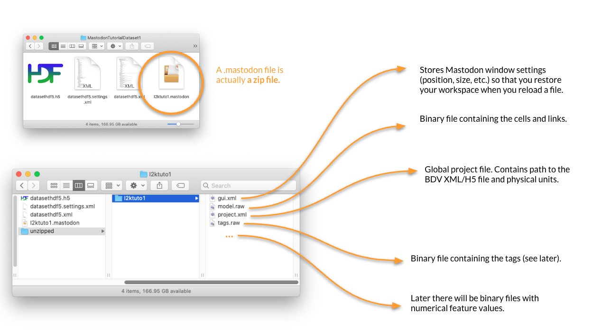

As explained in the [introduction tutorial](getting_started.md), we mainly use the BDV file format for local images files.
An image is represented by two files (a `xml` and a `h5`) that stores pixel data and spatial transformations, plus an optional `xml` file storing the display settings.

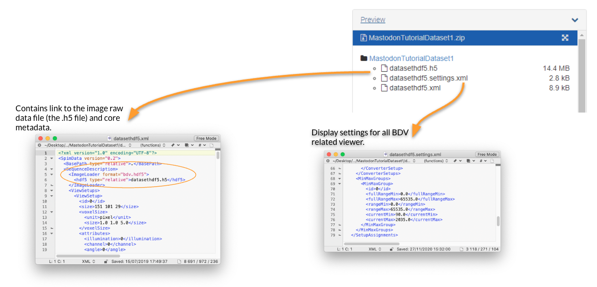

It turns out that the `xml` file is very flexible and can harness a wide range of file format.
The first one we can use is the remote BDV server.


## Opening a remote BDV image.

The BDV image file format we described before make it possible to store the `h5` on a remote server.
This server can send the image chunks required by a local client, like Mastodon.
In the example below we will be browsing and tracking an image stored on a server in the Institut Pasteur, Paris. 
The data layout is schematically the following:

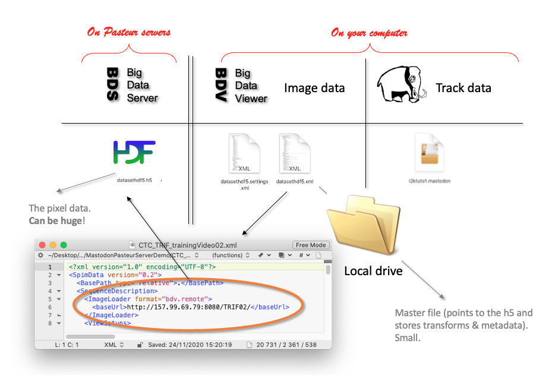

Download the exemple datasets from here: TODO TODO XXXX

The `ParhyaleHawaiensis` folder contains the first 10 timepoints of the MaMuT dataset, published in [Wolff, Tinevez, Pietzsch et al, 2018](https://doi.org/10.7554/eLife.34410).
If you open the file `MaMuT_Parhyale_demo.xml`, you can see that the link to the image is different from what we had with a local file:

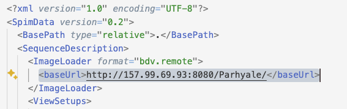

The `<ImageLoader>` element changed and we now have a `bdv.remote` as format. 
And the URL points to a http server, which is actually hosted in Pasteur.
Compare to what we have for a local file:
```xml
    <ImageLoader format="bdv.hdf5">
      <hdf5 type="relative">datasethdf5.h5</hdf5>
```

Let's use this XML file to create a new Mastodon project.
Open the Mastodon launcher (_Plugins > Tracking > Mastodon > Mastodon launcher_) and select _new Mastodon project_.
In the panel that shows up, select _Browse to a BDV file_ and browse to where the `MaMuT_Parhyale_demo.xml` is stored.

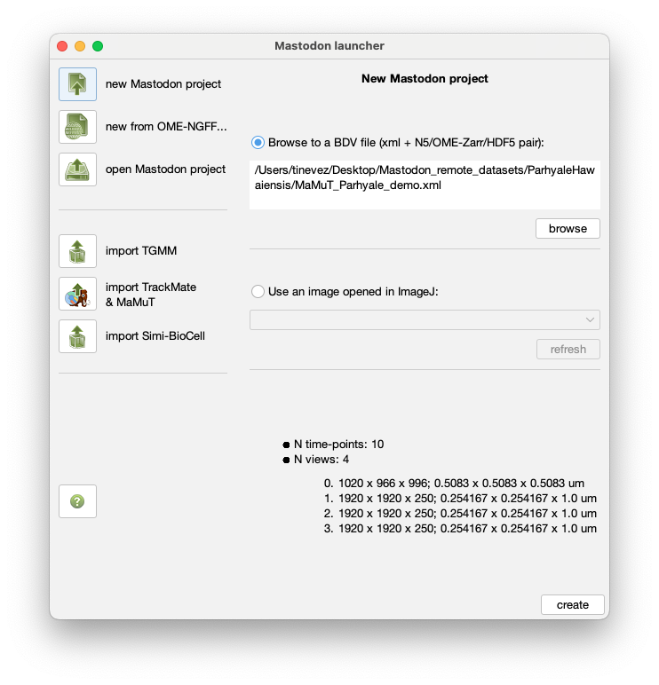{width="400px" align="center"}

Then create the project. 
The Mastodon control window should open and you will be able to browse a large image stored elsewhere, thanks to a 43kB file.

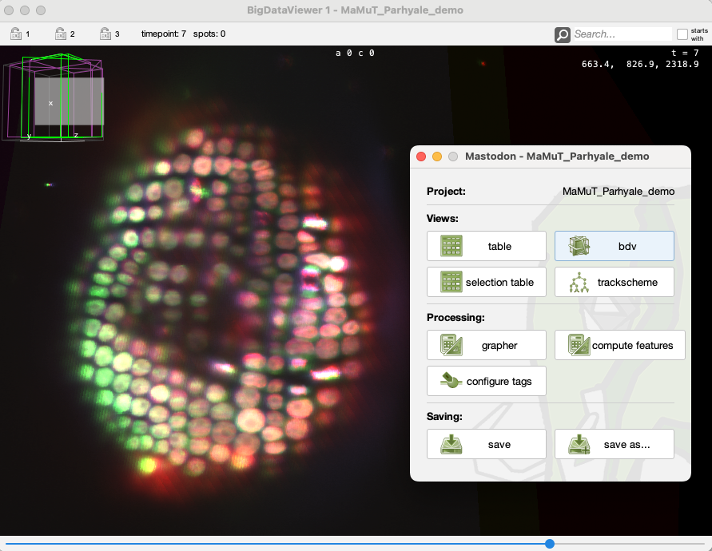{width="500px" align="center"}

The Mastodon projects you save from these files will keep the link to the remote image. 
For instance you can open the Mastodon file `MaMuT_Parhyale_demo-mamut.mastodon` in the same folder and have the remote image and the tracking data:

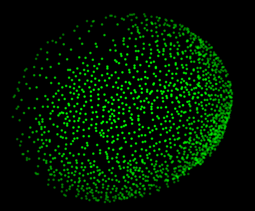{width="400px" align="center"}

Parenthetically, the tracking data stored in this file is the result of the TGMM tracking algorithm ([Amat et al 2014](https://doi.org/10.1038/nmeth.3036)).
Note also that the image is stored remotely, but all the tracking annotations are local only. 
They live in the `.mastodon` file on your computer.


## Another example.

In the `Tribolium` folder of the Zenodo dataset used on this page you can find another example of a BDV image hosted on the same server.
The image data is a TRIF training video 02 from the [Cell Tracking Challenge](https://CellTrackingChallenge.net), used with authorization.
The original dataset provider is Dr. A. Jain. Max Planck Institute of Molecular Cell Biology and Genetics, Dresden, Germany.

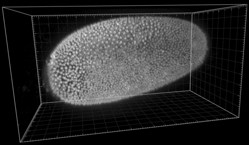{align="center"}

The following shows the nuclei (detecting with a plain DoG detector in Mastodon) colored by the mean distance to the 6 nearest neighbor.
With such a display we see the propagation of the cell division wave.
More information on the page describing the [nearest-neighbor statistics plugin](../partC/stats-on-nearest-neighbors.md).

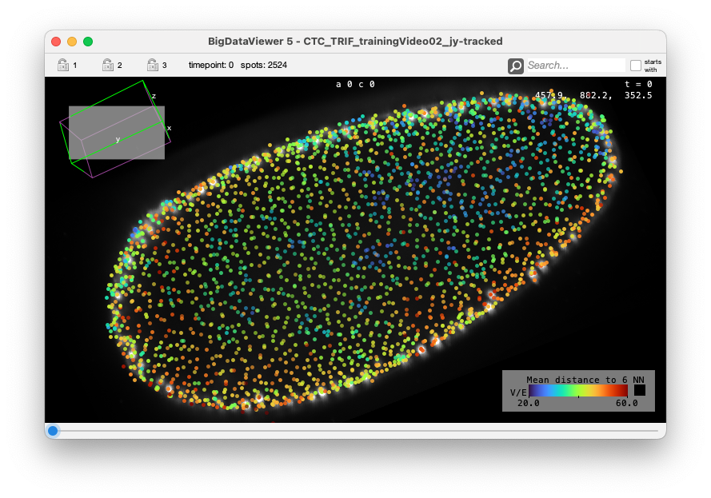{width="600px" align="center"}

{width="600px" align="center"}


## The Big Data Server.

The Big Data Server is a simple Java program that can serve images that you converted to the XML file format.
It is simple, there is no authentification and everything is public and read-only.
But it is a great tool if you do not want to deploy a fully-fledged S3 server, but still want to share an image with collaborators and avoid making multiple copies of it.

The server code and instructions can be found on the [Fiji wiki](https://imagej.net/plugins/bdv/server).
We will not repeat them here, but show how we set up the server we used above.

The Pasteur server we used in the two examples above is configured as follow.
The files present on the server are the following:

```sh
$ ls -1 /opt/bigdataserver/ 
server/
CTC_TRIF_trainingVideo02-00-00.h5
CTC_TRIF_trainingVideo02-01-00.h5
CTC_TRIF_trainingVideo02-02-00.h5
CTC_TRIF_trainingVideo02-03-00.h5
CTC_TRIF_trainingVideo02.h5
CTC_TRIF_trainingVideo02.xml
MaMuT_Parhyale_demo.h5
MaMuT_Parhyale_demo.settings.xml
MaMuT_Parhyale_demo.xml
server-runme.sh
server-runme.txt
```

The XML and H5 files are classical BDV image file format. 
This is what you get out of converting a large imge into the BDV format.

The file `server-runme.txt` contains the link to the local XML files:

```
Parhyale        /opt/bigdataserver/MaMuT_Parhyale_demo.xml
TRIF02          /opt/bigdataserver/CTC_TRIF_trainingVideo02.xml
```

The first column contains the name that will be used by the local client to point to the specific BDV image, stored in the second column.
For instance in the MaMuT dataset and TRIF dataset above, the XML files that will point to the server contain:


```xml
    <ImageLoader format="bdv.remote">
      <baseUrl>http://157.99.69.93:8080/Parhyale/</baseUrl>
    </ImageLoader>
```
for the MaMuT dataset and
```xml
    <ImageLoader format="bdv.remote">
      <baseUrl>http://157.99.69.93:8080/TRIF02/</baseUrl>
    </ImageLoader>
```
for the TRIF02 dataset.

The server is launched by a shell command:
```sh
$ cat server-runme.sh
IPADDR=157.99.69.93
PORT=8080
cd /opt/bigdataserver/server && \
/opt/bigdataserver/server/jre1.8.0_271/bin/java -jar bigdataviewer-server-3.1.3-SNAPSHOT.jar -s $IPADDR -p $PORT -t ./thumbnails  -d /opt/bigdataserver/server-runme.txt
```

The server itself is contained in the `server` subfolder.
```sh
$ ls -1 /opt/bigdataserver/server
bigdataviewer-server-3.1.3-SNAPSHOT.jar
thumbnails
```

It should be rather simple to adapt this to your configuration.


## Opening a remote OME-Zarr image.

OME-Zarr is emerging as a standard to serve large images remotely. 
They can be served from S3 servers conveniently and there are already examples out there.
Let's create a Mastodon project based on an image stored in the Image Data Resource ([IDR](https://idr.openmicroscopy.org/)).

The IDR lets you browse the images it store via an OMERO instance. 
For instance, we would like to open one image of the following dataset:

[https://idr.openmicroscopy.org/webclient/?show=project-2051](https://idr.openmicroscopy.org/webclient/?show=project-2051)

in Mastodon.
Specifically [this one](https://idr.openmicroscopy.org/webclient/img_detail/13457227/?dataset=15159):

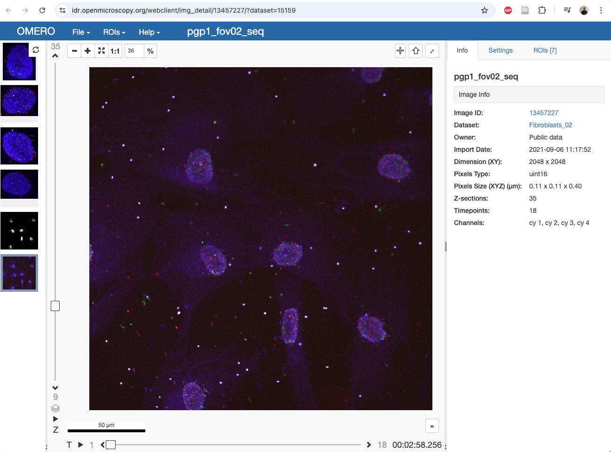{width="600px" align="center"}

The IDR serves some of these images as OME-NGFF, as listed on [this page](https://idr.github.io/ome-ngff-samples/).
There, we have to look for our target image. 
The Zarr file has the same name than the image ID in OMERO (`13457227`).
We just have to copy the `.zarr` link in this table:

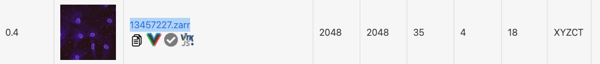{width="600px" align="center"}

`https://uk1s3.embassy.ebi.ac.uk/idr/zarr/v0.4/idr0101A/13457227.zarr`

This is all the information we need for Mastodon.

Open the Mastodon launcher, and select _new from OME-NGFF_.
In the panel that appear, click on the _Browse_ button.
The `Open N5` window appears.


In the main textfield, simply paste the `https://uk1s3.embassy.ebi.ac.uk/idr/zarr/v0.4/idr0101A/13457227.zarr` link and click _Detect datasets_.
After a while, the panel below should be populated with the information that could be retrieved about the image:

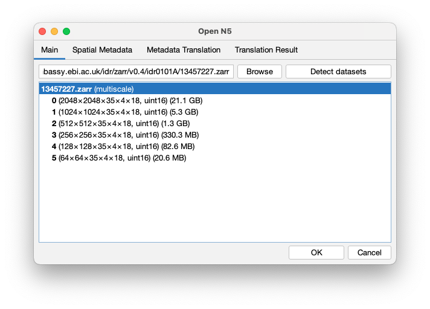{width="600px" align="center"}

Click _OK_. 
The Mastodon launcher now has this information.

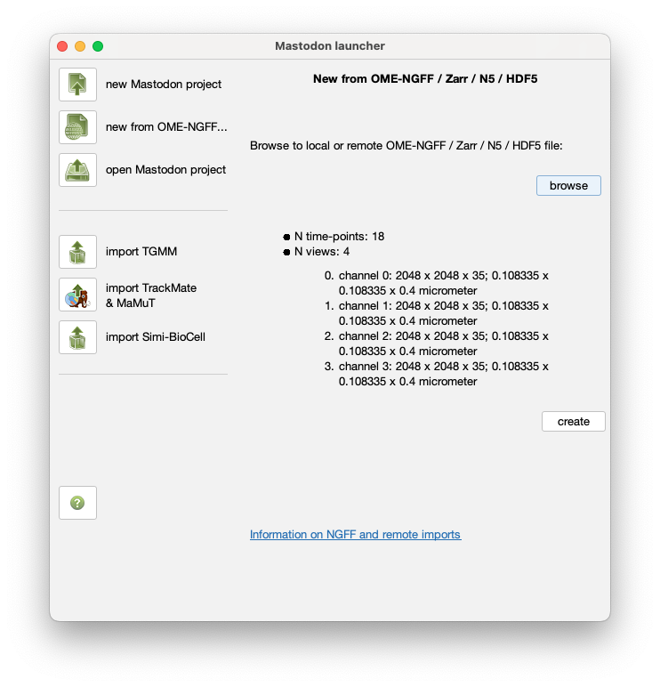{width="600px" align="center"}

Click on the _create_ button.
You will be prompted for a location in which to save a `xml` file, that will contain a link to the remote image.
You can then inspect the XML content to see the following:

```xml
<?xml version="1.0" encoding="UTF-8"?>
<SpimData version="0.2">
  <BasePath type="relative">.</BasePath>
  <SequenceDescription>
    <ImageLoader format="bdv.n5.universe" version="1.0">
      <Url>https://uk1s3.embassy.ebi.ac.uk/idr/zarr/v0.4/idr0101A/13457227.zarr</Url>
      <Dataset>/</Dataset>
    </ImageLoader>
```

And you now have a Mastodon project that points to this image.
In the folder `ZARR-IDR` you will find a copy of the Mastodon project generated from this remote image, with some automated detection of spots for one of the cell.

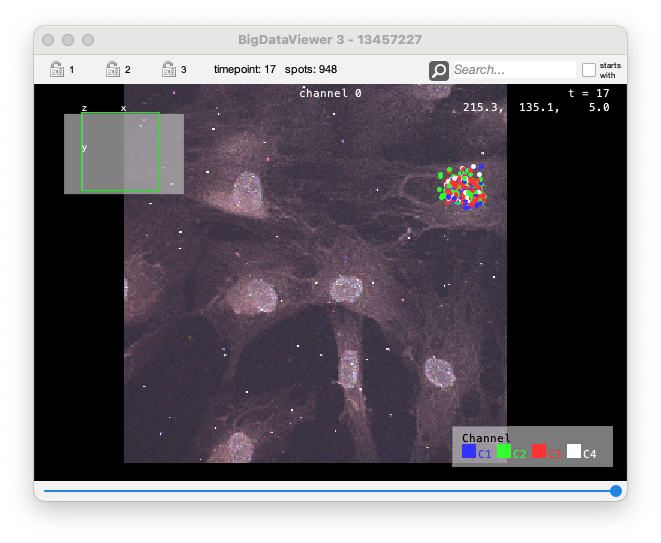


## Opening a local OME-Zarr images.

Opening local OME-Zarr images works like for remote. 
You simply have to point the path in the `Open N5` window to a local file.

In the `ZARR-local` folder your will find a Zarr file of a _C.elegans_ movie (where one part of the image was manually erased).
It was created from an ImageJ tiff, using the _File > Save as > HDF5/N5/Zarr/OME-NGFF_ command.


