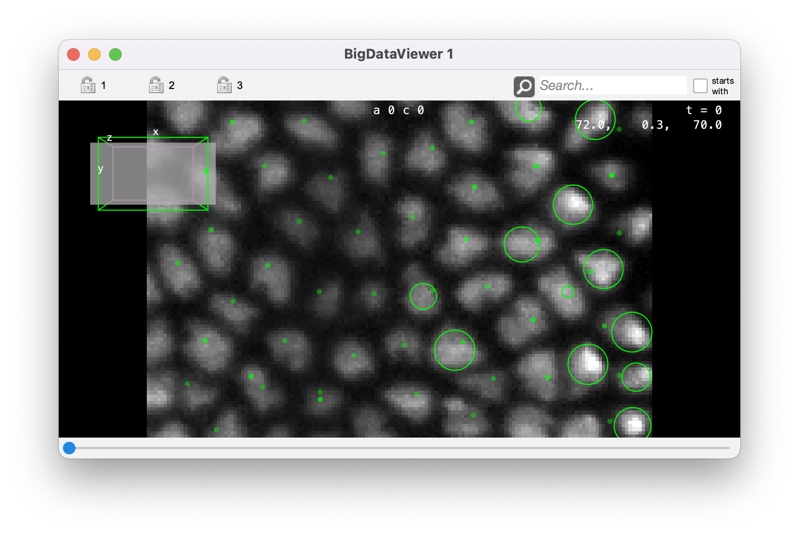

# Scripting Mastodon in Fiji.

With its integration in Fiji, Mastodon can be scripted in with the [script editor](https://imagej.net/scripting/script-editor) using any of the scripting language there. 
In the following, we will by using Jython, which is an implementation of Python 2 language.

The example script we will be using is [this one](https://github.com/mastodon-sc/mastodon-app/blob/master/scripts/MastodonExampleScript.py) and we will be detailing its section to document the supported functions of Mastodon.

## The required import.

The header of a Mastodon script needs to contain the following:

```python
#@ Context context

from org.mastodon.mamut import Mamut
import os
```

The scripting gateway of Mastodon is called `Mamut` and is located in the `org.mastodon.mamut` package. 
We chose this name to underly that this application is based on the Mastodon libraries, and is similar to the [MaMuT software](https://imagej.net/plugins/mamut/index) but with improved functionalities. 

The gateway needs to have a `Context` object, ideally coming from the Fiji instance you are running.
Thanks to the ImageJ2 scripting API, this is done by adding a special "shabang" at the first line of the script: `#@ Context context`.
With this, the `context` variable will contain the context we need in Mastodon.

This is all we need. 
There is also an import for the `os` package so that we can manipulate file paths.

## Creating a new project from a BDV file.

For this tutorial, we can use the small BDV file from the drosophila embryo we used in the first tutorial.
You can find it here:
[](https://doi.org/10.5281/zenodo.3336346)

Download the 3 files, and put them for instance on your  `Desktop` folder.
Creating a new Mastodon project from this image file is simply done via the `newProject` function of the gateway:

```python
bdvFile = os.path.join( os.path.expanduser('~'), 'Desktop', 'datasethdf5.xml' )
mamut = Mamut.newProject( bdvFile, context )

logger = mamut.getLogger()
logger.info( 'File opened: %s\n' % bdvFile)
logger.info( 'Mamust instance: %s\n' % mamut)
```
with `bdvFile` being the path to a BDV XML file. 
If the file cannot be found, you will be shown an error window stating that Mastodon will create the project with an empty image. 

Otherwise, the `mamut` object does now contain everything we need to perform tracking and analysis on the image.

Mastodon has a `logger` instance that is used to send messages. 
By default it sends all messages in the Fiji console:

```text
File opened: /Users/tinevez/Desktop/datasethdf5.xml
Mamust instance: org.mastodon.mamut.Mamut@10dcf50e
```

## Basic cell tracking.

The `mamut` object we have has some functions that readily performs basic tracking.
By basic, we mean that the default algorithms are used with a minimal set of sensible parameters:

```python
#------------------------------------------------------------------
# Run default detection and linking algorithms.
#------------------------------------------------------------------

logger.info( "\n\n-------------------------------------" )
logger.info( "\n  Basic detection and linking" )
logger.info( "\n-------------------------------------\n" )

# Detect with the DoG detector, a radius of 6 and a threshold on quality of 200.
radius = 6.
threshold = 200.
mamut.detect( radius, threshold )
# Link spots with the simple LAP tracker, with a max linking distance of 10, and forbidding gap-closing
max_linking_distance = 10.
gap_closing_n_frames = 0
mamut.link( max_linking_distance, gap_closing_n_frames )
```

You should get the following output:
```text
-------------------------------------
  Basic detection and linking
-------------------------------------
Detection with DoGDetectorMamut
Detection completed in 6.3 s.
There is now 1622 spots.
Particle-linking with SimpleSparseLAPLinkerMamut
Particle-linking completed in 0.2 s.
There is now 173 tracks.
```

Now we would like to see visually what are the results like.
Because we are scripting in Fiji we can generate views like in the GUI.
This is done via the `WindowManager` gateway. 
For instance, to create a BDV view with the current project, we write:

```python
# A new BDV window.
mamut.getWindowManager().createBigDataViewer()
```

You should see this window appearing:
{width="50%"}