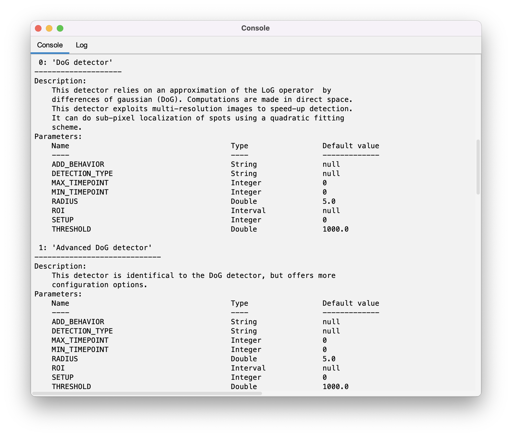
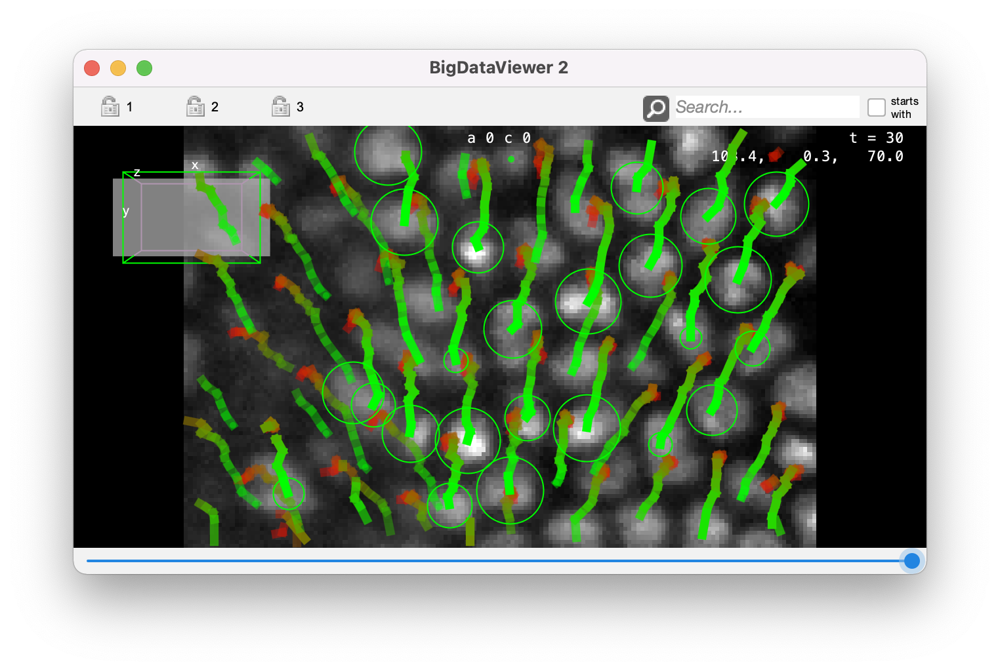
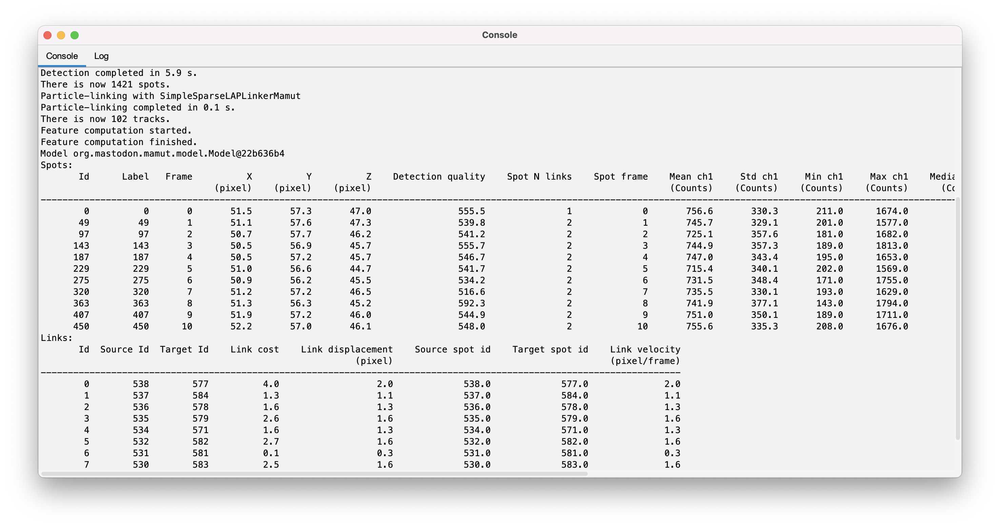
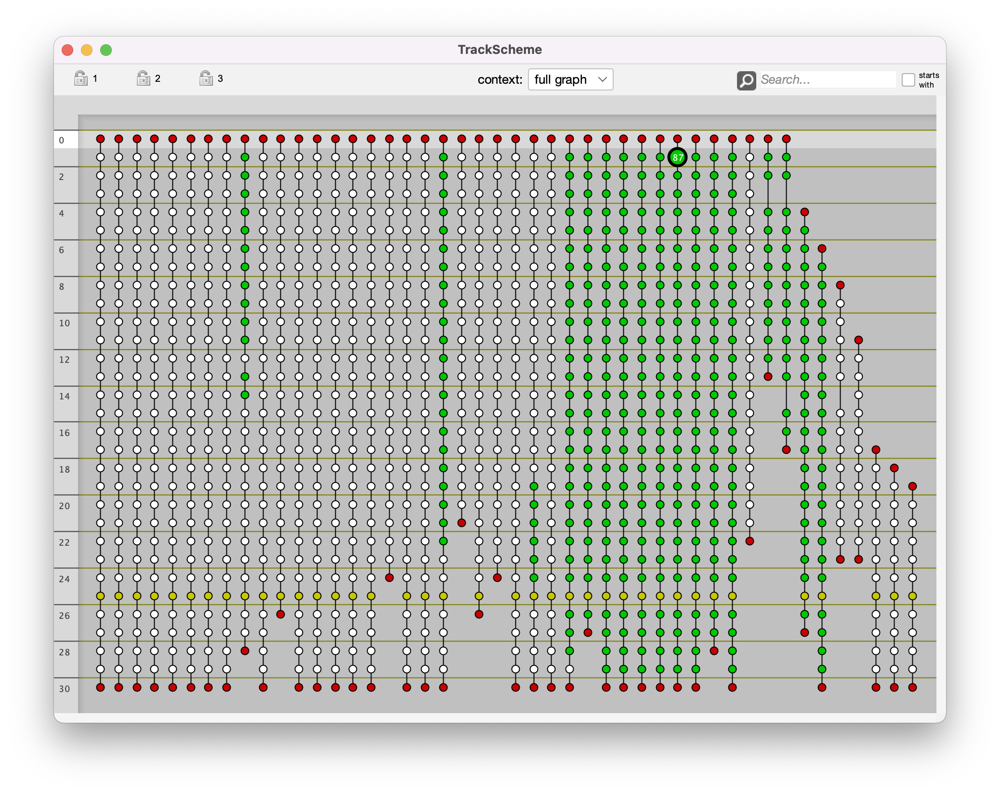

# Scripting Mastodon in Fiji.

With its integration in Fiji, Mastodon can be scripted in with the [script editor](https://imagej.net/scripting/script-editor) using any of the scripting language there. 
In the following, we will by using Jython, which is an implementation of Python 2 language.

The example script we will be using is [this one](https://github.com/mastodon-sc/mastodon-app/blob/master/scripts/MastodonExampleScript.py) and we will be detailing its section to document the supported functions of Mastodon.

## The required import.

The header of a Mastodon script needs to contain the following:

```python
#@ Context context

from org.mastodon.mamut import Mamut
import os
```

The scripting gateway of Mastodon is called `Mamut` and is located in the `org.mastodon.mamut` package. 
We chose this name to underly that this application is based on the Mastodon libraries, and is similar to the [MaMuT software](https://imagej.net/plugins/mamut/index) but with improved functionalities. 

The gateway needs to have a `Context` object, ideally coming from the Fiji instance you are running.
Thanks to the ImageJ2 scripting API, this is done by adding a special "shabang" at the first line of the script: `#@ Context context`.
With this, the `context` variable will contain the context we need in Mastodon.

This is all we need. 
There is also an import for the `os` package so that we can manipulate file paths.

## Creating a new project from a BDV file.

For this tutorial, we can use the small BDV file from the drosophila embryo we used in the first tutorial.
You can find it here:
[](https://doi.org/10.5281/zenodo.3336346)

Download the 3 files, and put them for instance on your  `Desktop` folder.
Creating a new Mastodon project from this image file is simply done via the `newProject` function of the gateway:

```python
bdvFile = os.path.join( os.path.expanduser('~'), 'Desktop', 'datasethdf5.xml' )
mamut = Mamut.newProject( bdvFile, context )

logger = mamut.getLogger()
logger.info( 'File opened: %s\n' % bdvFile)
logger.info( 'Mamust instance: %s\n' % mamut)
```
with `bdvFile` being the path to a BDV XML file. 
If the file cannot be found, you will be shown an error window stating that Mastodon will create the project with an empty image. 

Otherwise, the `mamut` object does now contain everything we need to perform tracking and analysis on the image.

Mastodon has a `logger` instance that is used to send messages. 
By default it sends all messages in the Fiji console:

```text
File opened: /Users/tinevez/Desktop/datasethdf5.xml
Mamust instance: org.mastodon.mamut.Mamut@10dcf50e
```

## Basic cell tracking.

The `mamut` object we have has some functions that readily performs basic tracking.
By basic, we mean that the default algorithms are used with a minimal set of sensible parameters:

```python
#------------------------------------------------------------------
# Run default detection and linking algorithms.
#------------------------------------------------------------------

logger.info( "\n\n-------------------------------------" )
logger.info( "\n  Basic detection and linking" )
logger.info( "\n-------------------------------------\n" )

# Detect with the DoG detector, a radius of 6 and a threshold on quality of 200.
radius = 6.
threshold = 200.
mamut.detect( radius, threshold )
# Link spots with the simple LAP tracker, with a max linking distance of 10, and forbidding gap-closing
max_linking_distance = 10.
gap_closing_n_frames = 0
mamut.link( max_linking_distance, gap_closing_n_frames )
```

You should get the following output:
```text
-------------------------------------
  Basic detection and linking
-------------------------------------
Detection with DoGDetectorMamut
Detection completed in 6.3 s.
There is now 1622 spots.
Particle-linking with SimpleSparseLAPLinkerMamut
Particle-linking completed in 0.2 s.
There is now 173 tracks.
```

Now we would like to see visually what are the results like.
Because we are scripting in Fiji we can generate views like in the GUI.
This is done via the `WindowManager` gateway. 
For instance, to create a BDV view with the current project, we write:

```python
# A new BDV window.
mamut.getWindowManager().createBigDataViewer()
```

You should see this window appearing:

{width="50%" align="center"}

## Configure tracking.

The `detect()` and `link()` methods use basic algorithms. 
You can configure tracking in depth using a dedicated gateway, that called `TrackMate` (as you can see we did not go very far for names).
We called it TrackMate, but it does not have shared code with the TrackMate software.
An instance of this gateway is created for a tracking session.
It offers methods to configure tracking and run the tracking. 
But first, let's remove the results of the preceeding tracking: 

```python
# Reset tracking data.
mamut.clear()
```

Creating the `TrackMate` gateway is done as follow:
```python
trackmate = mamut.createTrackMate()
```

It can be used to print information on what detectors and linkers are present at runtime. 
This is important, as Mastodon can be extended with 3rd party algorithms:
``` python
# Print info on available detectors and linkers.
trackmate.infoDetectors();
trackmate.infoLinkers();
```

A large quantity of text should be printed in the log window.
It gives information on the algorithms themselves, and on the parameters they require.

{width="50%" align="center"}

Let's pick and configure some algorithms.
We will use the **Advanced DoG detector**, using a special feature it has. 
This detector allows configuring what happens when it detects a cell in a location where there is already one detection. 
It can replace the existing one, or let it in place. 
Parenthetically, this is a very interesting feature to harness complex tissues with for instance different cell sizes depending on the location, or time.
You could run a first detection with a first radius, in a specific ROI.
Then use this detector a second time in another ROI with another radius.
Even if there are some overlap, this detector will be able to avoid creating conflicts or duplicate detections. 
In this case here it is not super interesting, as we just cleared the previous results.

Selecting and configuring this detector is done as follow:

```python
# Configure detection.
trackmate.useDetector( "Advanced DoG detector" );
trackmate.setDetectorSetting( "RADIUS", 8. );
trackmate.setDetectorSetting( "THRESHOLD", 200. );
trackmate.setDetectorSetting( "ADD_BEHAVIOR", "DONTADD" );
```

We just configured the detector.
The linker is still the default one. 
To print what is currently configured, you can call the `info()` method on the TrackMate gateway:


```python
# Show info on the config we have.
trackmate.info();
```

We see this:
```text
TrackMate settings:
org.mastodon.tracking.mamut.trackmate.Settings@50387161:
 - sources: [bdv.viewer.SourceAndConverter@2521e039]
 - detector: class org.mastodon.tracking.mamut.detection.AdvancedDoGDetectorMamut
 - detector settings: @407185223
    - DETECTION_TYPE = null
    - THRESHOLD = 200.0
    - MIN_TIMEPOINT = 0
    - RADIUS = 8.0
    - ADD_BEHAVIOR = DONTADD
    - ROI = null
    - MAX_TIMEPOINT = 31
    - SETUP = 0
 - linker: class org.mastodon.tracking.mamut.linking.SimpleSparseLAPLinkerMamut
 - linker settings: @742562126
    - MAX_FRAME_GAP = 2
    - MIN_TIMEPOINT = 0
etc.
```

The linker is configured in the same way.
You need to call the 
```python
useLinker('linkerName')
```
function, with `linkerName` being the name of the linker you want, that can be obtained with the `infoLinkers()` function.

The function
```python
setLinkerSetting('key', 'value')
```
is used to set parameters, again using the list of parameters that can be found in the `infoLinkers()` output.
In our case we are satisfied with the default linker and parameters, so we can just run the tracking.
This is simply done with:

```python
# Run the full tracking process.
trackmate.run()
# Show results.
mamut.getWindowManager().createBigDataViewer()
```

We get results that are slightly different from the previous run, as we changed the detection radius.
{width="50%" align="center"}


## Computing features.

Numerical features can be also computed via the script. 
As noted in a [previous tutorial](numerical_features_tags_the_table_view.md), only the features that take a long time to compute have a 'manual' computer.
You can get the list of computer as follow:

```python
mamut.infoFeatures()
```

We get this:
```text
Features that can be computed:
 - 'Spot center intensity'            - Computes the intensity at the center of spots by taking the mean of pixel intensity weigthted by a gaussian. The gaussian weights are centered int the spot, and have a sigma value equal to the minimal radius of the ellipsoid divided by 2.0.
 - 'Spot intensity'                   - Computes spot intensity features like mean, median, etc for all the channels of the source image. All the pixels within the spot ellipsoid are taken into account.
 - 'Spot quick mean'                  - Computes the mean intensity of spots using the highest resolution level to speedup calculation.It is recommended to use the 'Spot intensity' feature when the best accuracy is required.
 - 'Spot track ID'                    - Returns the ID of the track each spot belongs to.
 - 'Track N spots'                    - Returns the number of spots in a track.
 - 'Branch depth'                     - The depth of this branch in the track tree.
 - 'Branch duration and displacement' - The displacement and duration of a branch.
 - 'Branch N spots'                   - Returns the number of spots in a branch.
```

Again, this list is important. 
Mastodon can also be extended with 3rd party feature computers, so this list above (which is what you see with the vanilla beta-26 Mastodon) will change depending on future developments and future contributions.

To compute them we simply use the `computeFeatures()` function, with a list of  names taken from the list above. 
For instance
```python
mamut.computeFeatures( 'Spot intensity', 'Spot center intensity')
```

We get the following simple messages:
```text
Feature computation started.
Feature computation finished.
```

Not the features values are available.
You get them with a table view, or directly in a text table using the `echo()` method.
```python
# To display 2 tables with the first 10 spots and links:
mamut.echo( 10 )
```

{width="80%" align="center"}

## Selecting and editing the model.

We can now use these feature values to select data items, and then edit the model.
The syntax for selection based on feature values is the same that in the [selection creator](selection_creator.md).
Of course we must make sure the features we target are computed to use them for selection.
Also, as we are in a script, and because the selection creator uses strings to specify the feature names, we must be cautious with quotes and double-quotes.
For instance, to select the short tracks (fewer than 10 spots), we write:
```python
mamut.computeFeatures('Track N spots')
mamut.select( "vertexFeature( 'Track N spots' ) < 10" )
```
and we get:
```text
Evaluation successful. Selection has now 173 spots and 0 edges.
```

To remove this spots, we now call:
```python
mamut.deleteSelection()
```
```text
Removed 173 spots and 117 links.
```

## Tagging data items.

The selection can also be used to tag objects, exacly in the same way.
But as now we do not have tag-sets defined in the current `mamut` instance:
```python
mamut.infoTags()
```
```text
No tags are currently defined.
```

Creating tag-sets is done with the `createTag()` function.
It accepts a list of strings.
The first one must be the name of the tag-sets, and the following list of strings are the tags within the tag-set.
For instance:
```python
# We create a 'Fruits' tag-set, with 'Apple', 'Banana', 'Kiwi' as tags.
mamut.createTag('Fruits', 'Apple', 'Banana', 'Kiwi')
# The same with a 'Persons' tag-set.
mamut.createTag('Persons', 'Tobias', 'Jean-Yves')
```
You can also set the colors of each tag, by specifying the R,G and B value of the color:
```python
mamut.setTagColor('Fruits', 'Apple', 200, 0, 0 )
mamut.setTagColor('Fruits', 'Banana', 200, 200, 0 )
mamut.setTagColor('Fruits', 'Kiwi', 0, 200, 0 )
```
Again, you need to specify first the tag-set name, then the tag, then RGB triplet.
And now we get:
```python
mamut.infoTags()
```
```text
Tags currently defined:                           R    G    B
 - Fruits:
    - Apple                                    [ 200,   0,   0 ]
    - Banana                                   [ 200, 200,   0 ]
    - Kiwi                                     [   0, 200,   0 ]
 - Persons:
    - Tobias                                   [ 178, 245, 116 ]
    - Jean-Yves                                [ 159,  98, 229 ]
```

Let's use these tags in our instance.
To tag data items, you need to first select them, then calling 
```python
tagSelectionWith( 'Tag-set name', 'Tag name' )
```
For instance: 
```python
mamut.select("vertexFeature('Spot position' ,'X' ) > 100.")
mamut.tagSelectionWith('Fruits', 'Kiwi')

mamut.select("vertexFeature('Spot frame' ) == 25")
mamut.tagSelectionWith('Fruits', 'Banana')

mamut.select("vertexFeature('Spot N links' ) == 1")
mamut.tagSelectionWith('Fruits', 'Apple')

# Clear selection.
mamut.resetSelection()
```

## Showing and configuring views.

Let's visualize the tags we just assigned in a TrackScheme window. 
We need to 
We will again use the `WindowManager` gateway, using a python dictionary to configure settings.
For instance:
```python
displaySettings = {  'TagSet' : 'Fruits'}
mamut.getWindowManager().createTrackScheme( displaySettings )
```

{width="80%" align="center"}