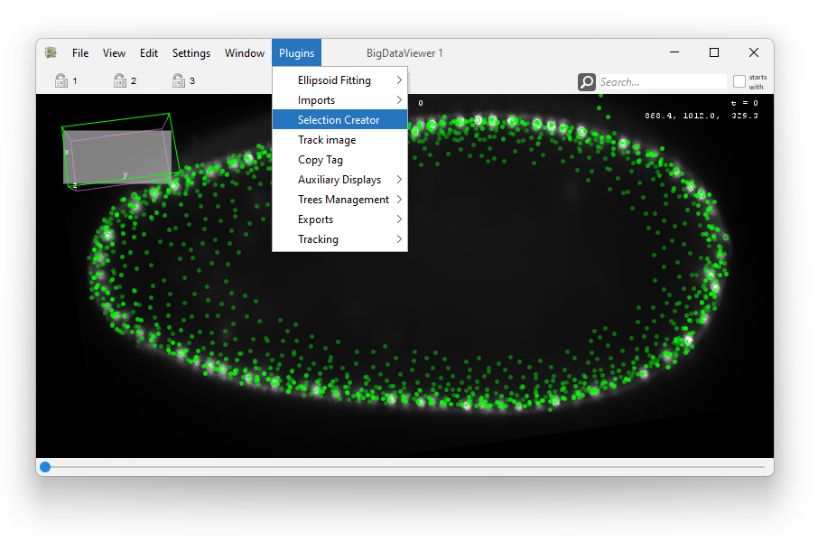
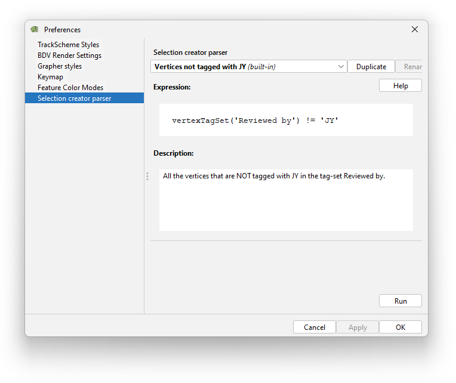
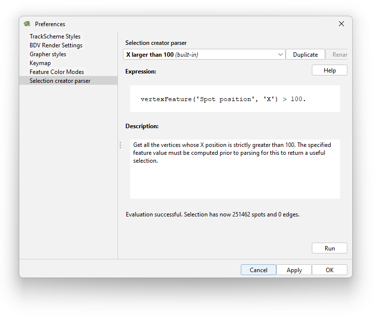
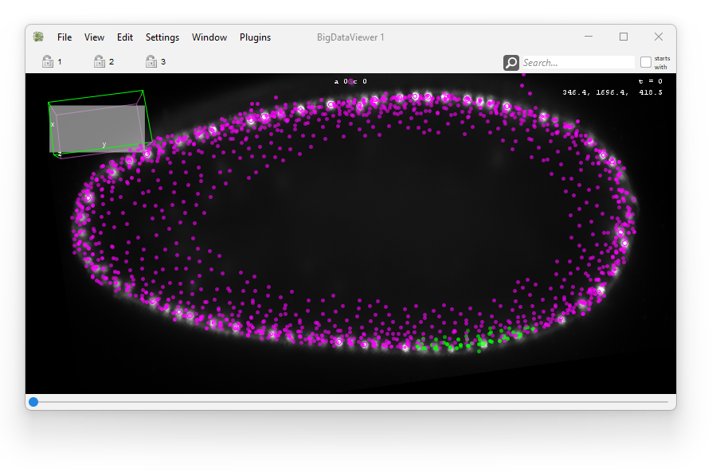

# The selection creator. 

The automated detection process we use often generates a lot of spurious
detections.
In [TrackMate](https://imagej.net/plugins/trackmate/) we complemented it by adding *feature filters* just after the detection step.
In TrackMate UI it takes the shape of filter windows, where the user can specify a feature and a threshold above or below which spots are rejected. 
The filters can be stacked to generate a more stringent filtering. 
This approach is like fishing with a small-hole net, then throwing back unwanted fishes to sea.

In Mastodon we take a somewhat different approach. 
We don't have a filter interface, but instead work with a dedicated tool called the **selection creator** that we describe it here. 
It works differently from the interactive selection we have in TrackMate.
Instead of manually clicking on spots or links, or drawing a selection rectangle in TrackScheme, you will enter an _expression_ that will be parsed to generate a selection.
The expression uses a basic language that allows translating criteria like _select all spots that have an intensity larger than X and their links_.

We thought this approach would be more convenient and powerful, and the selection is especially important in Mastodon. 
Indeed:

- You can create a selection to tag several data items that follow a certain criterion.

- The selection can be used as an input for the linking algorithms (see the [getting started tutorial](../partA/getting_started.md)).

- The BDV views can be used to only show the selection you just created.

- The selection content can be inspected in the selection table and inspected with the grapher views.

## The selection creator window.

We will be using the TRIF dataset from the cell tracking challenge for this tutorial. 
You can download the Mastodon file here TODO, that open an image stored on the Pasteur BDV-server and have some basic tracks.
The selection creator tool can be called from the _Plugins > Selection Creator_ menu, but is also a tab in the Preferences window:





The window for the tool is very simple.
It contains a text field for the expression, and another one that contains an editable description.
The `Run` button evaluates the current expression, which results in an error or in the selection being modified.
Several built-in examples are included, and there is a `Help` button that opens a document recapitulating the expression syntax.

Expression are stored and saved with the same menu that for the settings (TrackScheme styles, BDV render settings, etc).
When you press the `apply` button, they are saved to a file in the `.mastodon` folder in your home folder, called `selectioncreatorexpressions.yaml`.
For instance:
``` sh
>> pwd
/Users/tinevez/.mastodon
>> cat selectioncreatorexpressions.yaml
```
```yaml
Vertices with a tag
--- !selectioncreatorsettings {name: Spots with 1 link in frame 25, expression: vertexFeature('Spot
    N links') == 1 & vertexFeature('Spot frame') == 25, description: Spots with 1
    link in frame 25.}
--- !selectioncreatorsettings {name: Vertices with 1 link minus those in frame 25,
  expression: (vertexFeature('Spot N links') == 1) - (vertexFeature('Spot frame')
    == 25), description: Vertices with 1 link minus those in frame 25.}
```

## Selection based on spot feature values.

Let's see how we can select spots based on numerical features.
We will be mainly playing with the expression field.
First, in the top drop-down list, select the builtin example called `X larger than 100`, then click the `Run` button. 
This should be displayed:



And in a BDV window, you should see that most of the spots have been selected, saved for a few.



Let's have a look at the expression we used.
In the selection creator, you enter expressions that are evaluated for all the data items.
The expression must evaluate to a boolean answer: a `true` or `false` answer for each of the data item currently in mastodon. 
In our example we have:

```
vertexFeature('Spot position', 'X') > 100.
```
The keyword `vertexFeature` is a function that will fetch numerical values from a spot feature, for all spots. 
The arguments of this function are first, the feature name (`Spot position`) and second, the projection name `X`. 

Indeed, many features aggregates several _projections_.
A projection is a component of a feature that is always a real scalar. 
For instance, the `Spot position` feature is composed of 3 projects: `X`, `Y` and `Z`.
See the part on numerical feature computation in the [tutorial on the table views](../partA/numerical_features_tags_the_table_view.md) for more details.
Anyway, we need to remember that the `vertexFeature` function will return a scalar value for all spots, so it needs a feature _projection_ to be specified.

In the last part of the expression, we have a boolean comparison resulting in a boolean result: `> 100.` (the dot only stresses that 100 is floating point number).
So with this expression, all the spots that have a X position larger than 100 will evalute to `true` with this expression, and therefore will be added to the selection. 

We use the**strictly great than** operator `>`, but any comparison operator would have worked:

- `>` strictly greater than

- `<` strictly smaller than

- `>=` greater than

- `<=` smaller than

- `==` equal to

- `!=` different from

This is the basis for the whole selection creator framework.
You can enter any kind of mathematical expression based on the keyword supported, and it will be turned in a selection if it evaluates to a boolean results. 

## Let's make errors.

Because the selection creator accepts expressions that can be anything, it is likely that we will have error messages at some point. 
Let's spend some time generating errors on purpose.

First let's try removing the comparison:
```
vertexFeature('Spot position', 'X')
```
If we click the `Run` button we get the following error message:
```text
Evaluation failed. Got unexpected result: VertexFeature( Spot position → X, 256609 )
```
This is expected. 
The selection creator expects expressions to evaluate to booleans. 
When we removed the comparison operator (`< 100.`) we returned the X position for the 256609 spots in the model, and the selection creator does not know how to turn this into a selection.
So we need to remember that we always need to use expressions that evaluates to booleans.

Let's test an expression without specifying the projection name in the `vertexFeature` function:
```
vertexFeature('Spot position') > 100.
```
Now we get:
```text
Evaluation failed. Incorrect syntax: Calling vertexFeature: The projection key 
'Spot position' is unknown to the feature 'Spot position'.
```
Here the selection creator complains because we did not specify the projection in the call.
It then tried to find a projection with name identical to the feature name (`Spot position`) and could not find one.
So it complained. 
We would get the same error message if we tried calling the function with the name of a projection that does not exist. For instance `vertexFeature('Spot position', 'U') > 100.`

A similar error would be triggered when calling a feature that does not exist. 
For instance:
```
vertexFeature('Tralala', 'X') > 100.
```
returns the error message:
```text
Evaluation failed. Incorrect syntax: Calling vertexFeature: The feature 'Tralala' 
is unknown to the feature model.
```

Importantly, the same error message is triggered when you call the function **with a feature that has not been computed yet**.
For instance, in the Mastodon file you just downloaded, all feature are computed exccept one: `Track N spots`.
If we try to select short tracks with the valid expression that follows:
```
vertexFeature('Track N spots') < 20
```
we would get the same error message (feature unknown).
To fix this, you need to go to the `Feature computation` tool, make sure the `Track N spots` feature computer is selected and click `Compute`. 
After this, the expression will evaluate to a selection correctly:
```text
Evaluation successful. Selection has now 33316 spots and 0 edges.
```

## Selection with link features.

We can of course run the same kind of expression with link features.
For this we use another function: `edgeFeature`.
But the principles are the same. 
For instance, to select all the links that correspond to a cell displacement larger than 3 µm, we write the following:
```
edgeFeature('Link displacement') > 3.
```
which results in:
```text
Evaluation successful. Selection has now 0 spots and 16855 edges.
```
Note that in this case we called the function with only one function, the feature name.
This worked because this feature has exactly one projection.
In that case the function understands that it needs to return the values of this sole projection.

## Why are the functions called vertexFeature and edgeFeature?

In the Mastodon application we deal with data items called spots and links. 
The data model of Mastodon is a mathematical graph in which a cell in one frame is a vertex.
The same cell in the next frame is another vertex, and the two vertices are connected by an edge.
Tracks are built by all the vertices connected by edges. 
Spots and links are specialized versions of the vertices and edges of the graph used in the Mastodon application. 
But the selection creator is built for any kind of graph that uses the Mastodon API, not only the one in the application we document here. 
For this reason, the syntax of the functions adopted the most general terms: `vertex` and `edge`, but for us, they points to features of spots and links.

## Building selection based on tags.

We can also use tags in our expressions. 
The main function to do so is `tagSet`. 
It returns the tags of the specified tag-set for all the spots and links.
To create a selection from them, you simply need to check what ones are equal to a certain tag with the equality `==` operator. 
For instance the expression:
```
tagSet('Reviewed by') == 'JY'
```
will retrieve all the tags in the tag-set called `Reviewed by`, and data items (spots and links) that are tagged with `JY` in this tag-set will be selected. 
But with our current Mastodon project it returns an error:
```text
Evaluation failed. Incorrect syntax: The tag-set 'Reviewed by' is unknown to 
the tag-set model.
```
Indeed, the tag-set `Reviewed-by` does not exist.

The function `tagSet` returns spots and links altogether. 
If you want to retrieve only the spots or only the edges separately, there are two functions: `vertexTagSet` and `edgeTagSet`.
Otherwise they work like the `tagSet` function and can be substituted with the same syntax. 

There are also special switches to return data items that have no tag in a tag-set or that are tagged with anything in a tag-set.

- `~tagSet('Reviewed by')` will return all the data items that are tagged with any tag in the `Reviewed by` tag-set. It matters not what tag, but there must be one.

- `!tagSet('Reviewed by')` is the converse: it will return all the data items that are 
not tagged in the `Reviewed by` tag-set.

And of course, these two switches can be used with the `vertexTagSet` and `edgeTagSet` functions.

## Combining expressions.

Since we use boolean expressions we can combine them using logic operator. 
The first ones are the _and_ and _or_ operators `&` and `|`.
For instance, to select all spots that have 1 link **and** that are in frame 25, we write the following:
```
vertexFeature('Spot N links') == 1 & vertexFeature('Spot frame') == 25
```

To select all spots that have 1 link **or** that are in frame 25, we use the `|` operator instead:
```
vertexFeature('Spot N links') == 1 | vertexFeature('Spot frame') == 25
```

There are other operators which functions have been extended to have a proper meaning with the selection creator. 
For instance, the above expression is identical to select all spots that have 1 link, and **adding** the spots that are in frame 25.
So when it comes to selection, this works as in an addition, and we could write similarly:
```
vertexFeature('Spot N links') == 1 + vertexFeature('Spot frame') == 25
```
But we get an error:
```text
Evaluation failed. Incorrect syntax: Improper use of the 'add' operator, 
not defined for Integer and VertexFeatureVariable. Use brackets to clarify 
operator priority.
```
Here the expression parser is confused due to the classical operation priority of the the `+` and `-` operators. 
We need to use brackets to specify we operate on the results of the feature filtering:
```
(vertexFeature('Spot N links') == 1) + (vertexFeature('Spot frame') == 25)
```
```text
Evaluation successful. Selection has now 21814 spots and 0 edges.
```
The `+` operator gives the same results that the `|` operator, they just operate with different priorities. 

The **subtract** operator `-`  is used to remove data items from a selection.
As for the `+` operator, it needs brackets to operate properly.
For instance, to remove the spots that belong to the frame 25 from the selection of spots that have 1 link, we write:
```
(vertexFeature('Spot N links') == 1) - (vertexFeature('Spot frame') == 25)
```
```text
Evaluation successful. Selection has now 19397 spots and 0 edges.
```
And of course, you can combine expressions using features or tags:
```
(vertexFeature('Spot N links') == 1) - (tagSet('Reviewed by') == 'JY')
```

## Editing the selection.

Let's say you already have a selection, and want to alter it with an expression. 
There are 3 functions that return the content of the _current_ selection and let you modify it.
As such, they are not exacly functions, but can be considered as variables in an expression.

The `selection` variable simply returns the list of data items that are currently selected.
It can then be combined with another expression.
For instance, to remove from the selection all the spots that have 2 links, use this expression:
```
selection - ( vertexFeature('Spot N links') == 2 )
```
Of course, because running it will modify the selection, such expressions might have different outcome if you run it several times in a row.

The `vertexSelection` and `edgeSelection` variables work like their selection counterpart, but are limited to return only the spots, respectively the links, of the current selection.

## Morphing a selection.

All the expressions we have seen above works like a boolean operation on an array.
Except that in our case we have spots and links, and that each have their own separated set of features.
This separation is problematic if we want to create selection of spots based on the features of their links, or if we want to include in the selection the links of the spots we selected.
To workaroudn this, the selection creator ships the `morph` function.

The `morph` function is a bit special as it is able to change the type of data items that are selected, based on their relations. 
It is with this function that you will select the links of a spot. 
For instance:
```
morph(vertexSelection, 'incomingEdges')
```
will select the incoming links of the spots currently in the selection. 
The vertices themselves will not be included in the final selection.

The `morph` function need two inputs:

- a selection (it can result from `tagSet('TS') == 'A'`, `vertexFeature('F', 'FP') > 3`, `selection`, ...);

- a list of tokens that specify how to morph the selection.

In the above example, the token was `incomingEdges` which takes all the incoming links of the spots currently selected, and nothing else (not even the spots initially selected).
The supported morph tokens, or **morphers** are the following:

- `toVertex` includes the spots currently selected in the `morph` result. When this morpher is not present, the selected spots are removed from the target selection.

- `incomingEdges` includes the incoming links (backward in time) of the selected spots.

- `outgoingEdges` includes the outgoing links (forward in time) of the selected spots.

- `toEdge` includes the links of the source selection in the target selection. When this morpher is not present, the selected links are removed from the target selection.

- `sourceVertex` includes the source spots of the selected links. The source spot of a link is the one backward in time.

- `targetVertex` includes the target spots of the selected links. The target spot of a link is the one forward in time.

- `wholeTrack` includes the whole track of the selected spots and links.

You can combine several morphers, if you put them as a list between brackets. For instance:
```
morph( vertexFeature('Spot N links') == 3, ('toVertex', 'outgoingEdges') )
```
will select the spots that have 3 links, and return them plus their outgoing links.


## Summary.

### Functions and variables.

| Functions                                               | Usage                                                        |
| ------------------------------------------------------- | ------------------------------------------------------------ |
| `vertexFeature('Spot feature name', 'Projection name')` | Returns the values of the specified spot feature and projection. <br />To be used with a comparison operator on a numerical value <br />like `>`, `<`, `>=`, `<=`, `==` or `!=`. |
| `edgeFeature('Spot feature name', 'Projection name')`   | The same, but for link features.                             |
| `tagSet('Tag set name')`                                | Returns the tag of all data items for the specified tag-set. <br />To be used with the equality operator `==`, comparing to <br />a tag belonging to the specified tag set <br />(`tagSet('TS') == 'T'`). |
| `vertexTagSet('Tag set name')`                          | The same, but only returns the spots in the comparison.      |
| `edgeTagSet('Tag set name')`                            | The same, but only returns the links in the comparison.      |
| `selection`                                             | Returns the content of the current selection.                |
| `vertexSelection`                                       | Returns only the spots in the current selection.             |
| `edgeSelection`                                         | Returns only the links in the current selection.             |
| `morph`                                                 | Change the type of data items that are <br />selected, based on their relations. To use <br />with the morphers described below. |

### Morphers.

| Morpher name | Role |
| ------------ | ---- |
| `toVertex` | Include the spots currently selected in the `morph` result. When this <br />morpher is not present, the selected spots are removed from the <br />target selection. |
| `incomingEdges` | Include the incoming links (backward in time) of the selected spots. |
| `outgoingEdges` | Include the outgoing links (forward in time) of the selected spots. |
| `toEdge` | Include the links of the source selection in the target selection. <br />When this morpher is not present, the selected links are removed <br />from the target selection. |
|`sourceVertex` | Include the source spots of the selected links. The source spot of a <br />link is the one backward in time. |
| `targetVertex` | Include the target spots of the selected links. The target spot of a <br />link is the one forward in time. |
|`wholeTrack` | Include the whole track of the selected spots and links. |