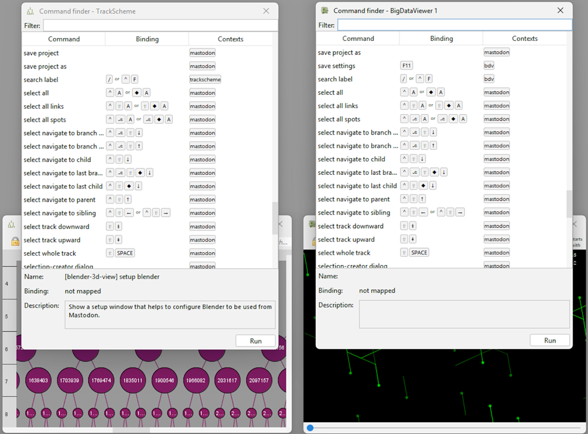

# Command Finder.

Mastodon offers a window-specific quick search functionality that filters available commands.
The `Command Finder` can be opened by pressing `Ctrl + Shift + F` in any active BDV, TrackScheme, Grapher, Table, or
Selection Table window. In the filter, users can type and thereby search functionality available in Mastodon. A double
click on a command in the list will execute it.
Examples of the Command Finder in the BDV and TrackScheme windows:

