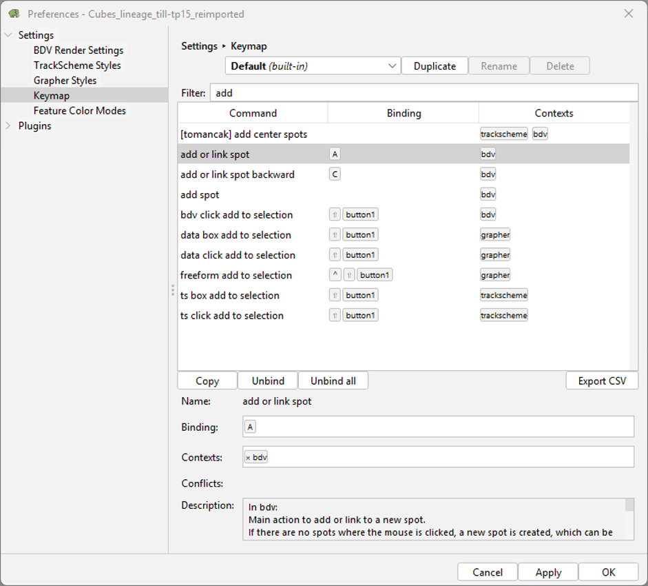

# Customizing Keymaps.

All important GUI windows (BigDataViewer, TrackScheme, Grapher) are highly customizable, and we encourage users to
adjust keymap bindings to suit their preferences. Users will find the possibility to adapt them in
`File > Preferences > Keymaps`.

