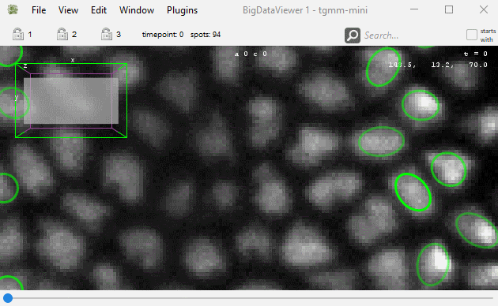

# Moving around in the BDV views. 

| **Action**                      | **Key**  |
|---------------------------------|---------------|
| **_View._**                        ||
| Move in X & Y.                  | `Right-click` and `Drag`.    |
| Move in Z.                      | `Mouse-wheel`.  Press and hold `Shift` to move faster, `Control` to move slower. |
| Align with XY plane | `Shift Z` |
| Align with YZ plane | `Shift X` |
| Align with XZ plane | `Shift C` or `Shift A`.  For these 3 shortcuts, the view will rotate around the mouse position on the BDV. |
| Zoom / Unzoom.                  | `Control` + `Shift` + `Mouse-wheel` or `Command` + `Mouse-wheel`.  The view will zoom and unzoom around the mouse location. |
| **_Time-points_**.              |                    |
| Next time-point.                | `]` or `M`         |
| Previous time-point.            | `[` or `N`         |
| **_Bookmarks_.**                |                    |
| Store a bookmark.               | `Shift B` then press any key to store a bookmark with this key as label.  A bookmark stores the position, zoom and orientation in the view but not the time-point. Bookmarks are saved in display settings file. |
| Recall a bookmark.              | Press `B` then the key of the bookmark. |
| Recall a bookmark orientation.  | Press `O` then the key of the bookmark. Only the orientation of the bookmark will be restored. |
| **_Image display_.**            |                         |
| Select source 1, 2 ...          | Press `1` / `2` ...     |
| Toggle fused mode.              | Press `F`.   In fused mode, several sources are overlaid. Press `Shift` + `1` / `Shift` + `2` ... to add / remove the source to the view. In single-source mode, only one source is shown.          |
| Save / load display settings.   | `F11` / `F12`.  This will create a _XYZ_settings.xml_ file in which the display settings and bookmarks will be saved.                                               |

Before mid-2023, the brightness and source visibility dialogs were configured in dialogs which visibility were toggled with the `F` and `F6`  shortcuts respectively. With the new version of BDV, they are configured with a side-pane in a BDV window that can be toggled by clicking on a button made visible when the mouse hovers over the right part of the window:

