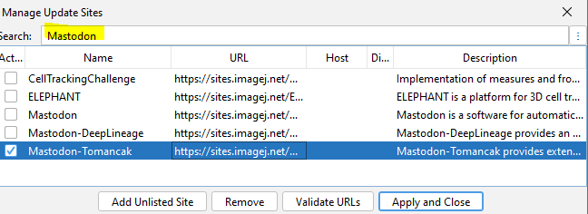
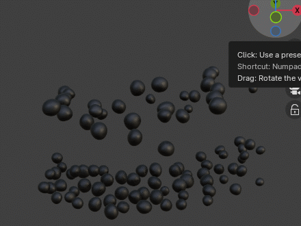

## Installation

### Setup Blender Addon...

* Pre-requisites:
    * Install [Fiji](https://imagej.net/downloads) and [Blender](https://blender.org/download) on your computer.
    * Make sure to install Blender as a "portable" installation. The reason for this is that the Mastodon Blender
      Plugin needs write access to the Blender installation directory, which may not be possible with a standard
      installation.
    * Activate the "Mastodon-Tomancak" [update site](https://imagej.net/update-sites/following) in Fiji.
        * 
* Open Fiji and create / open a Mastodon project.
* In Mastodon's main menu, you will find an entry ```Window > Blender Views > Setup Blender Addon ...```, click it and
  follow the instructions to install the Mastodon Blender Plugin.

### Configure Blender Template Files...

* Menu Location: `Window > Blender Views > Configure Blender Template Files...`
* This command allows you to configure the Blender template files that are used when opening a new Blender window. This
  is useful, if you want to use a different Blender template file than the default one. Blender templates can be used to
  define the initial state of a new Blender window, e.g. the camera position, the lighting, the background color, etc.
* An example of a Blender template files can be downloaded from
  here: [blender_template.zip](https://github.com/user-attachments/files/18346100/default_empty_spot-radius_2024-05-31.zip).
  Needs to be unzipped before use.
* Same dataset with default
  and [custom](https://github.com/user-attachments/files/18346100/default_empty_spot-radius_2024-05-31.zip) Blender
  template file:
    * Default Blender template file:
        * 
    * Custom Blender template file:
        * 
