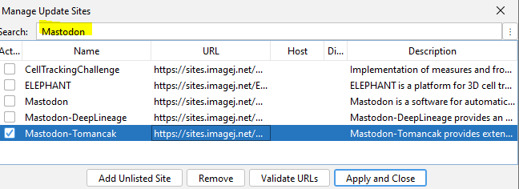
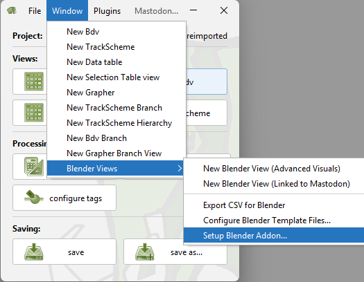
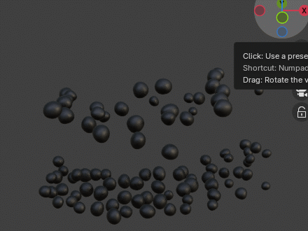

# Installation

* We have implemented a user-friendly installation routine within Mastodon, enabling users to leverage Blender’s 3D
  capabilities with just a few clicks. The installer can be accessed from any Mastodon window via `Window > Blender Views > Setup
  Blender Addon`.

## Setup Blender Addon...

* Pre-requisites:
    * Install [Fiji](https://imagej.net/downloads) and [Blender](https://blender.org/download) on your computer.
    * Make sure to install Blender as a "portable" installation. The reason for this is that the Mastodon Blender
      Plugin needs write access to the Blender installation directory, which may not be possible with a standard
      installation.
    * Activate the "Mastodon-Tomancak" [update site](https://imagej.net/update-sites/following) in Fiji.
        * 
* Open Fiji and create / open a Mastodon project.
* In Mastodon's main menu, you will find an entry ```Window > Blender Views > Setup Blender Addon ...```, click it and
  follow the instructions to install the Mastodon Blender Plugin.



## Troubleshooting: Python packages installed in the wrong location

* The installation routine installs a set of Python packages into Blender's bundled Python, located at
  `<Blender installation folder>/Contents/Resources/5.*/python/lib/python3.1*/site-packages`.
* On some systems with a pre-existing Python installation, these packages are instead installed into the user's local
  site-packages directory at `<user home directory>/.local/lib/python3.1*/site-packages`. When this happens, Blender
  cannot find the packages and the installation does not succeed.
* If you run into this, you can fix it manually by copying the following folders and files from
  `<user home directory>/.local/lib/python3.1*/site-packages` to
  `<Blender installation folder>/Contents/Resources/5.*/python/lib/python3.1*/site-packages`:
    * `bidict`
    * `bidict-*.dist-info`
    * `dateutil`
    * `google`
    * `grpc`
    * `grpc_tools`
    * `grpcio_tools-*.dist-info`
    * `grpcio-*.dist-info`
    * `pandas`
    * `pandas-*.dist-info`
    * `protobuf-*.dist-info`
    * `python_dateutil-*.dist-info`
    * `six-*.dist-info`
    * `six.py`

## Configure Blender Template Files...

* Menu Location: `Window > Blender Views > Configure Blender Template Files...`
* This command allows you to configure the Blender template files that are used when opening a new Blender window. This
  is useful if you want to use a different Blender template file than the default one. Blender templates can be used to
  define the initial state of a new Blender window, e.g. the camera position, the lighting, the background color, etc.
* An example of a Blender template files can be downloaded from
  here: [blender_template.zip](https://github.com/user-attachments/files/18346100/default_empty_spot-radius_2024-05-31.zip).
  Needs to be unzipped before use.
* Note: The template file must be a Blender file with the extension `.blend`. The template file is only used for the
  `Advanced Visuals` view. The `Linked to Mastodon` view does not use the template file.
* Same dataset with default
  and [custom](https://github.com/user-attachments/files/18346100/default_empty_spot-radius_2024-05-31.zip) Blender
  template file:
    * Default Blender template file:
        * 
    * Custom Blender template file:
        * 
