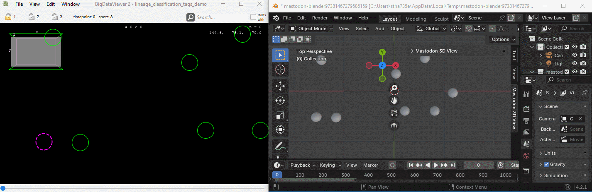
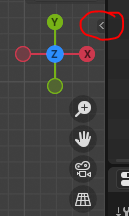
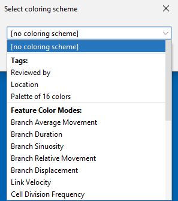

# Usage

## Blender View (Linked to Mastodon)

* Menu Location: `Window > Blender Views > New Blender View (Linked to Mastodon)`
* Before the Blender window opens, the user is asked to set a time scaling factor.
  * A time scaling factor of 1 means that there is no time scaling and the frame number in Big Data View / TrackScheme
    views matches the frame number in Blender.
  * A Time scaling factor larger than 1 means that interpolation between frames in the Blender view is computed, which
    leads to a smoother animation. Frame numbers in Blender are then multiplied by the time scaling factor.
  * Note: Interpolation may also happen in cases where spots of a track are not
    present in all frames. In this case, the positions of the missing spots are interpolated.
* Example with time scaling factor of 1: 
* Example with time scaling factor of 10: 
* Wait for some seconds, for the data to load into Blender.
* Play around!

### "Mastodon 3D View" panel in Blender


* Click on the 3D view in Blender.
* Press ```N```, This makes a few tabs appear on the right edge of the 3D view.
* Alternatively, click the arrow on the right edge of the 3D view. 
* One of the tabs is called "Mastodon 3D View".
* Click it and you will be able to:
    * Select a Mastodon synchronization group
    * Change sphere sizes
    * Select a "tag set" (The colors will be visualized in the 3d view.)
    * Update the "tag set" (After you made changes in tags in Mastodon.)

### Synchronize time-point and active spot between Mastodon and Blender

In the Mastodon TrackScheme window click one of the lock symbols 1, 2 or 3.
In Blender go to the "Mastodon 3D View" panel, and choose the same number 1, 2 or 3 as "Synchronization Group".


Now, the active time points and the active spot are synchronized between Blender and Mastodon.

### Example of a visualization


## Blender View (Advanced Visuals)

* Menu Location: `Window > Blender Views > New Blender View (Advanced Visuals)`
* Choose the tag set or the feature color mode you want to use for
  visualization. 
* Wait for some seconds for the data to load into Blender.
* Play around!

### Geometry Nodes

* The Blender View uses
  Blender's [Geometry Nodes](https://docs.blender.org/manual/en/latest/modeling/geometry_nodes/introduction.html) to
  visualize the data.
* This option opens a new Blender window with the cell tracking data. The data in the Blender window is detached
  from the Mastodon data, i.e. there is no interaction with Mastodon possible, and data updated in Mastodon is not
  updated in the Blender View. It can handle large datasets efficiently. It is possible to modify the visualization
  in Blender.
* Preferred option for high quality rendering of movies.
* The data can be rotated and shown from all angles.
* Note: In contrast to the "Linked to Mastodon" view, the "Advanced Visuals" view does not
  support the synchronization of the time point and the active spot with Mastodon. Furthermore, the "Advanced Visuals"
  view does not support
  the interpolation missing spots within a track.

### Example of a visualization of feature color modes

* 

### Example of a movie rendering created with the Blender View

* 
* Tracking data of phallusia mammillata embryogenesis
  by [Guignard et a. (2020)](https://doi.org/10.1126/science.aar5663).

## Export CSV for Blender

* Menu Location: `Window > Blender Views > Export CSV for Blender`
* Exports the current spot data to a CSV file. The CSV file contains the spot IDs, the spot labels, the time point, the
  x, y, z coordinates, the radius of the spot and potential tag and feature values. The CSV file, which is created by
  this command, is the same file that is used with `Blender View (Advanced Visuals)`.
* To import the CSV file into Blender manually, the script [read_csv.py](https://github.com/mastodon-sc/mastodon-blender-view/blob/master/src/main/resources/csv/read_csv.py) can be used.

