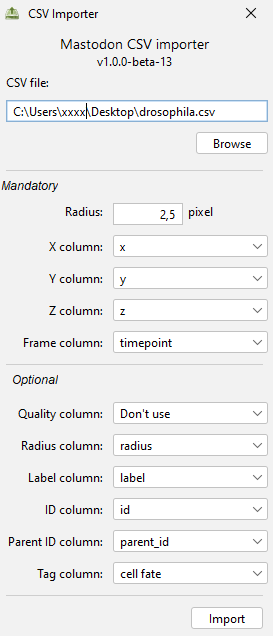

# CSV Importer

* Menu Location: `File > Import > CSV Importer`
* Description:
    * Allows importing spots that have been tracked outside Mastodon
    * Spots have to be saved in a CSV file with a specific format
    * The separator of the CSV file is supposed to be a comma (,)
    * Besides the spots, also links, radii, labels, quality and tags can be imported
* Command name: `show csv importer dialog`
* Default bindings: Not mapped
* Artifact: mastodon-pasteur
* Distribution: Included in the Mastodon update site.
* Link to code: https://github.com/mastodon-sc/mastodon-pasteur/tree/master/src/main/java/org/mastodon/mamut/io/csv
* The dialog: 

## Parameters

### Mandatory parameters

* Radius: The default radius of the spots to be imported. This will be the radius of the sphere that is used to create
  each spot.
* X Y Z: The columns in the CSV file that contain the X, Y and Z coordinates of the spots.
* Frame: The column in the CSV file that contains the frame number of the spots.

### Optional parameters

* Quality: The column in the CSV file that contains the quality of the spots. Use quality refers to segmentation /
  detection quality. Will be translated into a feature that can be seen in the feature table, called "Detection
  quality." It may be used to filter the spots.
* Radius: The column in the CSV file that contains the radii of the spots. If not provided, the default radius will be
  used for all spots.
* Label: The column in the CSV file that contains the labels of the spots. Labels can be seen in the track scheme. They
  can be used to search for spots. If not provided, no labels will be set for the spots. In this case, the imported
  spots will be given a sequential number as id, which will be used also as label. The values in the label column should
  preferably be surrounded by " or ' to avoid problems with spaces.
* ID and Parent ID: The columns in the CSV file that contain the IDs and parent IDs of the spots. This is useful if you
  want to import links between spots. If not provided, no links will be created. Both columns must not be empty. For
  spots that do not have a parent, use "-1" as Parent ID. The IDs must be unique.
* Tags: A column in the CSV file that contains a tag (attribute) belonging to the spots. If provided, a new tag set
  "Imported tags" will be created. All values contained in this column will generate a new tag in this tag set and the
  tag will be set for this spot.

## Example

* Demo data: [drosophila.csv](img/drosophila.csv)
    * Extract of the first 3 frames from the data set of drosophila embryonic
      development (https://janelia.figshare.com/articles/dataset/Drosophila_data_for_whole-embryo_lineage_reconstruction_with_linajea/24937092,
      file: drosophila_side_1_tracks_071621.txt, license: BSD-3-Clause)
* Published with: Malin-Mayor, C., Hirsch, P., Guignard, L. et al. Automated reconstruction of whole-embryo cell
  lineages by learning
  from sparse annotations. Nat Biotechnol 41, 44–49 (2023). https://doi.org/10.1038/s41587-022-01427-7
