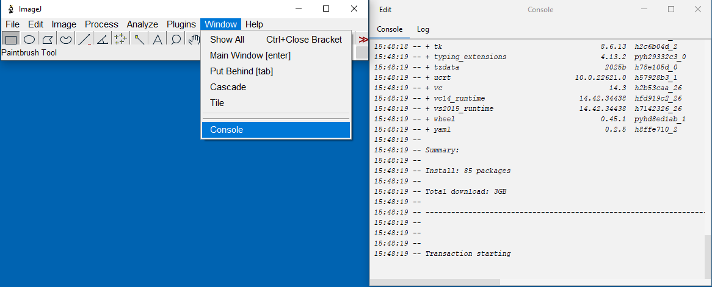
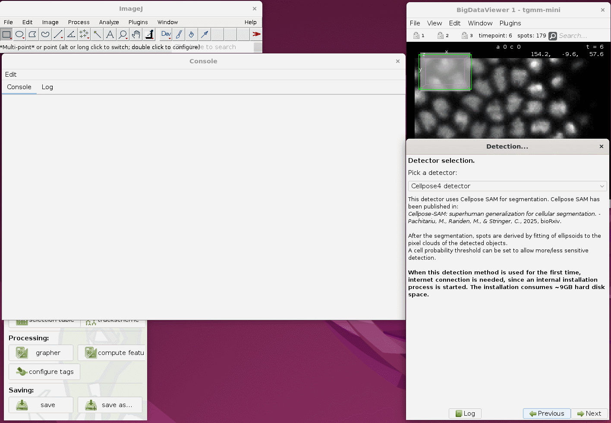
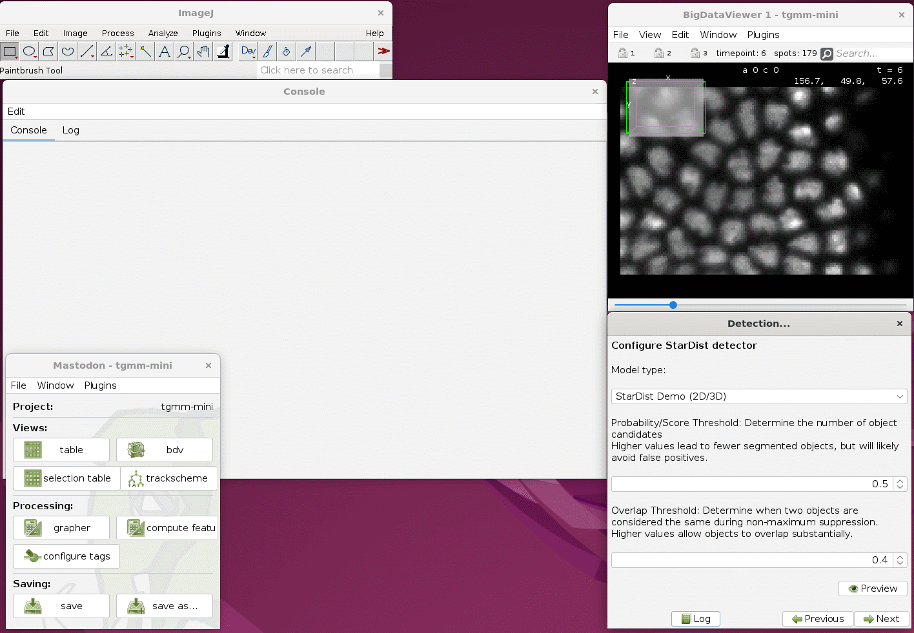

# Detectors added to Mastodon

**It is highly recommended to use all detectors, added by Mastodon Deep Lineage, only on machines with a GPU (ideally
NVIDIA). The detectors are very slow on machines without a GPU.**

* When running (or even previewing) the detectors for the first time, an internal installation process is started, which
  may take some time (a couple of minutes, depending on the speed of internet connection). We recommend opening the
  Window `Console` in Fiji using `Window > Console` to see the progress of
  the installation.

## StarDist Detector

This detector uses StarDist for segmentation.

StarDist has been published in:

* [Cell Detection with Star-convex Polygons](https://link.springer.com/chapter/10.1007/978-3-030-00934-2_30), Uwe
  Schmidt, Martin Weigert, Coleman Broaddus, and Gene Myers, International
  Conference on Medical Image Computing and Computer-Assisted Intervention (MICCAI), Granada, Spain, 2018.

After the segmentation, spots are derived by fitting of ellipsoids to the pixel clouds of the detected objects.
The resulting spots are ellipsoids with the semi-axes computed from the variance covariance matrix of the pixel
positions of each segmented spot.

Parameters:

* Model: The StarDist model to use for segmentation.
    * StarDist Demo 2D/3D: A pre-trained model for 2D and 3D segmentation. Has been trained on artificial data.
    * Plant Nuclei 3D: A pre-trained model for 3D segmentation of (plant) nuclei. Has been trained on real
      data: [10.5281/zenodo.8421755](https://bioimage.io/#/?tags=stardist&id=10.5281/zenodo.8421755)
    * StarDist Fluorescence Nuclei Segmentation: A pre-trained model for 2D segmentation of fluorescence nuclei. Has
      been trained on real
      data: [10.5281/zenodo.6348084](https://bioimage.io/#/?tags=stardist&type=model&id=10.5281/zenodo.6348084)
* Probability/Score Threshold: Determine the number of object candidates to enter non-maximum suppression. Higher values
  lead to fewer segmented objects, but will likely avoid false positives.
* Overlap Threshold: Determine when two objects are considered the same during non-maximum suppression. Higher values
  allow segmented objects to overlap substantially.
* **When this detection method is used for the first time, internet connection is needed, since an internal
  installation process is started. The installation consumes ~5.5GB hard disk space.**

## Cellpose3 Detector

This detector uses Cellpose3 for segmentation.

Cellpose3 has been published in:

* [Cellpose: a generalist algorithm for cellular segmentation](https://www.nature.com/articles/s41592-020-01018-x).
  Stringer et al., 2021, Nature Methods.

After the segmentation, spots are derived by fitting of ellipsoids to the pixel clouds of the detected objects.
The resulting spots are ellipsoids with the semi-axes computed from the variance covariance matrix of the pixel
positions of each segmented spot.

* Different Cellpose models can be used for different types of images. Cf.
  the [Cellpose documentation](https://cellpose.readthedocs.io/en/v3.1.1.1/models.html) for more information on the
  models.
* Cell probability threshold:
    * 0 ... more detections
    * 6 ... less detections (in dim regions)
* Flow threshold:
    * 0 ... viewer (ill-shaped) detections
    * 6 ... more detections
* Diameter:
    * Cellpose can exploit a priori knowledge on the size of cells.
    * If you have a rough estimate of the size of a typical cell, it can be entered, which will speed up the
      detection and improve the results.
    * Units are in pixels, so if your image has a pixel size of e.g. 0.5 µm, and you expect cells to be around 10 µm,
      enter 20 here.
    * If you do not know, enter 0 and cellpose will automatically determine the cell size estimate.
* For 3D data, anisotropy can be respected. Respecting anisotropy may take significantly more time but can lead to
  better detection results.
* **When this detection method is used for the first time, internet connection is needed, since an internal
  installation process is started. The installation consumes ~7.5GB hard disk space.**

## Cellpose4 Detector

This detector uses Cellpose4 (Cellpose-SAM) for segmentation.

Cellpose4 has been published in:

* [Cellpose-SAM: superhuman generalization for cellular segmentation](https://www.biorxiv.org/content/10.1101/2025.04.28.651001v1).
  Pachitariu, M., Rariden, M., & Stringer, C. (2025). bioRxiv.

After the segmentation, spots are derived by fitting of ellipsoids to the pixel clouds of the detected objects.
The resulting spots are ellipsoids with the semi-axes computed from the variance covariance matrix of the pixel
positions of each segmented spot.

* Cell probability threshold:
    * 0 ... more detections
    * 6 ... less detections (in dim regions)
* Flow threshold:
    * 0 ... viewer (ill-shaped) detections
    * 6 ... more detections
* Diameter:
    * Cellpose can exploit an a priori knowledge on the size of cells.
    * If you have a rough estimate of the size of a typical cell, it can be entered, which will speed up the
      detection and improve the results.
    * Units are in pixels, so if your image has a pixel size of e.g. 0.5 µm, and you expect cells to be around 10 µm,
      enter 20 here.
    * If you do not know, enter 0 and cellpose will automatically determine the cell size estimate.
* **When this detection method is used for the first time, internet connection is needed, since an internal
  installation process is started. The installation consumes ~7.5GB hard disk space.**

## Which Cellpose version to use?

* Cellpose3 is the original Cellpose version, which is still widely used. It is a good choice for most applications. You
  have to choose a model that fits your data. Cyto3 seems to work for many different types of images, but it may happen
  that you have to try different models to find the best one for your data.
  For 3D applications, Cellpose3 is ~20 times faster than Cellpose4. For 2D applications the running time is similar.
* Cellpose4 is the latest version of Cellpose, which is based on the [SAM](https://segment-anything.com/) architecture.
  It does not require a model to be selected since it
  automatically adapts to the data. In 2D applications its running time is similar to Cellpose3, but in 3D applications
  it is ~20 times slower than Cellpose3.

## Example dataset:

* You can try the detectors on
  the [Mastodon example dataset](https://github.com/mastodon-sc/mastodon-example-data/tree/master/tgmm-mini)
* Cellpose3: 
* Cellpose4: 
* StarDist: 
