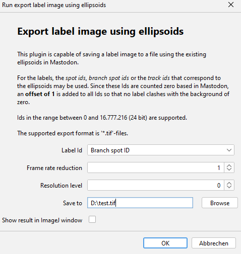
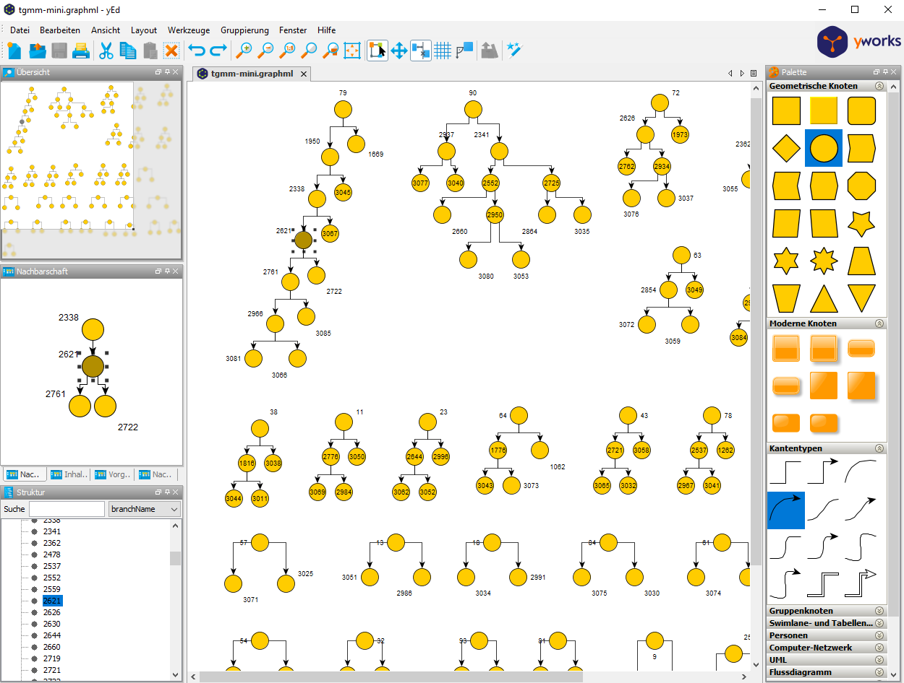

# Exporters

## Label Image Exporter

* Menu Location: `File > Export > Export label image using ellipsoids`
* The Label image exporter is capable of saving a label image to a file using the existing ellipsoids in Mastodon.
* For the labels, the _spot ids_, _branch spot ids_ or the _track ids_ that correspond to the spots / ellipsoids may be
  used. Since these Ids are counted zero based in Mastodon, an **offset of 1** is added to all Ids so that no label
  clashes with the background of zero.
* The recommended export format is '*.tif'-files. However, it should work also for other formats supported by ImageJ.
* The export uses an image with signed integer value space, thus the maximum allowed id is 2.147.483.646.
* The dialog:  

###  Parameters

* Label Id: The id that is used for the labels. The default is the Spot track Id.
    * The ids correspond to the highlighted columns in the feature
      table: 
* Frame rate reduction: Only export every n-th frame. 1 means no reduction. Value must be >= 1.
    * The frame number corresponds to the _Spot frame_ column in the feature table.
* Resolution level: Spatial resolution level of export. 0 means highest resolution. Value > 0 mean lower resolution.
* Save to: Path to the file to save the label image to. Should end with '.tif'.

###  Example

* Demo data: [Example data set](https://github.com/mastodon-sc/mastodon-example-data/tree/master/tgmm-mini)
* The timelapse with the ellipsoids in
  BigDataViewer: 
* The exported tif imported into [Napari](https://napari.org/stable/) 3D
  view: 

## GraphML Exporter

* Menu Location: `File > Export > Export to GraphML (branches)`
* Exports the branch graph to a [GraphML](http://graphml.graphdrawing.org/) file.
    * The graph is directed. The branch spots are the vertices and the branch links are the edges.
    * The vertices receive a label attribute with the branch spot name. The vertices receive a duration attribute with
      the branch duration.
    * The edges are not labeled and have no attributes.
* GraphML can be visualized with [Cytoscape](https://cytoscape.org/), [yEd](https://www.yworks.com/products/yed)
  or [Gephi](https://gephi.org/).
* GraphML can be processed in Java using the [JGraphT](https://jgrapht.org/) library.
* GraphML can be processed in Python using the [NetworkX](https://networkx.org/) library.

###  Options

* Export all branches to GraphML (one file)
    * Exports the whole branch graph to a single file.
    * Select a file to save to. Should end with '.graphml'.
* Export selected branches to GraphML (one file)
    * Exports the selected branches to a single file.
        * The selected branches are the ones that are highlighted in the branch view.
        * A branch is considered selected if at least one of its spots is selected. However, the exported duration
          attribute
          always reflects the whole branch duration.
    * Select a file to save to. Should end with '.graphml'.
* Export tracks to GraphML (one file per track)
    * Exports each track to a separate file.
    * Select a directory to save to.

###  Example

* Demo data: [Example data set](https://github.com/mastodon-sc/mastodon-example-data/tree/master/tgmm-mini)
* The resulting file loaded into yEd: 
* The resulting file loaded into Cytoscape: 
