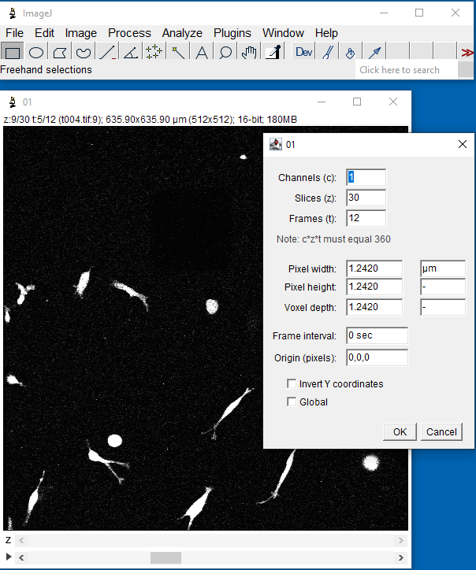
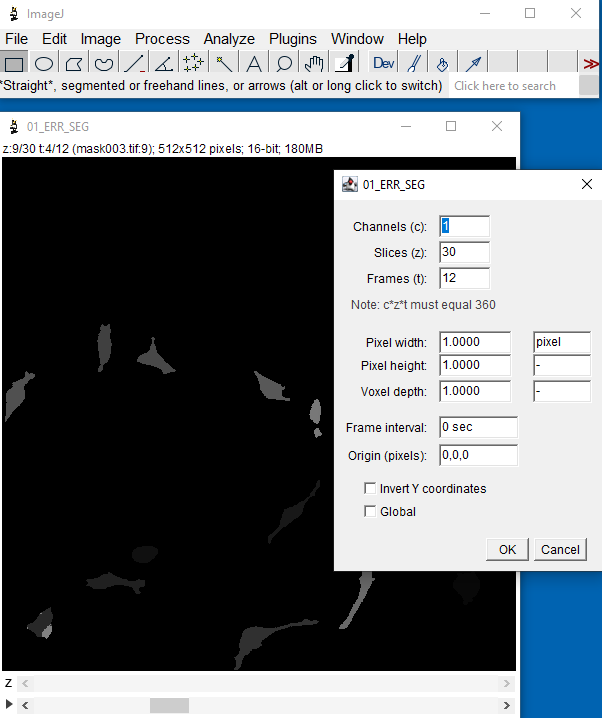
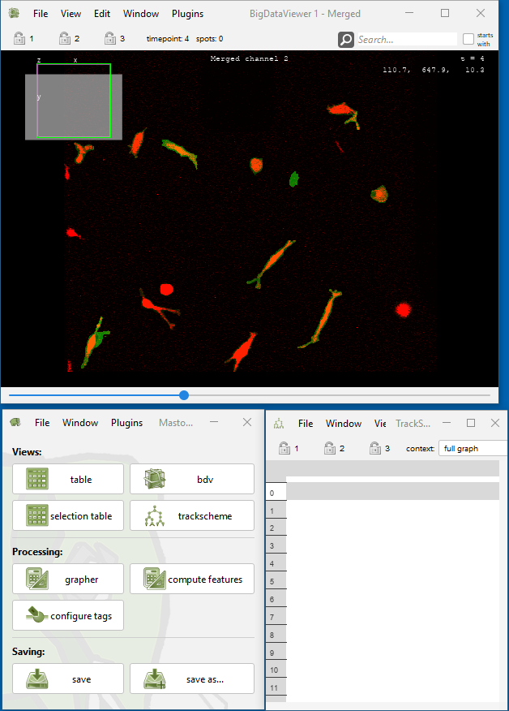
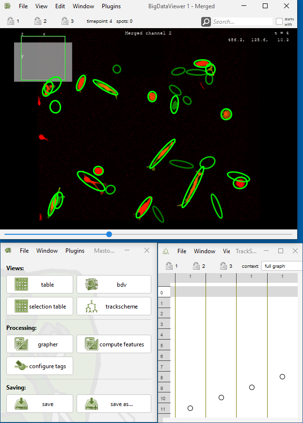

# Import

## Import Spots from Segmented Label Image

* Menu Location: `File > Import > Import spots from label image`
* You can use the plugin to import spots from a label image representing an instance segmentation into Mastodon. This
  may be useful if you have an instance segmentation of cells or other objects, and you want to track them using
  Mastodon.
* The label image is expected to contain the spot ids as pixel values.
* The label image is expected to have the same dimensions as the image data in Mastodon.
* Labels are processed frame by frame.
* Multiple blobs with the same id in the same frame are considered to belong to the same spot by this importer. It is
  advised to use unique ids for spots in the same frame.
* The resulting spots are ellipsoids with the semi axes computed from the variance covariance matrix of this pixel
  positions of each label.
* Labels with only one pixel are ignored. This is because the variance covariance matrix is not defined for a single
  point. If you want to import single pixel spots, you can use the [
  `Import Spots from CSV`](https://mastodon.readthedocs.io/en/latest/docs/partC/csv-importer.html) plugin.
* The resulting spots may be linked using the linker plugin in Mastodon (`Plugins > Tracking > Linking...`)
  or [Elephant](https://elephant-track.github.io/#/?id=linking-workflow).

### Parameters

* Ellipsoid scaling factor: The scaling factor to apply to the ellipsoids. The default is 1.0. The scaling factor is
  applied to the semi axes of the ellipsoids. The ellipsoid scaling factor can be used to increase (>1) or decrease (
  &lt;1) the size of the resulting ellipsoid. 1 is equivalent of ellipsoids drawn at 2.2σ.
* Link spots having the same id in consecutive frames: If checked, spots with the same label id in consecutive frames
  are linked. Division or merge events are not considered.
* Image source that has been used for the external segmentation: The channel containing the image data that has been
  used to create the label image.
  This channel is used to check, if the dimensions of the label image match the dimensions of the image data in
  Mastodon.

### Label image as active image in ImageJ

* The label image can be opened in ImageJ and the plugin can be called from the
  menu: `File > Import > Import spots from label image > Import spots from ImageJ image`
* Please make sure that the label image is the active image in ImageJ.
* Please make sure that the label image has the same dimensions as the image data in Mastodon.
  * You can use the `Image > Properties` command ImageJ to check (and) set the dimensions of the label image.

#### Example

* You can also watch a video tutorial on how to import spots from a label image in
  Mastodon 
* Example
  dataset: [Fluo-C3DL-MDA231 from Cell Tracking Challenge](http://data.celltrackingchallenge.net/training-datasets/Fluo-C3DL-MDA231.zip)
* Extract the file to a folder named `Fluo-C3DL-MDA231`
* Import the image sequence with the actual image into ImageJ contained in folder `Fluo-C3DL-MDA231/01/`
  * `File > Import > Image Sequence...`
* Set the dimensions of the image sequence to 512x512x1x30x12 (XYCTZ) using `Image > Properties`
  * 
* Open Mastodon from Fiji and create a new project with the image sequence
  * `Plugins > Mastodon > new Mastodon project > Use an image opened in ImageJ > Create`
  * 
* Import the image sequence encoding the label images into ImageJ contained in folder: `Fluo-C3DL-MDA231/01_ERR_SEG/`
  * Set the dimensions of the label image to 512x512x1x30x12 (XYCTZ) using `Image > Properties`
  * 
* Open Import window in Mastodon: `File > Import > Import spots from label image > Import spots from ImageJ image`
  * You can keep the ellipsoid scaling factor at 1.0. Select factor higher than 1.0 to increase the size of the
    ellipsoids and lower than 1.0 to decrease the size of the resulting ellipsoids.
  * Check the box to link spots having the same label id in consecutive frames.
  * Select the channel in Big Data Viewer containing the image that has been used to create the label image. The
    channel is used to check, if the dimensions of the label image in ImageJ match the dimensions of the image data in
    Mastodon.
  * 
  * Click `OK` and the spots are imported into Mastodon.
  * 

### Label image as BDV channel

* The plugin can be called from the
  menu: `File > Import > Import spots from label image > Import spots from BDV channel`

#### Example

* You can also watch a video tutorial on how to import spots from a label image in
  Mastodon 
* Example
  dataset: [Fluo-C3DL-MDA231 from Cell Tracking Challenge](http://data.celltrackingchallenge.net/training-datasets/Fluo-C3DL-MDA231.zip)
* Extract the file to a folder named `Fluo-C3DL-MDA231`
* Import the image sequence with the actual image into ImageJ contained in folder `Fluo-C3DL-MDA231/01/`
  * `File > Import > Image Sequence...`
  * Set the dimensions of the image sequence to 512x512x1x30x12 (XYCTZ) using `Image > Properties`
  * 
* Import the image sequence encoding the label images into ImageJ contained in folder: `Fluo-C3DL-MDA231/01_ERR_SEG/`
  * Set the dimensions of the label image to 512x512x1x30x12 (XYCTZ) using `Image > Properties`
  * 
    * Merge the 2 images into a single image using the `Image > Color > Merge Channels...` command
  * 
* Open Mastodon from Fiji and create a new project with merged image
  * `Plugins > Mastodon > new Mastodon project > Use an image opened in ImageJ > Create`
  * 
* Open Import window: `File > Import > Import spots from label image > Import spots from BDV channel`
  * Keep the ellipsoid scaling factor at 1.0
  * You can decide to link spots having the same label id in consecutive frames. This is useful if you have a time
    series of label images and you want to link spots between frames. Linking dividing spots cannot be done by this.
    The Mastodon Linker plugin should be used for this.
  * Select the BDV channel containing the label image that has been used to create the segmented label image. This is
    used to check, if the dimensions of the label image and the image data in BDV match, which is required.
  * 
  * Click `OK` and the spots are imported into Mastodon.
  * 
