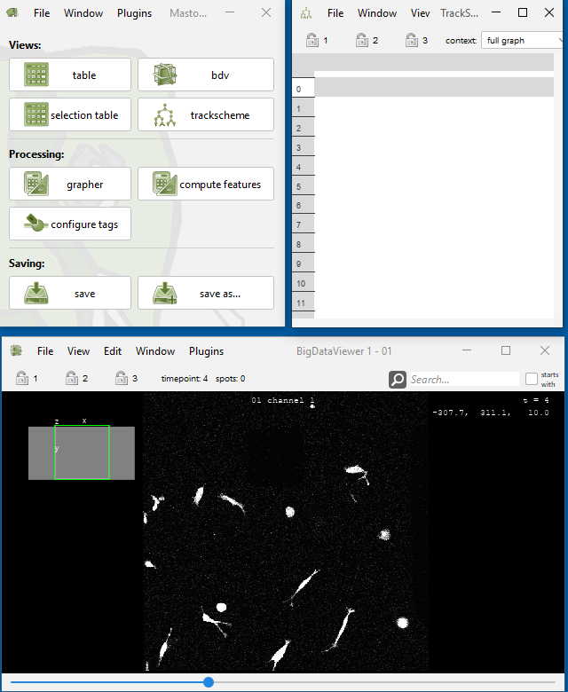
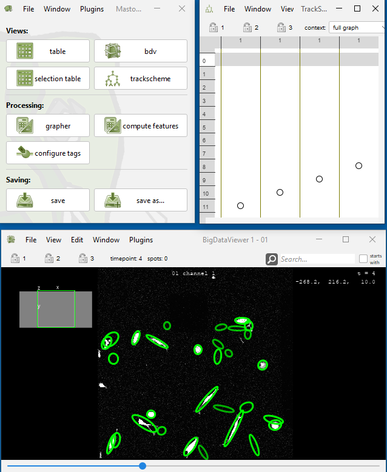
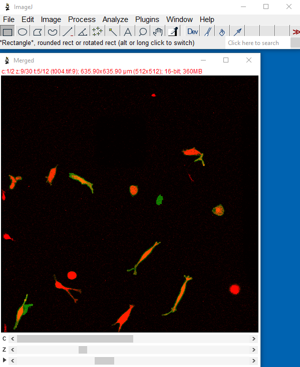
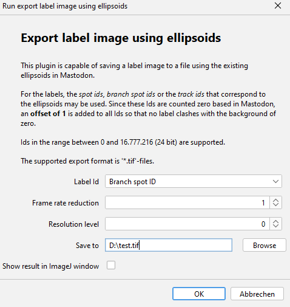

# Importers

## Import Spots from Label Image

* Menu Location: `File > Import > Import spots from label image`
* You can use the plugin to import spots from a label image representing an instance segmentation into Mastodon. This
  may be useful if you have an instance segmentation of cells or other objects, and you want to track them using
  Mastodon.
* The label image is expected to contain the spot ids as pixel values.
* The label image is expected to have the same dimensions as the image data in Mastodon.
* Labels are processed frame by frame.
* Multiple blobs with the same id in the same frame are considered to belong to the same spot by this importer. It is
  advised to use unique ids for spots in the same frame.
* The resulting spots are ellipsoids with the semi axes computed from the variance covariance matrix of this pixel
  positions of each label.
* Labels with only one pixel are ignored. This is because the variance covariance matrix is not defined for a single
  point. If you want to import single pixel spots, you can use the [
  `Import Spots from CSV`](https://mastodon.readthedocs.io/en/latest/docs/partC/csv-importer.html) plugin.
* The resulting spots may be linked using the linker plugin in Mastodon (`Plugins > Tracking > Linking...`)
  or [Elephant](https://elephant-track.github.io/#/?id=linking-workflow).

###  Parameters

* Ellipsoid scaling factor: The scaling factor to apply to the ellipsoids. The default is 1.0. The scaling factor is
  applied to the semi axes of the ellipsoids. The ellipsoid scaling factor can be used to increase (>1) or decrease (
  &lt;1) the size of the resulting ellipsoid. 1 is equivalent of ellipsoids drawn at 2.2σ.
* Link spots having the same id in consecutive frames: If checked, spots with the same id in consecutive frames are
  linked.

###  Label image as active image in ImageJ

* The label image can be opened in ImageJ and the plugin can be called from the
  menu: `File > Import > Import spots from label image > Import spots from ImageJ image`
* Please make sure that the label image is the active image in ImageJ.
* Please make sure that the label image has the same dimensions as the image data in Mastodon.
    * You can use the `Image > Properties` command ImageJ to check (and) set the dimensions of the label image.

### # Example

* Example
  dataset: [Fluo-C3DL-MDA231 from Cell Tracking Challenge](http://data.celltrackingchallenge.net/training-datasets/Fluo-C3DL-MDA231.zip)
    * Extract the file to a folder named `Fluo-C3DL-MDA231`
    * Import the image sequence with the actual image into ImageJ contained in folder `Fluo-C3DL-MDA231/01/`
        * `File > Import > Image Sequence...`
    * Set the dimensions of the image sequence to 512x512x1x30x12 (XYCTZ) using `Image > Properties`
  * 
        * Open Mastodon from Fiji and create a new project with the image sequence
            * `Plugins > Mastodon > new Mastodon project > Use an image opened in ImageJ > Create`
    * 
        * Import the image sequence encoding the label images into ImageJ contained in
          folder: `Fluo-C3DL-MDA231/01_ERR_SEG/`
        * Set the dimensions of the label image to 512x512x1x30x12 (XYCTZ) using `Image > Properties`
    * 
        * Open Import window in
    Mastodon: `File > Import > Import spots from label image > Import spots from ImageJ image`
        * Select the channel in Big Data Viewer containing the image that has been used to create the label image.
            * Click `OK` and the spots are imported into Mastodon.
    * 

###  Label image as BDV channel

* The plugin can be called from the
  menu: `File > Import > Import spots from label image > Import spots from BDV channel`

### # Example

* Example
  dataset: [Fluo-C3DL-MDA231 from Cell Tracking Challenge](http://data.celltrackingchallenge.net/training-datasets/Fluo-C3DL-MDA231.zip)
    * Extract the file to a folder named `Fluo-C3DL-MDA231`
    * Import the image sequence with the actual image into ImageJ contained in folder `Fluo-C3DL-MDA231/01/`
        * `File > Import > Image Sequence...`
    * Set the dimensions of the image sequence to 512x512x1x30x12 (XYCTZ) using `Image > Properties`
  * 
        * Import the image sequence encoding the label images into ImageJ contained in
          folder: `Fluo-C3DL-MDA231/01_ERR_SEG/`
  * Set the dimensions of the label image to 512x512x1x30x12 (XYCTZ) using `Image > Properties`
    * 
  * Merge the 2 images into a single image using the `Image > Color > Merge Channels...` command
    * 
  * Open Mastodon from Fiji and create a new project with merged image
      * `Plugins > Mastodon > new Mastodon project > Use an image opened in ImageJ > Create`
    * 
  * Open Import window: `File > Import > Import spots from label image > Import spots from BDV channel`
      * Select the BDV channel containing the label image
      * Click `OK` and the spots are imported into Mastodon.
          * 

## Export

## Label Image Exporter

* Menu Location: `File > Export > Export label image using ellipsoids`
* The Label image exporter is capable of saving a label image to a file using the existing ellipsoids in Mastodon.
* For the labels, the _spot ids_, _branch spot ids_ or the _track ids_ that correspond to the spots / ellipsoids may be
  used. Since these Ids are counted zero based in Mastodon, an **offset of 1** is added to all Ids so that no label
  clashes with the background of zero.
* The recommended export format is '*.tif'-files. However, it should work also for other formats supported by ImageJ.
* The export uses an image with signed integer value space, thus the maximum allowed id is 2.147.483.646.
* The dialog:  

###  Parameters

* Label Id: The id that is used for the labels. The default is the Spot track Id.
    * The ids correspond to the highlighted columns in the feature
      table: 
* Frame rate reduction: Only export every n-th frame. 1 means no reduction. Value must be >= 1.
    * The frame number corresponds to the _Spot frame_ column in the feature table.
* Resolution level: Spatial resolution level of export. 0 means highest resolution. Value > 0 mean lower resolution.
* Save to: Path to the file to save the label image to. Should end with '.tif'.

###  Example

* Demo data: [Example data set](https://github.com/mastodon-sc/mastodon-example-data/tree/master/tgmm-mini)
* The timelapse with the ellipsoids in
  BigDataViewer: 
* The exported tif imported into [Napari](https://napari.org/stable/) 3D
  view: 

## GraphML Exporter

* Menu Location: `File > Export > Export to GraphML (branches)`
* Exports the branch graph to a [GraphML](http://graphml.graphdrawing.org/) file.
    * The graph is directed. The branch spots are the vertices and the branch links are the edges.
    * The vertices receive a label attribute with the branch spot name. The vertices receive a duration attribute with
      the branch duration.
    * The edges are not labeled and have no attributes.
* GraphML can be visualized with [Cytoscape](https://cytoscape.org/), [yEd](https://www.yworks.com/products/yed)
  or [Gephi](https://gephi.org/).
* GraphML can be processed in Java using the [JGraphT](https://jgrapht.org/) library.
* GraphML can be processed in Python using the [NetworkX](https://networkx.org/) library.

###  Options

* Export all branches to GraphML (one file)
    * Exports the whole branch graph to a single file.
    * Select a file to save to. Should end with '.graphml'.
* Export selected branches to GraphML (one file)
    * Exports the selected branches to a single file.
        * The selected branches are the ones that are highlighted in the branch view.
        * A branch is considered selected if at least one of its spots is selected. However, the exported duration
          attribute
          always reflects the whole branch duration.
    * Select a file to save to. Should end with '.graphml'.
* Export tracks to GraphML (one file per track)
    * Exports each track to a separate file.
    * Select a directory to save to.

###  Example

* Demo data: [Example data set](https://github.com/mastodon-sc/mastodon-example-data/tree/master/tgmm-mini)
* The resulting file loaded into yEd: 
* The resulting file loaded into Cytoscape: 
