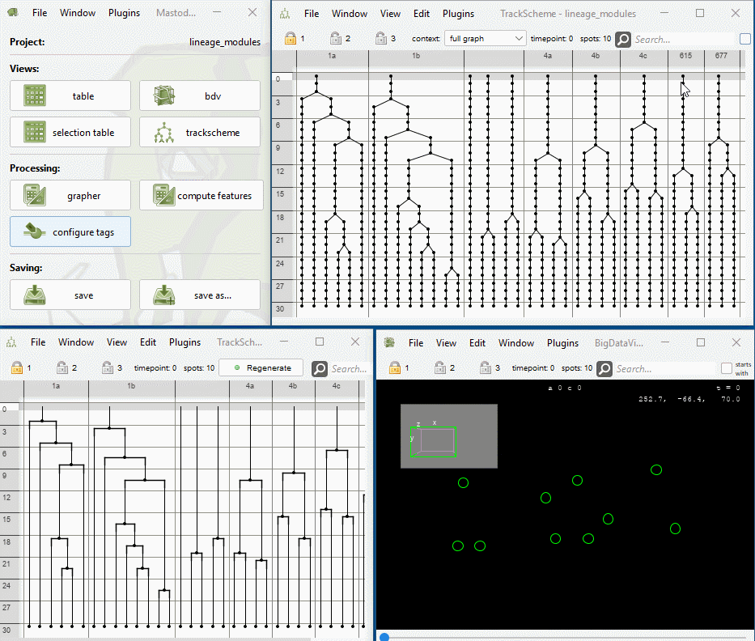

# Lineage Motif Search

* Menu Location: `Plugins > Lineage Analysis > Lineage Motif Search`
* This command is capable of finding lineage motifs that are similar to a motif defined by a selection of the user.
* The linage motif search operates on Mastodon's branch graph.
* Lineage trees are considered similar if they share a similar structure and thus represent a similar cell division
  pattern. The structure of a lineage tree is represented by the tree topology.
  This tree topology consists of the actual branching pattern and the cell lifetimes,
  i.e., the time points between two subsequent cell divisions.
* The algorithm iterates over the branch graph

## Workflow

1. The user selects a motif in the track scheme, which should be searched for in the lineage trees.
2. The algorithm iterates over each branch in the branch graph using an offset before the first division, which is the
   same as the duration before the first division of the selected motif.
3. For each branch, the algorithm computes the tree edit distance between the selected motif and the branch
   tree. For more details on the tree edit distance, see
   section [Zhang tree edit distance](clustering.md#zhang-tree-edit-distance).
4. The algorithm creates a new tag set and tags the spots belonging to the `n` most similar branches with a color
   that is faded out from the original motif color. `n` is the number of motifs specified by the user. The lower the
   computed distance, the more similar the found motif is to the original motif.

## Usage

1. The user selects a motif in the track scheme, which should be searched for in the lineage trees.
    1. The motif must have exactly one root node, i.e. the selected spots all must be connected to one root spot.
2. Open the dialog. Set the parameters and click on `OK`.
3. Visualize the results in the track scheme and/or the BigDataViewer using `View > Coloring > The generated tag set`.

## Parameters

* Number of motifs
    * The number of motifs to search for in the lineage trees.
    * The given motif will always be included in the results.
* Color
    * A color that will be used to tag spots that are part of a motif. The actual colors will be faded out versions of
      the given color. The more the color is faded, the less similar is the found motif to the original motif.
* Similarity measure:
    1. (default) 1,2
    2. 1
    3. [Zhang](https://doi.org/10.1007/BF01975866) Tree Edit Distance1,2

    * 1Local cost function: 
    * 2Local cost function with
      normalization: 
* Run on:
    * The graph on which the motif search should be run
        1. Branch graph (default):  faster, (sightly) less accurate
        2. Model graph: much slower, (sightly) more accurate
* Load motif from a file:
    * Only available when choosing Find similar motifs based on imported motif
    * The file must be a graph ml file containing a single tree with exactly one root node
    * Such a file can be exported from any Mastodon project using after selecting a tracklet and
      `File > Export > Export selected spots to GraphML (one file)`
* Scaling of the search motif:
    * Only available when choosing Find similar motifs based on imported motif
    * The imported motif can be scaled in time to account for faster or slower cell cycles in the current project
      compared to the project from which the motif had been exported.

## Example

* Demo data: [Example data set](lineagemotifs/lineage_motifs.mastodon)
    * The demo data does not contain any image data.
    * The spatial positions of the spots are randomly generated.
    * When opening the dataset, you should confirm that you open the project with dummy
      images. 
* The track scheme of the demo data contains 10 lineage trees in total.
* Demo usage: 
