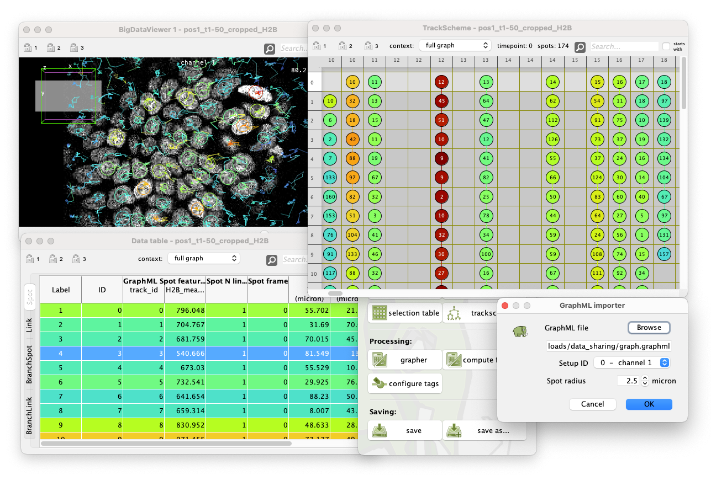

# GraphML Importer

* Menu Location: `File > Import > Import GraphML`
* Description:
    * Imports the data stored in the specified GraphML file into the project.
    * Allows importing spots that have been tracked outside Mastodon
    * Spots have to be saved in a GraphML file with a specific format
    * Besides the spots, also links, labels, track_ids and features can be imported
    * The X, Y, Z coordinates are scaled by the pixel sizes read from the setup with the specified id.
* Command name: `show csv importer dialog`
* Default bindings: Not mapped
* Artifact: mastodon
* Distribution: Included in the Mastodon update site.
* Link to code: https://github.com/mastodon-sc/mastodon/tree/master/src/main/java/org/mastodon/mamut/io/importer/graphml
* The dialog: !

## GraphML format requirements

*
* The GraphML file must contain keys for properties with <code>attr.name</code> 'x', 'y', 'z' and 'frame' to be properly
  imported.
* If it contains the key with <code>attr.name</code> 'label', data with this key is imported as spot labels.
* Other property keys are imported as projections in a new feature.
* Right now, only properties declared for nodes are imported this way.
* The properties are imported in Mastodon with no dimension.

## Example

* Demo data:
    * [graph_t0_t4.graphml](data/graph_t0_t4.graphml)
    * [pos1_t1-5_cropped_H2B.xml](data/pos1_t1-5_cropped_H2B.xml)
      and [pos1_t1-5_cropped_H2B.h5](data/pos1_t1-5_cropped_H2B.h5)
    * Extract of the first 5 frames
    * Data from Hiromune Eto and Jan-Daniël de Leede from the Sonnen lab, Hubrecht Institute, Netherlands, shared with
      permission.
      The image is a 3D timelapse of a mouse intestinal organoid grown as an epithelial monolayer, expressing
      H2B-mCherry. The data was generated by Hiromune Eto. This example contains only the first 5 timeframes
