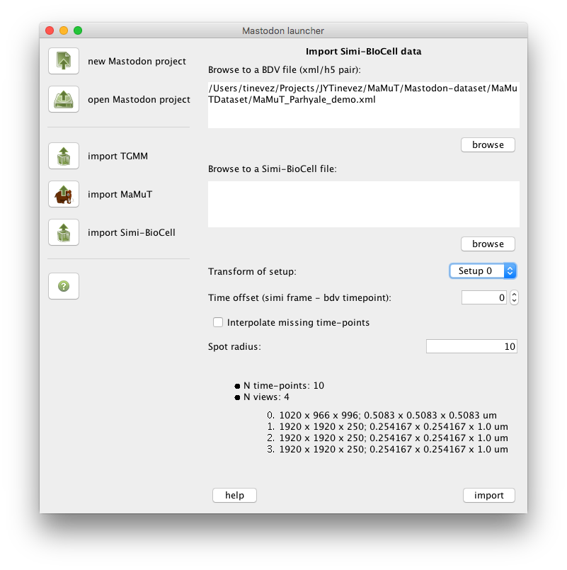

# Simi-BioCell importer.

When starting Mastodon, on the Mastodon Launcher, it is possible to import Simi-BioCell files as a new Mastodon project.



## Simi-BioCell files description.

Simi-BioCell files are normally shipped as a pair of `sbc/sbd` files, but we need only the `sbd` file for import. Both
are text files. The `sbc` file starts with something like this:

```
;***** SIMI∞BioCell *****

;data file description

[BIOCELL]
FILETYPE=DATA
FILEVERSION=400
[DISC]
DISCNAME=Harddisk
```

and the `sbd` file starts with:

```
SIMI*BIOCELL
400
---
0
---
1 1
0
---
1 1 0 0 X
-6000 0 -1 -1
-5 0 -1 -1 -1 6776679
0
---
1 1 0 0 X?
0 0 -1 -1
0 0 -1 -1 -1 6776679
0
---
```

## Import procedure

The BDV file format is made of a pair of `xml/h5` files.

First, browse to a BDV file by clicking on the first browse button or entering the full path to the XML file into the
first text area. The information area at the bottom should display some information gathered from the BDV File.

The `Transform of setup` drop-down list should now be enabled and show the names of the views found in the BDV file.
Select the view on which the Simi-BioCell analysis was run.

Then, browse to a `sbd` file by clicking on the second browse button or entering the full path to the `sbd` file into
the
second text area.

The `Time offset` entry lets you specify whether there is an offset in time, regarding the frames of the image stored in
the BDV file, and the time-points reported in the Simi-BioCell file. A time offset equal to `2` means that the data
stored in the Simi-BioCell file at time-point `2` is to be displayed at the frame `0` of the image data.

The `Interpolate missing time-points` option allows you to create spots for missing frames upon import. If, for
instance, the Simi-BioCell data contains a spot in time-point 0 linked to a spot in time-point 5, spots will be added at
frames 1, 2, 3, and 4, with their positions linearly interpolated between spots at time-points 0 and 5.

The `Spot radius` field allows for specifying the imported spot radius, in the physical units specified in the BDV file.

## Troubleshooting

If the image data appears not to be aligned with the lineage data, check whether you specified the right view in the
`Transform of setup` drop-down list.

Then check whether there should be a time offset entered in the `Time offset` field.
