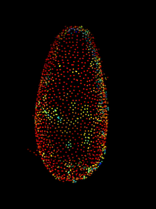
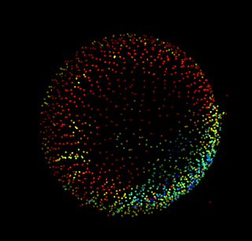
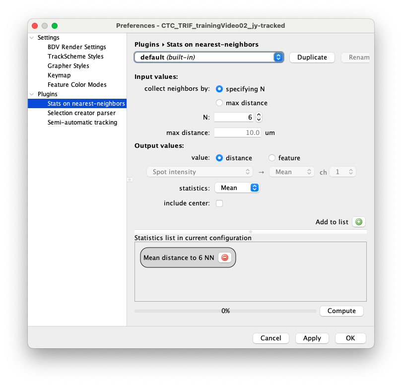
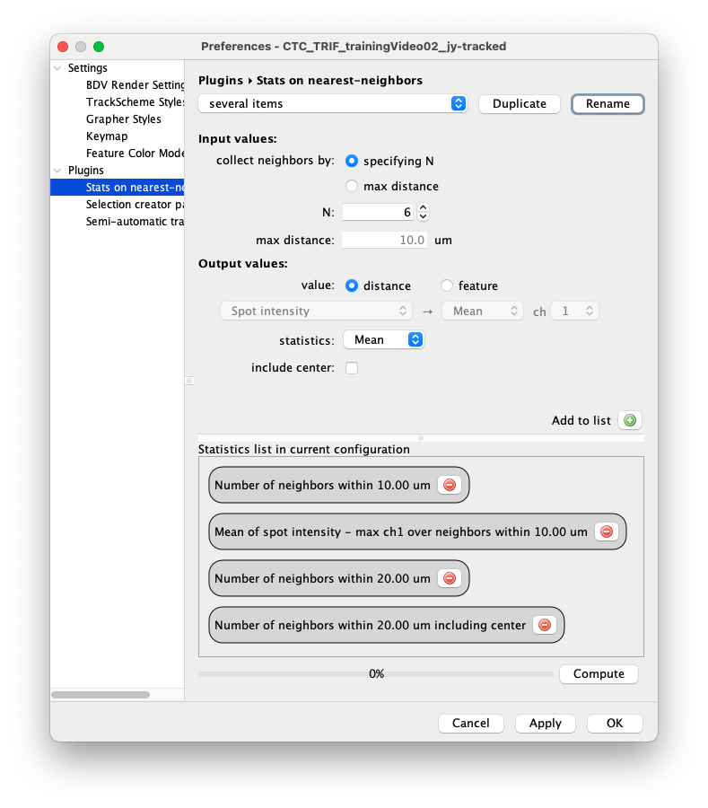
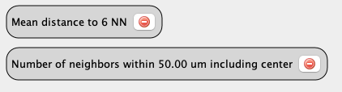
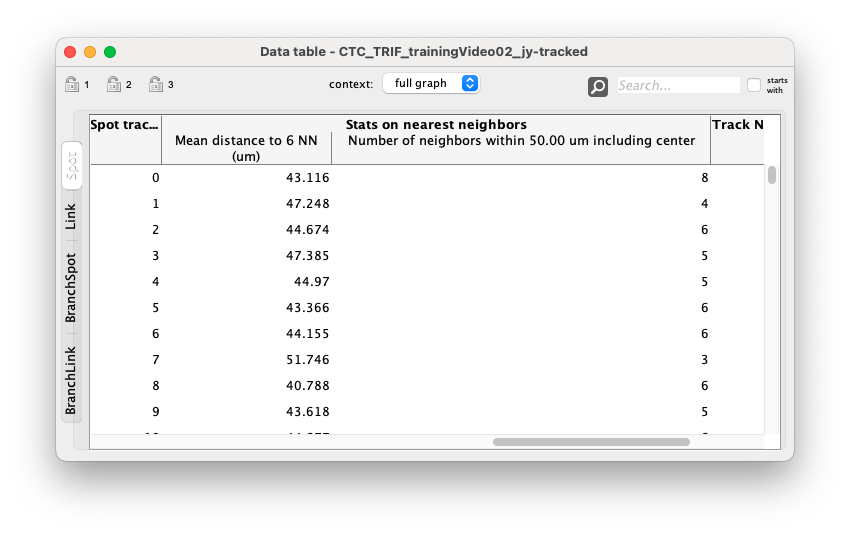
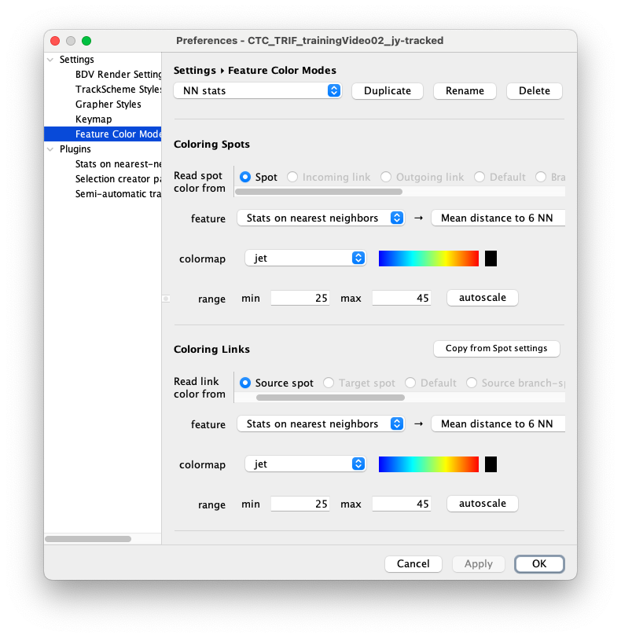

# Statistics on nearest neighbors

| Statistics on nearest neighbors |                                                              |
| ------------------------------- | ------------------------------------------------------------ |
| Menu location                   | *Plugins > Compute Feature > Statistics on nearest neighbors* |
| Description                     | Configurable tool to create spot feature values based on the distance of one spot to its nearest neighbors. |
| Command name                    | `generate statistics on nearest neighbors`                   |
| Default bindings                | Not mapped                                                   |
| In artifact                     | mastodon-pasteur                                             |
| Distribution                    | Included in the Mastodon update site.                        |
| Link to code                    | https://github.com/mastodon-sc/mastodon-pasteur/tree/master/src/main/java/org/mastodon/mamut/nearest |

## Example

This plugin generate statistics in a cell based on its nearest neighbors. 
It can be configured to collect and average any feature values on the N nearest neighbors around each cell.
For instance you can use it to measure the mean distance to 6 nearest cells for all cells in a Tribolium embryo:

 

The color encodes for the mean distance, blue: 25 µm, red: 45 µm.  The image data is a TRIF training video 02 from the [Cell Tracking Challenge ](https://t.co/yBHxrjjRmW), used with authorization.

## Usage

### How does it work

For each cell, the plugin collects the N nearest-neighbors, or all the nearest-neighbors within a fixed distance. It then computes and store in the cell statistics based on the distance to these neighbors, or based on a feature value of these neighbors. 
For instance you can compute the mean distance to the 6 nearest-neighbors as above, and / or compute the mean of the fluorescence intensity in all the neighbors cells within 100 µm.
These values are then stored in a special features of Mastodon, and can be used and accessed as any other numerical feature.

### Configuration

This plugin is highly configurable. 
The statistics are configured generated from a page in the plugin section of the preference page (`ctrl ,` or _File > Preferences..._):

{align="center"}

It uses the same system than for other configuration pages, which mean that you can save a configuration and retrieve it later. 
With the _default_ configuration, the mean distance to the 6 nearest neighbors will be computed for each cell. 

The top part of the panel is used to create and configure a statistics item. 
It is then added to the list of items with the `Add to list` button.
All the statistics in the list will then be computed when the user press the `Compute` button.

In the top panel, the configuration options are the following:

**Input values**

- **`collect neighbors by:`** If you choose `specifying N` then a fixed numbers of nearest neighbors will be included in the statistics. If you choose `max distance` then all the cells within this distance will be included. Then you can specify one of these two values in the **`N`** or **`max distance`** fields.

**Output values**
Once the nearest-neighbors are collected, this part specify what we compute on them.

- **`value:`** You can specify whether you want to compute a statistics based on a feature value or on the neighbors themselves. If you selected `specifying N` above, then you will be able to make statistics on the distance of these neighbors. If you selected `max distance`, then you will be able to report how many neighbors are found within this radius.

If you choose `feature` then you can specify what feature values to extract in the feature selector just below. 
This value will then be fetched for all the collected neighbors.

- **`statistics:`** This lets you specify how to summarize the distribution of values, with the mean, median, max, min, sum or standard deviation.

- **`include center:`** Finally, you can specify whether you want to include values for the center cell itself in the statistics by checking this box. It comes on top of the N cells possibly specified above.

### Several statistics item

It is perfectly possible to specify several statistics item.
They will all be computed at once, and appear in separate columns in the data table.
For instance after playing with the `Add to list` button:

{align="center"}

The items you don't want can be removed by pressing the red `-` button on its token in the list.

### Computing and using statistics values

Pressing the `Compute` button triggers the calculation of all the statistics item that are in the  configuration currently selected.
For instance, the following list:

{align="center"}

will trigger the calculation of statistics that will appear in a feature called `Stats on nearest neighbors` with two projections: `Mean distance to 6 NN` and `Number of neighbours within 50.0 um including center`:

{align="center"}

This feature be then used in the grapher, or to generate a colouring of the data, as was done in the movies above:

{align="center"}

## Limitations

> :warning: **The statistic values are not recalculated automatically when you edit the data**. If you add, remove or move a cell, the stats will not be valid anymore. You need to recompute them again by pressing the `Compute` button on the NN Stats page.
