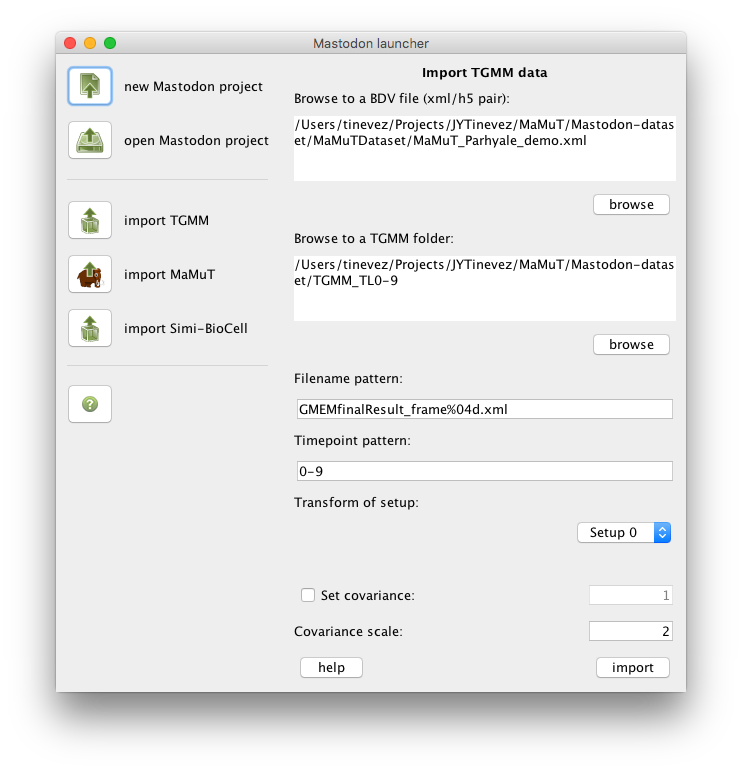

# TGMM importer

This panel lets you import the lineage data generated with the TGMM (Tracking with Gaussian Mixture Models) software
tool. For information about TGMM, read the following paper:

Amat F, Lemon W, Mossing DP, McDole K, Wan Y, Branson K, Myers EW, Keller PJ. *Fast, accurate reconstruction of cell
lineages from large-scale fluorescence microscopy data.* [**Nature Methods. 2014;11:951.
**](https://www.nature.com/articles/nmeth.3036) doi: 10.1038/nmeth.3036

## The TGMM file structure

TGMM outputs a folder containing one XML file per time-point. For instance:

```shell
tinevez@lilium:~/Development/Mastodon/TrackMate3$ ls -1  ~/Projects/JYTinevez/MaMuT/Mastodon-dataset/TGMM_TL0-9/
GMEMfinalResult_frame0000.xml
GMEMfinalResult_frame0001.xml
GMEMfinalResult_frame0002.xml
GMEMfinalResult_frame0003.xml
GMEMfinalResult_frame0004.xml
GMEMfinalResult_frame0005.xml
GMEMfinalResult_frame0006.xml
GMEMfinalResult_frame0007.xml
GMEMfinalResult_frame0008.xml
GMEMfinalResult_frame0009.xml
```

Each XML file contains the lineage data, linking to TGMM file in previous time-points if needed. A TGMM file starts like
this:

```
<?xml version="1.0" encoding="utf-8"?>
<document>
<GaussianMixtureModel id="0" lineage="0" parent="-1" dims="3" splitScore="0" scale="1 1 1 "
nu="38.2708" beta="38.2708" alpha="38.2708" m="855.173 507.877 806.944 " W="0.00340707 0.00209769 0 0.00209769 0.00397173 0 0 0 0.00410872 "
nuPrior="4" betaPrior="-1" alphaPrior="0" distMRFPrior="0" mPrior="855.173 507.877 806.944 " WPrior="0.0325978 0.02007 0 0.02007 0.0380002 0 0 0 0.039311 " svIdx="51 ">
</GaussianMixtureModel>
<GaussianMixtureModel id="1" lineage="1" parent="-1" dims="3" splitScore="0" scale="1 1 1 "
nu="5.16494" beta="5.16494" alpha="5.16494" m="908.81 580.504 433.433 " W="0.0212964 0.000765177 0 0.000765177 0.00999115 0 0 0 0.0430209 "
nuPrior="4" betaPrior="-1" alphaPrior="0" distMRFPrior="0" mPrior="908.81 580.504 433.433 " WPrior="0.0274986 0.000988023 0 0.000988023 0.0129009 0 0 0 0.05555 " svIdx="58 ">
</GaussianMixtureModel>
<GaussianMixtureModel id="2" lineage="2" parent="-1" dims="3" splitScore="0" scale="1 1 1 "
nu="18.7463" beta="18.7463" alpha="18.7463" m="825.041 691.186 715.285 " W="0.00913546 0.00335316 0 0.00335316 0.00771559 0 0 0 0.011853 "
nuPrior="4" betaPrior="-1" alphaPrior="0" distMRFPrior="0" mPrior="825.041 691.186 715.285 " WPrior="0.042814 0.0157148 0 0.0157148 0.0361597 0 0 0 0.05555 " svIdx="66 ">
</GaussianMixtureModel>
```

## Import procedure



The BDV file format is made of a pair of `xml/h5` files.
First, browse to a BDV file by clicking on the first browse button or entering the full path to the XML file into the
first text area. The information area at the bottom should display some information gathered from the BDV File.

The `Transform of setup` drop-down list should now be enabled and show the names of the views found in the BDV file.
Select the view on which the TGMM analysis was run.

Also: The `Timepoint pattern` field will be updated with the time-point information found in the BDV file. For instance,
if there are 10 time-points starting from 0 in the file, the time-point pattern will be updated with the text `0-9`. The
syntax for this pattern lets you handle various cases. It must be enumerations separated by commas, and each entry can
be a single number, a range (e.g. `4-100`) or a range in intervals (e.g. `0-30:10` – which is equivalent to
`0,10,20,30`).

You must now browse to a **folder** containing the TGMM files. There can be other files in the TGMM folder, but the TGMM
file names should follow the pattern specified in the `Filename pattern` field. This field contains default naming that
should work.

The importer will check whether it can find all the TGMM files, based on the file-name pattern entered in the
`Filename pattern` field and the time-point pattern specified in the `Timepoint pattern` field. For instance, if the
time-point pattern is `0-10`, but only TGMM files ranging from 0 to 9 can be found, the following warning will be
displayed:

```
Cannot find file /Users/tinevez/Projects/JYTinevez/MaMuT/Mastodon-dataset/TGMM_TL0-9/GMEMfinalResult_frame0010.xml in the TGMM folder.
Found 10 files matching the TGMM filename and timepoint patterns in folder.
```

If the `Set covariance` checkbox is selected, the importer will override the covariance found in the TGMM file with a
fixed value, specified in the field next to the checkbox.

The `Covariance scale` allows to specify how to convert from covariance to ellipsoid size. It is in units of sigmas of
the Gaussian mixture. The default value of 2 is reasonable if you did not scale the image data.
