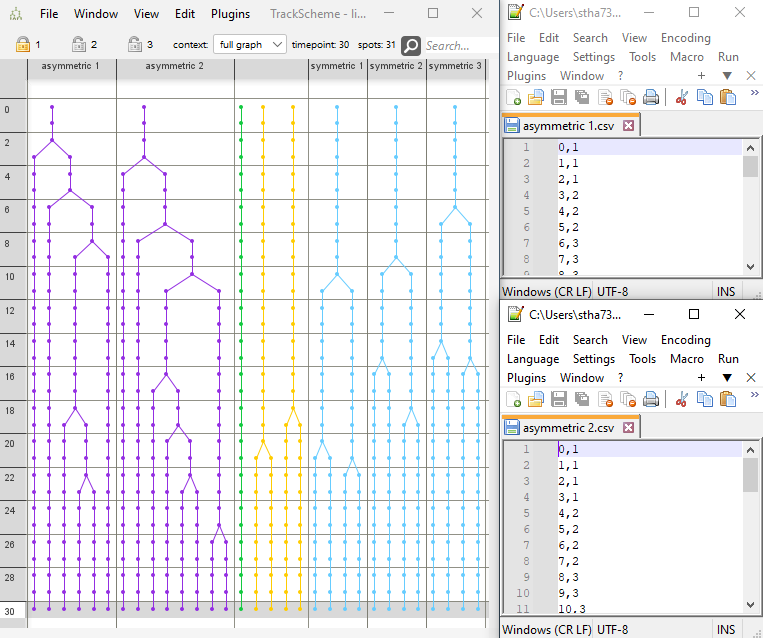
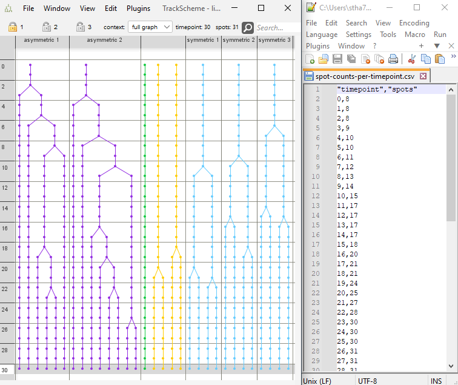

# Export measurements

## Export spot counts per lineage

* Menu Location: `File > Export > Export measurements > Export spot counts per lineage`
* Export spots counts per lineage per time point.
* If spots are selected, only lineages with selected spots are included, otherwise all lineages are included.
* Results in one CSV file per lineage.
* Example: 

## Export spot counts per time point

* Menu Location: `File > Export > Export measurements > Export spot counts per time point`
* This command writes the time point and the number of spots at each time point to a single CSV file.
* Example: 
