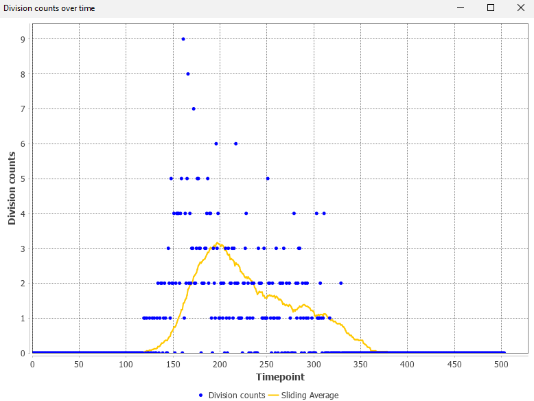

# Lineage analysis

## Show division counts over time

* Menu Location: `Plugins > Lineage analysis > Show division counts over time`
* The command shows a plot of the number of divisions over time.
* It is possible to set a window size, which is used to compute a sliding average.
* A division is defined as a spot with more than one outgoing edge.
* Example: 
