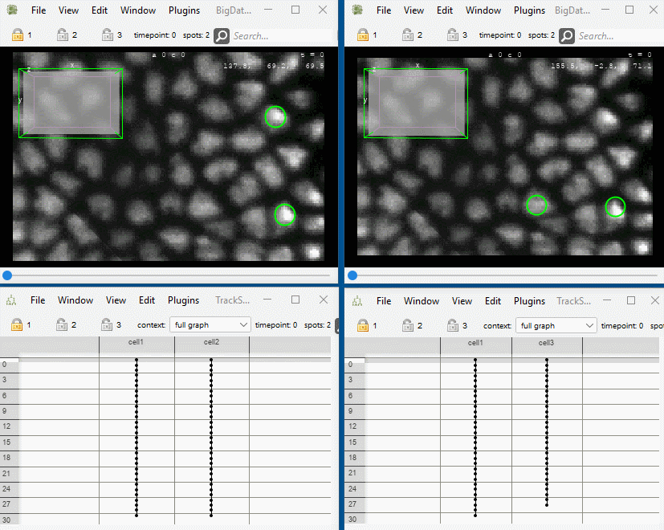
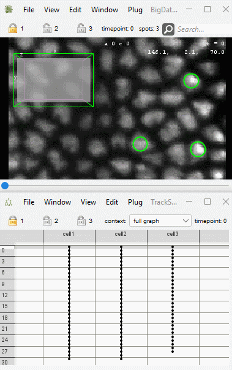

# Merge Projects

* Menu Location: in FIJI (not in Mastodon) `Plugins > Tracking > Mastodon > Merge Two Projects`
* The command is able to merge tracking data from two projects that refer to the same image data.
* Tracking data from the `Project B` is added to the `Project A` and the result is opened in a new project, which can be
  saved by the user.
* While merging `Project B` into `Project A`, the command tries to omit spots and links from `Project B` that already
  exist in `Project A`. The detection of duplicates is based on spatial proximity.
* The parameters `Absolute distance cutoff` and `Mahalanobis distance cutoff` can be used to adjust the sensitivity of
  the duplicate detection. Higher values will lead to more spots and links being considered as duplicates and thus in
  less spots and links being added to the merged project.
* Example:
    * Input projects (left `Project A`, right
      `Project B` ):
      

    * Resulting project:
      
