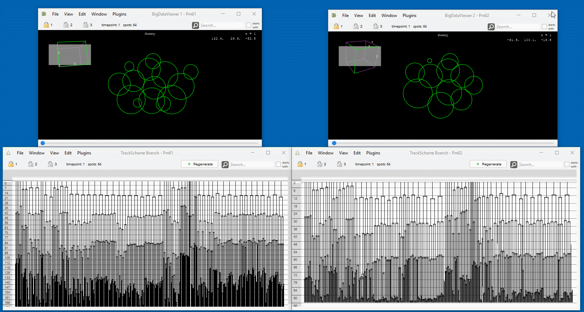

# Spatial Track Matching

The **Spatial Track Matching** plugin in Mastodon enables the comparison of two datasets showing stereotypically developing embryos. Typically, Mastodon datasets operate independently without interaction. This plugin, however, allows users to select two open datasets in Mastodon and compute the correspondence between their cells.

Once correspondence is established, the plugin offers several operations, such as:
- Synchronizing the focused cell between two datasets.
- Copying cell names from one dataset to another.
- Copying "tag sets" between datasets.
- Sorting tracks in Mastodon's TrackScheme to match the other dataset.
- Plotting angles between cell division directions.

## Datasets Restriction

The plugin has specific requirements for supported datasets:
- Both datasets must feature stereotypically developing embryos of the same species.
- The datasets must begin at a similar developmental stage, with at least three dividing cells. \
  (If the datasets start at different stages or too early e.g., fewer than three dividing cells,
  users can specify a "first frame" to align them. Any data before this frame is ignored.)
- At the initial stage, all cells must be manually named, and their names must match between the two datasets.

The plugin has been successfully tested on the following: *Macrostomum* embryos (starting at the 4-cell stage),
*Platynereis* embryos (starting at ~32-cell stage), *Phallusia mammillata* embryos (starting at ~64-cell stage).

Note: Cells or tracks without divisions are ignored by the plugin.

## Installation

The plugin is included in the **"Mastodon-Tomancak"** collection of plugins for Mastodon.
To install it in Fiji, activate the update sites: **Mastodon** and **Mastodon-Tomancak**.\
(For help read the guide on [how to follow an update site](https://imagej.net/update-sites/following).)

## Usage

First make sure to have the update sites installed and restart Fiji.

To use the plugin:
1. Open two Mastodon datasets containing stereotypically developing embryos.\
   Example datasets can be found [here](https://github.com/mastodon-sc/mastodon-example-data/blob/master/astec/).
1. Make sure to have the initial cells named with corresponding names in both dataset.\
   (Cells/spots can be renamed in Mastodon by pressing `F2`.)
1. In the Mastodon menu navigate to `Plugins > Lineage Analysis > Spatial Track Matching`.\
   A dialog box, "Spatial Track Matching Across Two Mastodon Projects," will appear. 
1. Select your projects as project A and project B.
1. (Optional: If the datasets start at different stages, specify a "first frame" to align them. Any data before this frame is ignored.)

Now by clicking one of the available buttons, these actions can be performed:
- Sorting TrackSchemes of one dataset to be consistent with the order.
- Copying tag sets between datasets.
- Plotting angles between cell division directions.
- Clicking a lock icon  will suncronized the focus of cells between the two datsets. This works best together with the "Branch TrackScheme" opened for both datasets.
- Renaming cells in one dataset to match the other.

## Example

* project A (left
  side): [Phallusia mammillata](https://github.com/mastodon-sc/mastodon-example-data/blob/master/astec/Pm01.mastodon)
* project B (right
  side): [Phallusia mammillata](https://github.com/mastodon-sc/mastodon-example-data/blob/master/astec/Pm02.mastodon)
* Visualisation: 

---
---
Here’s the revised and polished version of your text. I've improved grammar, flow, and clarity while maintaining the technical details:

---

## Algorithm for Finding Cell Correspondences

### Principle

Let’s assume we have Mastodon datasets for two embryos, which we’ll call embryo X and embryo Y. Both datasets start at the four-cell stage, and these initial cells have been labeled by an expert as A, B, C, and D. At this initial timepoint, we already know the correspondence: cell A in embryo X corresponds to cell A in embryo Y, cell B in embryo X corresponds to cell B in embryo Y, and so on.

Now, when a cell divides—for instance, cell B in both datasets—the question arises: how do the two daughter cells of cell B in embryo X correspond to the two daughter cells of cell B in embryo Y?

To answer this question, lets first name the daughter cells for convenience: X1 and X2 in embryo X, and Y1 and Y2 in embryo Y.

There are only two possible correspondences for the daughter cells:
1. X1 corresponds to Y1, and X2 corresponds to Y2.
2. X1 corresponds to Y2, and X2 corresponds to Y1.

To determine the correct correspondence, our strategy is to spatially align the embryos with one another.
We use the known correspondences (A ↔ A, B ↔ B, C ↔ C, D ↔ D) to calculate the rotation, translation, and scaling of embryo Y that minimizes the sum of squared distances between cells A, B, C, and D in both datasets.

Once the embryos are aligned within the same coordinate system, we can compare directions in both datasets. Mastodon provides the coordinates for all cells at all timepoints, allowing us to compute the vectors (directions) between the daughter cells: from X1 to X2 (purple arrow) and from Y1 to Y2 (green arrow). We call those vectors between the daugther cells, *cell division direction*. The angle between these two vectors can then be calculated.

The angle determines the correct correspondence:
- If the angle is less than 90 degrees, the correspondence is X1 ↔ Y1 and X2 ↔ Y2.
- If the angle is greater than or equal to 90 degrees, the correspondence is X1 ↔ Y2 and X2 ↔ Y1.

This simple yet effective approach lets us find the correspondence for a cell division, provided we already know the correspondence for the parent cells. By repeating this process for all cell divisions in the Mastodon datasets, we can establish the full set of correspondences between the two datasets.

Certainly! Here’s an improved version of your paragraph with clearer phrasing, improved grammar, and enhanced readability:

### Correctness of the Result

There is no guarantee that the determined correspondences are biologically accurate or relevant. However, the method provides an indication of the quality of the computed correspondences. By analyzing the angle between the cell division directions, we can assess their reliability. Angles close to 0° or 180° strongly suggest a specific correspondence, whereas angles near 90° offer only a weak distinction between the two possible options.

The Spatial Track Matching dialog includes an option to plot cell division angles (<i>"plot angles"</i>). Below is an example of such a plot:

The plot illustrates the cell division angles corresponding to matched cell divisions between two embryos.
Up to timepoint 300, there are almost no division angles close to 90°,
which indicates that the spatial track matching works reliably within this range.
However, there are two cell division angles near 90° early on,
which might suggest developmental differences between the two embryos.

### Alignment of the Two Datasets

The algorithm for finding correspondences relies on the angles between cell division directions in the embryos. Achieving a good alignment between the two embryos/datasets is critical for obtaining high-quality results. To facilitate this, three slightly different methods have been implemented for computing the alignment:

#### 1. Fixed Spatial Registration Based on Root Cells

This is the simplest approach and works well when the embryos remain relatively stationary during the recording. The alignment is based on the correspondence between the initial root cells (e.g., A ↔ A, B ↔ B, C ↔ C, D ↔ D). These root cells appear in multiple timepoints in the cell tracking data.

For each root cell (e.g., cell A), there is not just one coordinate vector, but one for each timepoint before the cell divides. To simplify, the last coordinate vector before division is used. If there are four root cells (A, B, C, D), we extract one coordinate vector for each of these cells in embryo X and another set for the same cells in embryo Y. These vectors are then aligned by computing a transformation (translation, rotation, and scaling) that minimizes the squared distances between corresponding vectors. This transformation is used to align embryo Y with embryo X.

#### 2. Dynamic Spatial Registration Based on Root Cells and Their Descendants

This approach is more dynamic and works even if the embryos rotate during the recording. It starts with the correspondence between the initial root cells (e.g., A ↔ A, B ↔ B, C ↔ C, D ↔ D). 

For each root cell (e.g., cell A), instead of extracting a fixed position vector. We extract a position vector by timepoint which will be denoted as P(A,X,t), where A is the cell, X is the embryo and t is the timepoint. If the timepoint t is between the appearance of the cell A and its cell division, P(A,X,t) will simply denote the position vector of the cell A. Afterwards when the cell has divided into two daugther cells, it will be the average position of the two daugther cells of cell A at that time point. When the daughter cells divide further, it will simply be the average position of all the descendants of cell A at the time point in embryo A.

This approach gives us a position for each initial cell at each timepoint for both embryos. So for our example we would have:
- for embryo X: P(A,X,t), P(B,X,t), P(C,X,t), P(D,X,t)
- for embryo Y: P(A,Y,t), P(B,Y,t), P(C,Y,t), P(D,Y,t). 

When comparing a cell division in embryo X at timepoint t_X with a cell division in embryo Y at timepoint t_Y,
the algorithm aligns the positions P(A,X,t_X+2), ..., P(D,X,t_X+2) with P(A,Y,t_Y+2), ..., P(D,Y,t_Y+2). The resulting rotation is then used to transform the cell division directions in embryo Y into the coordinate system of embryo X before calculating the cell division angle.

Since this transformation depends on the timepoints of the cell division, it changes dynamically over time. This allows the algorithm to compensate for movement (specifically rotation) of the embryos during the recording.

#### 3. Dynamic Spatial Registration Based on the "Landmarks" Tag Set

The method is similar to the second approach, except that instead of relying on the root cells and their descendants, it uses the tagged cells.
A tag set named "landmarks" has to be present in both Mastodon datasets. The tag names in the "landmarks" tag set must match between the two datasets.
The only difference to approach 2 is that rather of calculating a average position P(A,X,t) of the descendants of cell A in embryo X at timepoint t. We instead compute P(S, X, t) the avarage position of the spots labeled with tag S at timepoint t in embryo X.

### Remarks

In the first timepoints after cell division the daugther cells usually move a lot. To reduce the noise when computing a cell division direction, we avarage over the position of the daugther cell in the three time points after cell division. This has the effect that the "timepoint of the cell division direction" is t + 2, if t denotes the last timepoint before cell division. This is also the reason why an offset t+2 is used when computing the dynamic spatial registration.

## Operations based on the correspondence information

The plugin allows performing various operations based on the correspondence information, such as:

* Couple projects:
    * Spot highlighting and focus are synchronized between the two projects.
    * Navigation to a clicked spot is synchronized for the selected `sync group`.
    * Synchronization works best between the TrackScheme Branch and TrackScheme Hierarchy windows.
    * Synchronization is only implemented for spots, not for links.
* Sort TrackScheme based on the correspondences
    * Orders the descendants in the TrackScheme of the chosen project such that their order matches the order in the
      other project.
* Copy cell names
    * The correspondences are on the level of cells. This is why all the spots that belong to the same cell will get
      the same label. Labels of individual spots can not be copied.
    * The label of the first spot of a cell is assumed to be the cell name.
    * This assumption is different from the TrackScheme Branch. Which actually shows the label of the last spot as
      the label of the branch.
* Copy tags between the corresponding cells in both embryos:
    * Use the found correspondences to copy a tag set from one project to the other.
    * The correspondences are on the level of cells / branches thus tags are only copied if the entire cell / branch
      is tagged. Tags on individual spots are not copied.
* Plot cell division angles
    * Show a plot of angles between paired cell division directions over time
* Add angles to table
    * Stores the angles between paired cell division directions as a feature in both projects.
* Color paired lineages
    * Creates a new tag set `lineages` in both projects. Lineages with the same root node label get a tag with the
      same color.

## Parameters and Track Matching Methods

* project A: the first project to compare
* project B: the second project to compare
* First frame: The first time point of a project to be used for the registration.
    * This is useful if
        * both projects start at different stages of development
            * e.g. one project starts at the 4-cell stage and the other at the 8-cell stage
            * in this case, the user can set the first frame of both projects to the same stage (i.e. the 8-cell stage)
        * there are less than three cells in the first time point
            * in this case, the user can set the first frame to a later time point where there are at least three cells
              in both projects.
* Spatial track matching method:
    * Fixed spatial registration based on root cells
      (see [above](#1-fixed-spatial-registration-based-on-root-cells))
    * Dynamic spatial registration based on root cells and their descendants
      (see [above](#2-dynamic-spatial-registration-based-on-root-cells-and-their-descendants))
    * Dynamic spatial registration based on "landmarks" tag set
      (see [above](#3-dynamic-spatial-registration-based-on-the-landmarks-tag-set))

