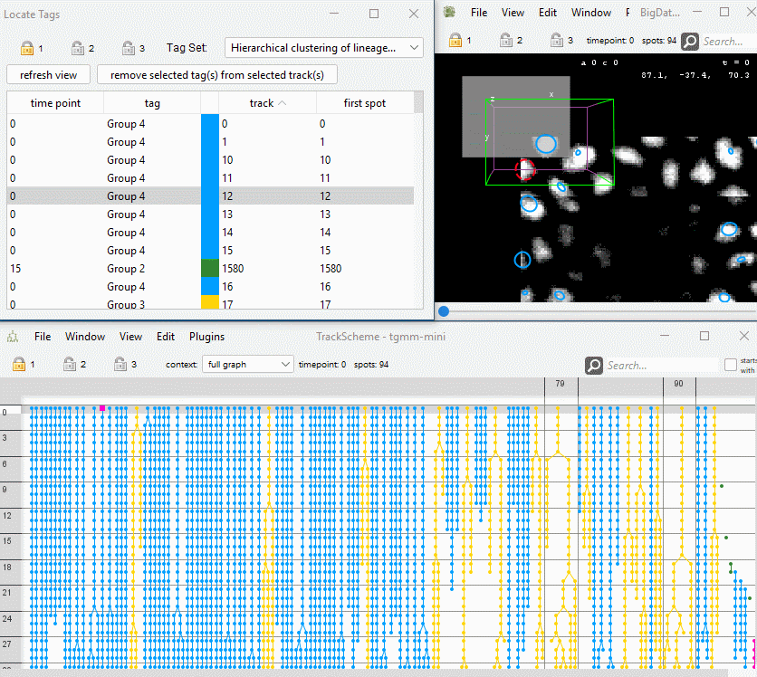
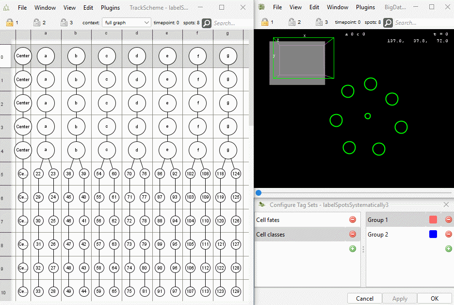
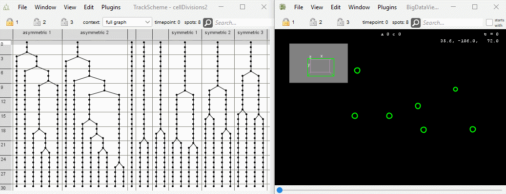
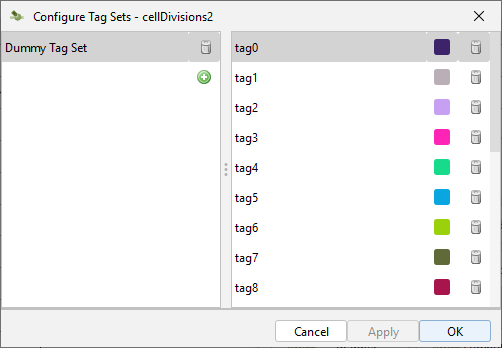

# Tags

## Locate tags

* Menu Location: `Plugins > Tags > Locate tags`
* Opens a window with a list showing tracks and tags assigned to them.
  The time point and the spot (identified via its label) of the first occurrence of the tag in a track are shown.
* The user can select a tag-track combination in the list and linked views will navigate to the corresponding spot.
  The spot will be selected and highlighted.
* Tags can be removed from the selected spots.
* Example: 

## Copy tags

* Menu Location: `Plugins > Tags > Copy tag`
* Allows the user to assign a tag to spots under the condition that the spots already have a certain tag that can be
  specified by the user.
* Example: 

## Add tag set to highlight cell divisions

* Menu Location: `Plugins > Tags > Add tag set to highlight cell divisions`
* The command creates a tag set that highlights cell divisions. The user interface allows to specify the number of spots
  to highlight before and after a division.
* The colors for highlight background can be selected.
* Example: 

## Create Dummy Tag Set

* Menu Location: `Plugins > Tags > Create Empty Tag Set`
* Creates a tag set with a specified number of tags in random colors.
* Example: 
