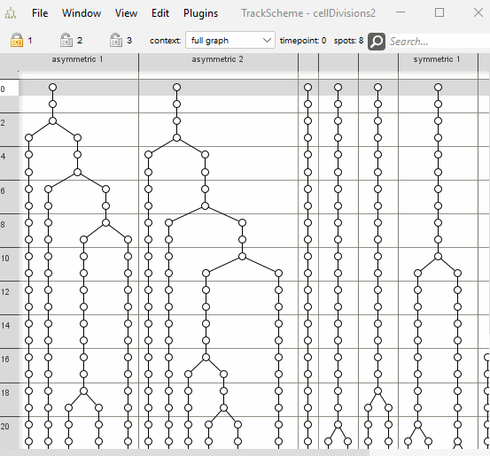
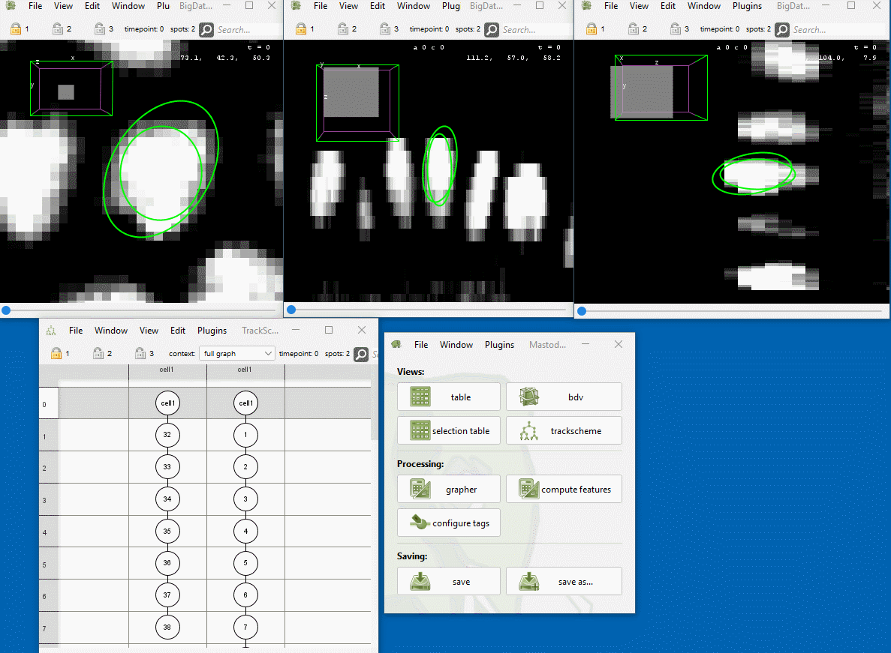
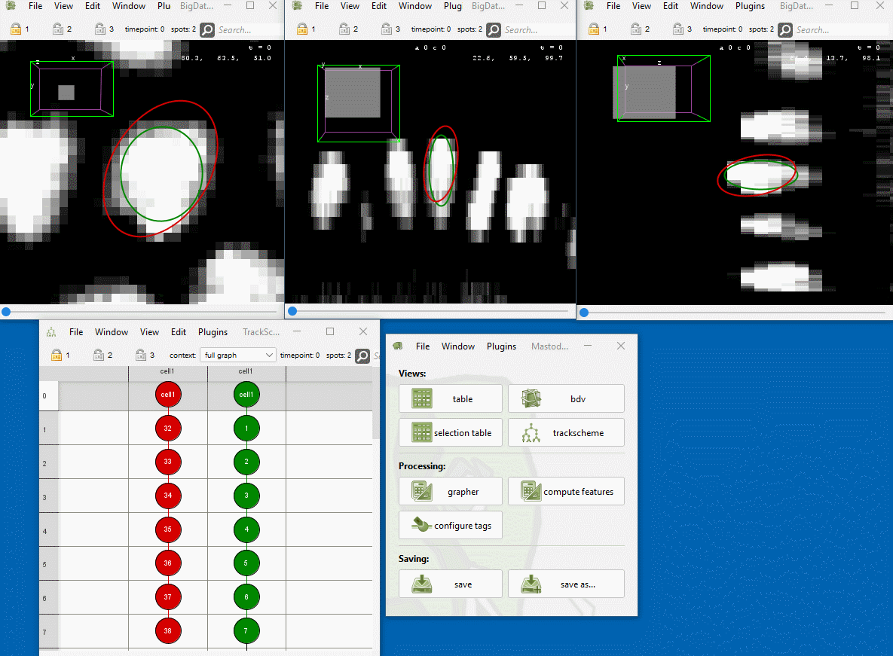
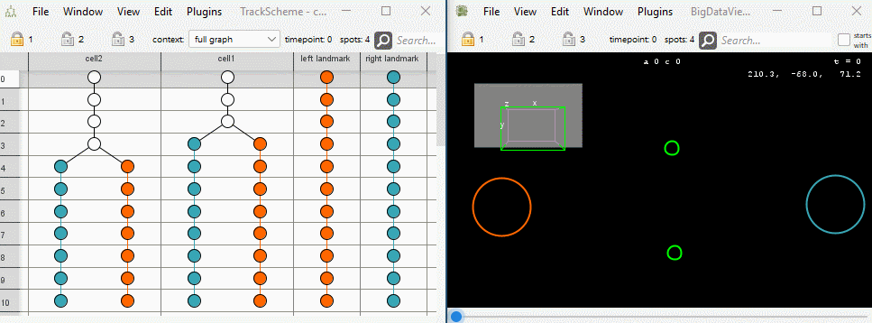
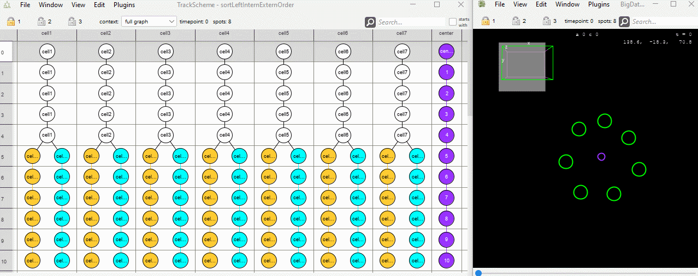
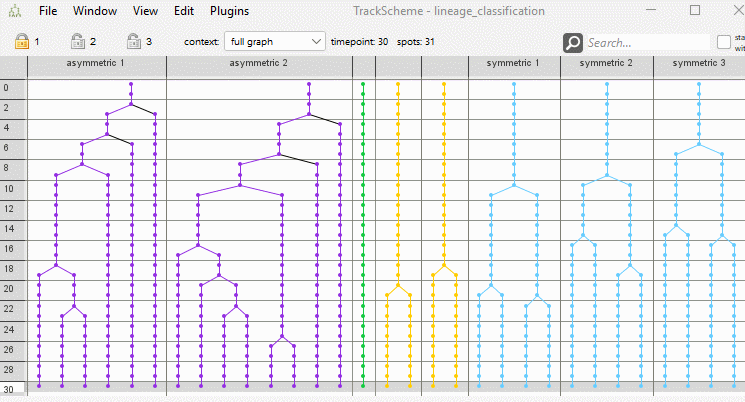
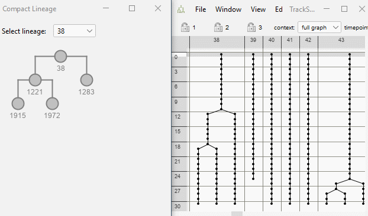

# Trees management

## Flip descendants

* Menu Location: `Plugins > Trees management > Flip descendants`
* Flip children of the currently selected and focused spot in the track scheme graph.
* Example: 

## Conflict resolution

### Create conflict tag set

* Menu Location: `Plugins > Trees management > Conflict resolution > Create conflict tag set`
* During tracking it can happen that the same objects has been detected multiple times at similar positions in the
  image. The result of this are overlapping spots in the tracking data that actually represent the same object.
* This command searches for overlaps (aka 'conflicts') in the tracked spots that may indicate such situations.
* The command creates a new tag set with the name "Conflicting Spots" that contains tags for all the detected conflicts.
* Two spots are considered to be in conflict if they overlap to a certain degree.
    * More precisely, the Hellinger
      distance [1](https://en.wikipedia.org/wiki/Hellinger_distance), [2](https://www.ncbi.nlm.nih.gov/pmc/articles/PMC3582582/figure/F11/)
      between the ellipsoids of the spots is computed.
    * The spots are considered to be in overlapping / in conflict, if the distance is below a threshold that can be set
      by the user:
        * Only spheres that strongly overlap are considered to be in conflict. (0.3)
        * Two spheres with a moderate overlap are considered to be in conflict. (0.5)
        * Two spheres that slightly touch are considered to be in conflict. (0.7)
* Example: 

### Fuse selected spots

* Menu Location: `Plugins > Trees management > Conflict resolution > Fuse selected spots`
* The currently selected spots are fused into a single track. For each time point, the position and covariance of the
  selected spots are averaged and assigned to a fused spot.
* The selected spots must fulfill very specific requirements. As shown here:

<pre>
     before:                                 after fusion:
     (selected spots are marked with *)

     A1      B1      C1                      A1   B1  C1
     |       |       |                         \  |  /
     A2*     B2*     C2*                          A2
     |       |       |           ---&gt;             |
     A3*     B3*     C3*                          A3
     |       |       |                         /  |  \
     A4      B4      C4                      A4   B4  C4
</pre>

* The selected spots must belong to a fixed number of branches. And in each branch, the same number of spots must be
  selected and the spots must be at the same time points.
* One of the branches is considered to be the "focused" branch. (If a spot is focused that containing branch will be
  that "focused" branch.) The spots in the focused branch are kept. Their position and covariance are updated to the
  average of the selected spots of the same time point. The other selected spots, that are not in the "focused" branch,
  are removed.
* New edges are added as if the spots were actually fused.
* Example: 

## Sort track scheme

### Sort lineage tree (left-right-landmarks)

* Menu Location: `Plugins > Trees management > Sort trackscheme > Sort lineage tree (left-right-anchors)`
* Sorts the order of sub lineages in the track scheme.
* Cell closer to the left landmark, are put to the left side.
* Cells closer to the right landmark are put to the right side.
* The user can specify the left and right landmark by selecting tracks.
* The user can specify if the entire tree should be sorted, only selected subtrees or subtrees with a specific tag.
* Example: 

### Sort lineage tree (extern-intern)

* Menu Location: `Plugins > Trees management > Sort trackscheme > Sort lineage tree (extern-intern)`
* Sorts the order of the sub lineages in the track scheme.
* Cells further away from the center landmark, are put to the left side.
* Cells closer to the center landmark, are put to the right side.
* The user can specify the center landmark by selecting a track.
* The user can specify if the entire tree should be sorted, only selected subtrees or subtrees with a specific tag.
* Example: 

### Sort lineage tree (cell life cycle duration)

* Menu Location: `Plugins > Trees management > Sort trackscheme > Sort lineage tree (cell life cycle duration)`
* Sort selected spots such that the child cell with the longer cell cycle duration (aka branch duration) is arranged to
  the left in the TrackScheme.
* If no spots are selected, the entire track scheme is sorted.
*

Example: 

### Show compact lineage

* Menu Location: `Plugins > Trees management > Show compact lineage`
* Shows a compact representation of the lineage tree, i.e. only the roots, leaves and spots immediately before a
  division are shown.
* Example: 
