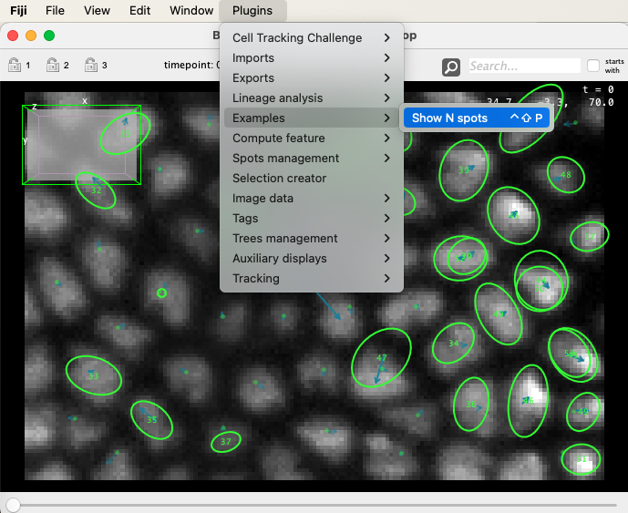
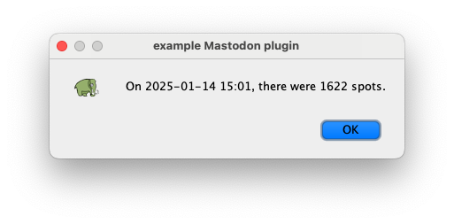
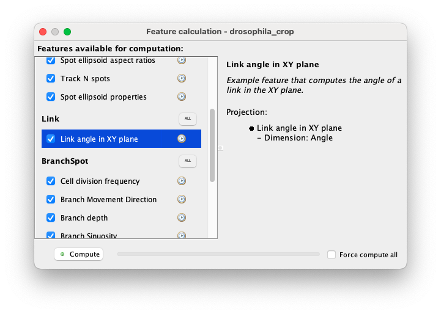
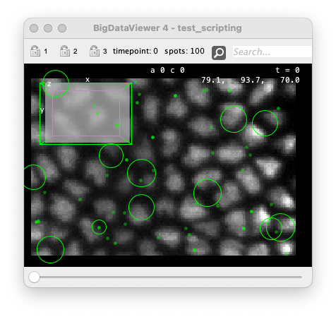
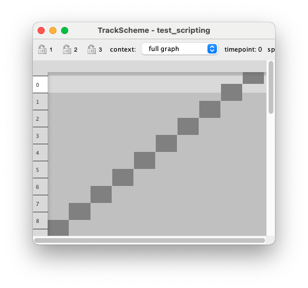
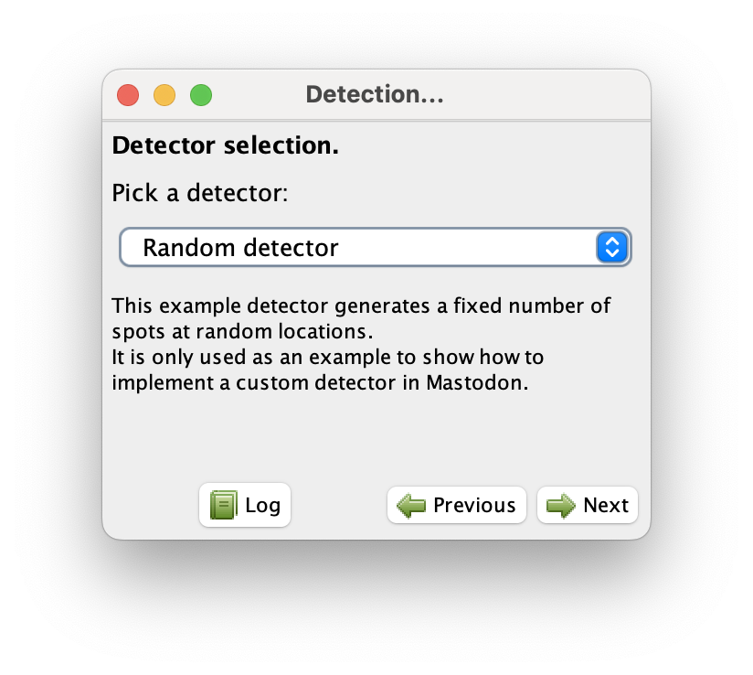
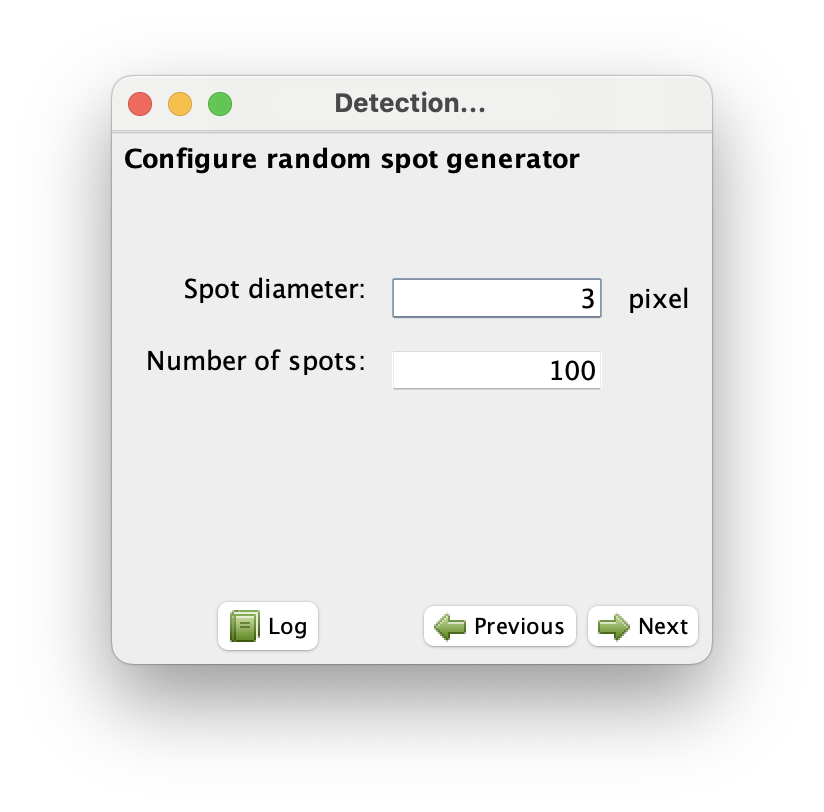
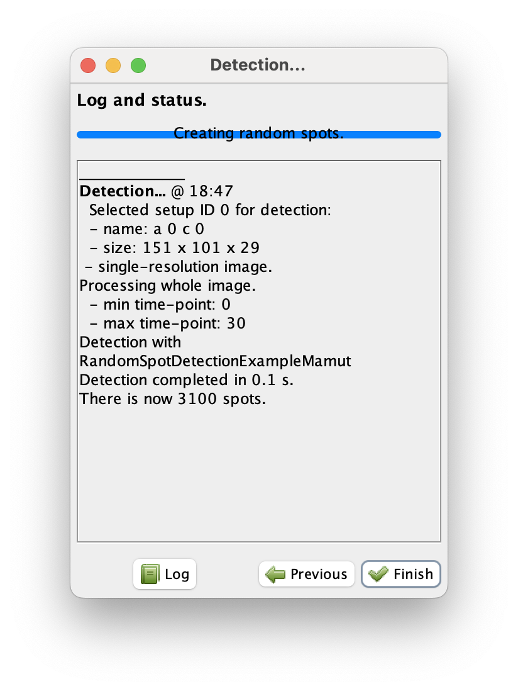
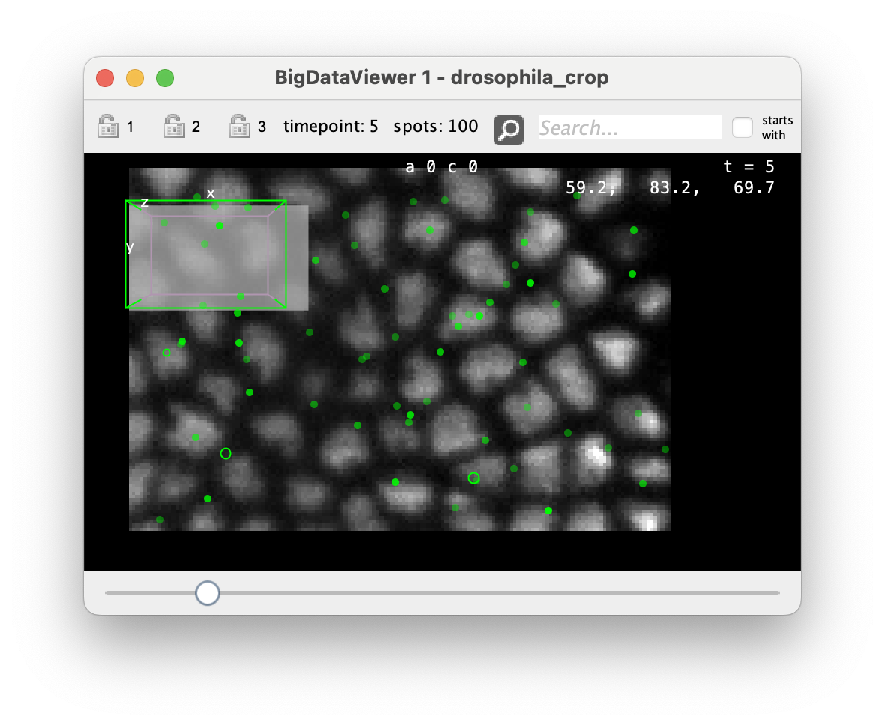

# Creating custom detectors in Mastodon.

In this developer tutorial we will introduce how to create your own detectors in Mastodon.
Detectors are special Mastodon plugins that are used to detect objects of interest, typically cells, in an image.
They will be used subsequently for linking and analysis, building cell trajectories and lineages.
Mastodon is like  [TrackMate](https://imagej.net/plugins/trackmate/) and can be extended with new detectors and linkers by third-parties.
It can serve as a platform for you to deploy a novel detection algorithm and benefit from the existing visualization, analysis and IO facilities of Mastodon.

Ideally you should have read the previous tutorial on creating generic [plugins](create_custom_mastodon_plugins.md) in Mastodon.
Custom detectors will use a similar mechanism. 
They are however specialized for the task at hand, which makes writing them a bit more guided.

## The code template.

We will use the same example repository as for the previous tutorial.
You can clone it from:

> [https://github.com/mastodon-sc/mastodon-plugin-example](https://github.com/mastodon-sc/mastodon-plugin-example)

The detector example we will use in this tutorial are in the package:
> `src/main/java/org/mastodon/mamut/example/detection/`

([Or online](https://github.com/mastodon-sc/mastodon-plugin-example/tree/main/src/main/java/org/mastodon/mamut/example/detection).)

You will find three classes there, the purpose of which we will explain shortly.
They implement a dummy detector that creates spots at random locations in the source image.

One class is needed for the detector itself and one for the integration in the detection wizard.

> `RandomSpotDetectionExampleMamut`
> `RandomSpotDetectorDescriptor`

`RandomSpotDetectionExampleMamut` implements `SpotDetectorOp`.
It is a SciJava operator whose `compute` method accepts:
- the `List< SourceAndConverter< ? > > sources`,
- and the `ModelGraph graph` which is the Mastodon app data structure to which the spots will be added. 

For your own Detector, it is recommended to extend the abstract class `AbstractSpotDetectorOp` that has many facilities
to pass and receive settings and manage logging, without you having to worry about it.

## Writing a custom detector.

We will be writing the `RandomSpotDetectionExampleMamut` class by extending `AbstractSpotDetectorOp`.
For brevity and simplicity, this example detector will not actually process the image, but simply create spots at random
location in the source image, with a radius specified by the user.

Our detector class will start with:

```java
@Plugin( type = SpotDetectorOp.class, priority = Priority.LOW, name = "Random detector",
		description = "<html>"
				+ "This example detector generates a fixed number of spots at random "
				+ "locations."
				+ "<p>"
				+ "It is only used as an example to show how to implement a custom "
				+ "detector in Mastodon."
				+ "</html>" )
public class RandomSpotDetectionExampleMamut extends AbstractSpotDetectorOp
{
	// ...
```

The `@Plugin( type = SpotDetectorOp.class )` annotation will make the detector discoverable by Mastodon.
The `priority` attribute will determine the position of the detector in the UI menu (not very important in our case). It
will be shown there with the `name` and `description` set by the two last attributes of the plugin definition.

The abstract class leaves us with only one method to implement:

```java
	@Override
	public void compute( final List< SourceAndConverter< ? > > sources, final ModelGraph graph )
	{
		// ...
```

The abstract class `AbstractSpotDetectorOp` we inherit provides several useful fields that are used to store settings
and communicate success or failure with an error message. It also sends messages to the user interface.
The first field is the `ok` flag, that states whether the computation finished successfully.
If not, a meaningful error message should be provided in the `errorMessage` field. The user interface will use them.

We start by settings the `ok` flag to false. 
If we break before the end, this will signal something wrong happened.

```java
		ok = false;
```

And we clear the status display.

``` java
		statusService.clearStatus();
```

### Reading the settings map, and check validity.

The parameters used to configure your detector will be stored in a variable `settings` of type `Map< String, Object`.
The keys of the map are strings containing a key to a parameter (e.g. `"N_SPOTS"`) and the values are the corresponding parameter value (e.g. `3`; `1.5`; `true`, etc.).
The first task is to check that these settings are present and valid:

The `settings` variable (stored in the super abstract class) is a map, that will be passed with all the settings the
user will specify, either programmatically or in the wizard.
For our dummy detector example, we have 5 parameters: 

1. the number of spots we will create,
2. their radius,
3. with respect to what source of channel, 
4. and 5. the min and max time-points we will process.

To check that they are present in the map and of the right class, we use a utility function defined in `LinkingUtils` that accepts the settings map, the key of the parameter to test, its desired class, and a holder to store error messages. It goes like this:

In the import list:
```java
import static org.mastodon.tracking.detection.DetectorKeys.DEFAULT_MAX_TIMEPOINT;
import static org.mastodon.tracking.detection.DetectorKeys.DEFAULT_MIN_TIMEPOINT;
import static org.mastodon.tracking.detection.DetectorKeys.DEFAULT_RADIUS;
import static org.mastodon.tracking.detection.DetectorKeys.DEFAULT_SETUP_ID;
import static org.mastodon.tracking.detection.DetectorKeys.KEY_MAX_TIMEPOINT;
import static org.mastodon.tracking.detection.DetectorKeys.KEY_MIN_TIMEPOINT;
import static org.mastodon.tracking.detection.DetectorKeys.KEY_RADIUS;
import static org.mastodon.tracking.detection.DetectorKeys.KEY_SETUP_ID;
import static org.mastodon.tracking.linking.LinkingUtils.checkParameter;
```

In the method:
```java
		final StringBuilder errorHolder = new StringBuilder();
		boolean good = true;
		good = good & checkParameter( settings, KEY_N_SPOTS, Integer.class, errorHolder );
		good = good & checkParameter( settings, KEY_RADIUS, Double.class, errorHolder );
		good = good & checkParameter( settings, KEY_SETUP_ID, Integer.class, errorHolder );
		good = good & checkParameter( settings, KEY_MIN_TIMEPOINT, Integer.class, errorHolder );
		good = good & checkParameter( settings, KEY_MAX_TIMEPOINT, Integer.class, errorHolder );
		if ( !good )
		{
			errorMessage = errorHolder.toString();
			return;
		}
		// Now we are sure that they are here, and of the right class.

		final int n = ( int ) settings.get( KEY_N_SPOTS );
		final int minTimepoint = ( int ) settings.get( KEY_MIN_TIMEPOINT );
		final int maxTimepoint = ( int ) settings.get( KEY_MAX_TIMEPOINT );
		final int setup = ( int ) settings.get( KEY_SETUP_ID );
		final double radius = ( double ) settings.get( KEY_RADIUS );

		// Extra checks.
		if ( n < 1 )
		{
			errorMessage = "The parameter " + KEY_N_SPOTS + " has a value lower than 1: " + n;
			return;
		}
		if ( radius <= 0 )
		{
			errorMessage = "Radius is equal to or smaller than 0: " + radius;
		}
		if ( setup < 0 || setup >= sources.size() )
		{
			errorMessage = "The parameter " + KEY_SETUP_ID + " is not in the range of available sources ("
					+ sources.size() + "): " + setup;
			return;
		}
		if ( maxTimepoint < minTimepoint )
		{
			errorHolder.append( "Min time-point should smaller than or equal to max time-point, be was min = "
					+ minTimepoint + " and max = " + maxTimepoint + "\n" );
			return;
		}
```

Now we are sure that the parameters we need are set, of the right class and have valid values.

### Loop over all time-points and detect objects.

Now we move on to the processing of the image. 
Not in our case actually, because the dummy detector we write creates spots randomly. 
You would normally need to use `imglib2` to process the image, and as such, know how to use `imglib2`. 
Here will just use it to get the size of the input image so that we create random spots within its bounds.

The detector interface we implement requires that we process the whole time-lapse. 
It is up to us to decide whether we want to process multiple time-points in parallel or not. 
In Mastodon case, I would humbly recommend processing one time-point at a time, and allocating all threads to this time-point.
Single time-point images can be very large in Mastodon, and you run the risk to saturate your computer RAM if you process them in parallel, as they are loaded lazily.

So in our case, the beginning of this section starts like this:

```java

		final Random ran = new Random();

		// The `statusService` can be used to show short messages.
		statusService.showStatus( "Creating random spots." );
		for ( int tp = minTimepoint; tp <= maxTimepoint; tp++ )
		{
			// We use the `statusServive to show progress.
			statusService.showProgress( tp - minTimepoint + 1, maxTimepoint - minTimepoint + 1 );

			/*
			 * The detection process can be canceled. For instance, if the user
			 * clicks on the 'cancel' button, this class will be notified via
			 * the `isCanceled()` method.
			 * 
			 * You can check if the process has been canceled as you wish (you
			 * can even ignore it), but we recommend checking every time-point.
			 */
			if ( isCanceled() )
				break; // Exit but don't fail.

			/*
			 * Important: With the image data structure we use, some time-points
			 * may be devoid of a certain source. We need to test for this, and
			 * should it be the case, to skip the time-point.
			 * 
			 * Again, there is a utility function to do this:
			 */
			if ( !DetectionUtil.isPresent( sources, setup, tp ) )
				continue;
```

Now let's move to the image processing part.
We know that there is an image or a _source_ for the setup (or channel) and time-point we request.
This source has possibly several resolution levels, as explained in the part A of the documentation.
And for your own real detector, it might be very interesting to work on a lower resolution (higher level). 
Check the [DogDetectorOp](https://github.com/mastodon-sc/mastodon-tracking/blob/master/src/main/java/org/mastodon/tracking/detection/DoGDetectorOp.java) code for instance.
For us, we don't even care for pixels, we just want to have the image boundary from the highest resolution (level 0).

```java
			final int level = 0;
			final RandomAccessibleInterval< ? > image = source.getSource( tp, level );
			/*
			 * This is the 3D image of the current time-point, specified
			 * channel. It always 3D. If the source is 2D, the 3rd dimension
			 * will have a size of 1.
			 */

			// The image bounds. It might be different for every time-point.
			final int[] mins = Intervals.minAsIntArray( image );
			final int[] maxs = Intervals.maxAsIntArray( image );
```

Now let's create N random points within these bounds.

``` java
			final List< double[] > points = new ArrayList<>( n );
			for ( int i = 0; i < n; i++ )
			{
				final double x = mins[ 0 ] + ran.nextDouble() * ( maxs[ 0 ] - mins[ 0 ] );
				final double y = mins[ 1 ] + ran.nextDouble() * ( maxs[ 1 ] - mins[ 1 ] );
				final double z = mins[ 2 ] + ran.nextDouble() * ( maxs[ 2 ] - mins[ 2 ] );
				final double[] pos = new double[] { x, y, z };
				points.add( pos );
			}
```

### Adding spots to the model.

We have now to create the `Spot` objects corresponding to these detections to the model.

The detections are have now are just points. 
Their position is stored in pixel units, in the reference frame of the source.
But each source might be rotated, translated, etc. 
And this might change for every time-point and source. 
So before creating spots we need to transform these points in the global coordinate system.

This is done with an `AffineTransform3D`, also stored in the source. 
There is a utility method to extract it for the current source, time-point and level:

```java
			final AffineTransform3D transform = DetectionUtil.getTransform( sources, tp, setup, level );
```

We have now to create the `Spot` objects corresponding to these detections to the model.
We want to be nice and efficient. We will use a spot memory reference, and lock the graph for modification.
To be extra cautious we lock and unlock the graph in a try / finally block.
And we won't forget to transform the point coordinates in the global coordinate system before creating the spots:

``` java
// The lock.
			final ReentrantReadWriteLock lock = graph.getLock();
			lock.writeLock().lock();
			// The ref.
			final Spot ref = graph.vertexRef();
			try
			{
				for ( final double[] point : points )
				{
					/*
					 * The transform "goes" from the pixel coordinate to the
					 * global coordinate system. We can get the "world"
					 * coordinates of our detection this way:
					 */
					final double[] worldCoords = new double[ 3 ];
					transform.apply( point, worldCoords );

					/*
					 * `worldCoords` now contains the coordinate of the
					 * detection, in physical units, in the global reference
					 * frame. We can now create the `Spot` object from these
					 * coordinates.
					 */
					final Spot spot = graph.addVertex( ref ).init( tp, worldCoords, radius );
```

Mastodon stores a `quality` feature value, that reports how 'good' the detection is. 
By convention, it is a strictly positive value (zero or negative values can be used to indicated manual creation), not necessarily normalized. 
Large quality values are indicative of spots for which the confidence is high. 
The exact signification depends on the detector implementation.
Here is will be just random and the abstract class has a protected field for the quality feature ready to use.

```java
					final double quality = ran.nextDouble();
					qualityFeature.set( spot, quality );
				}
			}
			finally
			{
				// unlock.
				lock.writeLock().unlock();
				// release the ref.
				graph.releaseRef( ref );
			}
		}
```

We are done!
Gracefully exit, stating we are ok.

``` java
		ok = true;
	} // end of the compute method.
```

That's it for the detection part.


### Declaring required parameters.

The second method of the class is used to specify default settings. 
This is important for Mastodon to discover what parameters are needed, what name they have and what type they accept.
This is done via the method `getDefaultSettings()` method.
You should create a map with all the required parameters for your detectors (and only them) and set a default value of the right class. 
Ideally, if you have parameters that are the same that for the built-in detectors, you should re-use the parameter names and default values for them.

``` java
	@Override
	public Map< String, Object > getDefaultSettings()
	{
		final Map< String, Object > ds = new HashMap< String, Object >();
		ds.put( KEY_SETUP_ID, DEFAULT_SETUP_ID );
		ds.put( KEY_MIN_TIMEPOINT, DEFAULT_MIN_TIMEPOINT );
		ds.put( KEY_MAX_TIMEPOINT, DEFAULT_MAX_TIMEPOINT );
		ds.put( KEY_RADIUS, DEFAULT_RADIUS );
		ds.put( KEY_N_SPOTS, 30 );
		return ds;
	}
} // end of class RandomSpotDetectionExampleMamut
```

This code is sufficient to plug our detector in the Mastodon app.
The next step would be to write a config panel that can be shown in the detection wizard.
But we could also call this detector programmatically.

## Compiling and installing the code

We will assume here that you are working from the template repository we linked at the start of this page (`mastodon-plugin-example`).
If you have it installed or derived from it, the compilation is done as for many other Fiji projects, with `maven`.

``` sh
❯ cd mastodon-plugin-example
❯ mvn
[INFO] Scanning for projects...
[INFO] 
[INFO] ----------------< org.mastodon:mastodon-plugin-example >----------------
[INFO] Building Mastodon Plugin Example 1.0.0-beta-23-SNAPSHOT
[INFO] --------------------------------[ jar ]---------------------------------
[INFO] 
...
```
This will create a jar in the `target` folder:
```sh
❯ ls target
mastodon-plugin-example-1.0.0-beta-23-SNAPSHOT.jar
...
```

Copy this file (not the one ending in `-sources` or `-tests`) to the `jars/` folder of a Fiji installation with Mastodon installed:

```sh
❯ cp target/mastodon-plugin-example-1.0.0-beta-23-SNAPSHOT.jar ~/Applications/Fiji.app/jars
❯ ls -1  ~/Applications/Fiji.app/jars/mastodon*
/Users/tinevez/Applications/Fiji.app/jars/mastodon-1.0.0-beta-33.jar
/Users/tinevez/Applications/Fiji.app/jars/mastodon-app-1.0.0-beta-25.jar
/Users/tinevez/Applications/Fiji.app/jars/mastodon-blender-view-0.3.2.jar
/Users/tinevez/Applications/Fiji.app/jars/mastodon-collection-1.0.0-beta-29.jar
/Users/tinevez/Applications/Fiji.app/jars/mastodon-ctc-0.1.3.jar
/Users/tinevez/Applications/Fiji.app/jars/mastodon-ctc-baseline-0.0.9.jar
/Users/tinevez/Applications/Fiji.app/jars/mastodon-deep-lineage-0.4.3.jar
/Users/tinevez/Applications/Fiji.app/jars/mastodon-ellipsoid-fitting-0.7.1.jar
/Users/tinevez/Applications/Fiji.app/jars/mastodon-graph-1.0.0-beta-29.jar
/Users/tinevez/Applications/Fiji.app/jars/mastodon-pasteur-1.0.0-beta-12.jar
/Users/tinevez/Applications/Fiji.app/jars/mastodon-plugin-example-1.0.0-beta-23-SNAPSHOT.jar
/Users/tinevez/Applications/Fiji.app/jars/mastodon-selection-creator-0.0.11.jar
/Users/tinevez/Applications/Fiji.app/jars/mastodon-tomancak-0.6.3.jar
/Users/tinevez/Applications/Fiji.app/jars/mastodon-tracking-1.0.0-beta-18.jar
```

This should be enough to make all the plugins and detectors we have been working on in this tutorial visible there.
For instance:

{align="center"}
{align="center"}
{align="center"}

And of course our detector as well.
To make it visible, in the wizard user-interface, we will need to create a configuration panel for it.
But we can already test it via the scripting interface.


## Running the detector programmatically


Still in Fiji, open the script editor, and select `Python (Jython)` as a language. 
Mastodon can be scripted from there, as explained in the section dedicated to [scripting](../partA/scripting_mastodon.md).
We will assume you are working with the file created during this tutorial.
The following script will open this file as a Mastodon project:

```python
#@ Context context

from org.mastodon.mamut import Mamut
import os

existingMastodonFile = os.path.join( os.path.expanduser('~'), 'Desktop', 'test_scripting.mastodon' )
mamut = Mamut.open( existingMastodonFile, context )
mamut.info()
```
And in the console you should see something along these lines:
```text
Data model #4
 - mastodon project file: /Users/tinevez/Desktop/test_scripting.mastodon
 - dataset: /Users/tinevez/Desktop/datasethdf5.xml
 - objects: 1622 spots, 1449 links and 173 tracks.
 - units: pixel and frame
```

Now we can interrogate what detectors are visible by Mastodon:

```python
trackmate = mamut.createTrackMate()
trackmate.infoDetectors()
```
Our new detector appears at the end of the list, and gives what parameters it expects:

``` text
Available detectors:
[... the other detectors]

 3: 'Random detector'
-----------------------
Description:
    This example detector generates a fixed number of spots at random
    locations. It is only used as an example to show how to implement a
    custom detector in Mastodon. 
Parameters:
    Name                                     Type                 Default value       
    ----                                     ----                 -------------       
    MAX_TIMEPOINT                            Integer              0                   
    MIN_TIMEPOINT                            Integer              0                   
    N_SPOTS                                  Integer              30                  
    RADIUS                                   Double               5.0                 
    SETUP                                    Integer              0  
```

We also get the list of parameters to provide in the settings dictionary.
To run the detector on fresh data we do:

```python
mamut.clear()
trackmate.useDetector( "Random detector" );
# Let's change some parameters
trackmate.setDetectorSetting( "N_SPOTS", 100 );
trackmate.setDetectorSetting( "RADIUS", 8. );
trackmate.setDetectorSetting( "MIN_TIMEPOINT", 0 );
trackmate.setDetectorSetting( "MAX_TIMEPOINT", 9 );

trackmate.useLinker(None) # Will skip the linking step
trackmate.run()

mamut.getWindowManager().createBigDataViewer()
mamut.getWindowManager().createTrackScheme()
```




## Making a user interface for configuring the detector

In Mastodon the main way we run the detection is actually via the wizard UI, that users run with the _Plugins > Tracking > Detection..._ command.
In the third panel of this wizard, Mastodon lists all the detectors it found, _and_ that have a config panel.
For our dummy detector to appear in this list, we need to create such a config panel.
Let's do this.

For the wizard UI, we need to create a 'descriptor'. 
A descriptor is a class that represents a 'card' in the sequence of panels shown by the UI. 
The one we will make has only one responsibility: offer the user to configure the random spot detector, and pass these settings to the detection runner.
For this it creates a UI panel, specific to the detector.
It also has several methods to get and store setting values, and to inform Mastodon about the detector it relates to.

We don't have to go into details here, but it turns out that the class in charge of running the automated detection and linking processes is called [`TrackMate`](https://github.com/mastodon-sc/mastodon-tracking/blob/master/src/main/java/org/mastodon/tracking/mamut/trackmate/TrackMate.java).
It stores the detection and linking settings, and will modify the data model.
We just have to worry about the detection settings, everything else is taken care of.

The full class of this descriptor is in the example repository [here](https://github.com/mastodon-sc/mastodon-plugin-example/blob/main/src/main/java/org/mastodon/mamut/example/detection/RandomSpotDetectorDescriptor.java). 
We describe its content below.

First, your descriptor must extend the `SpotDetectorDescriptor` abstract class.
It has several fields and methods that simplify writing a custom one.
Second, the descriptor also uses the SciJava discovery mechanism, so it needs the `@Plugin` annotation, like the two other classes above. 
We will see soon how Mastodon associate a descriptor with the right detector it can configure.

```java
@Plugin( type = SpotDetectorDescriptor.class, name = "Random spot dummy detector configuration descriptor" )
public class RandomSpotDetectorDescriptor extends SpotDetectorDescriptor
{
```

Also this descriptor has only one specific field, the tracking settings to configure:

```java
	private Settings settings;
```

In the descriptor constructor, you need to specify a unique ID, and create the UI panel with the elements to configure the settings

```java
	public RandomSpotDetectorDescriptor()
	{
		/*
		 * A descriptor represents a 'card' in the wizard we have in Mastodon.
		 * For the wizard to run properly, you need to give it a unique
		 * identifier and a UI panel when you create it.
		 */

		this.panelIdentifier = "Configure random spot detector";
		this.targetPanel = new ConfigPanel(); // described just below.
	}
```

The UI panel can be anything you want (it must extend `JPanel`) but we recommend to follow the size, look and feel of
the other ones.
For this example we copy / pasted an existing one and removed everything not needed. 
It contains only two `JFormattedTextField` to set the diameter and the number of random spots to create. 

Normally our detector requires more parameters to be configured: we need to tell what channel (setup ID) to run the detection on, the min and max time-point as well. 
But in the wizard, this is actually done in the first two panels, and we don't have to worry about them.

```java

	/*
	 * The UI part, stored as a private static class. We need to show only two
	 * controls that can configure the number of spots we want to generate and
	 * their diameter.
	 */
	private static class ConfigPanel extends JPanel
	{
		// ... see content in the file directly.
	}
```

After that comes the method to handle the wizard process, that is: the user 'moving' in the panel or leaving it.

```java
	@Override
	public void setTrackMate( final TrackMate trackmate )
	{
		/*
		 * This method is called when the panel is shown, when the user 'enters'
		 * the config panel. It receives the instance of TrackMate that will run
		 * the detection, and that this panel needs to configure. We use the
		 * method for two things:
		 * 
		 * 1/ Get the settings map to configure. The TrackMate instance stores
		 * the detector settings in a map. We will need to update it with the
		 * values set by the user on the panel when they 'leave' the panel, so
		 * we store a reference to it in the descriptor.
		 */

		this.settings = trackmate.getSettings();

		/*
		 * 2/ We want to display the detector settings values, either the
		 * default ones, or the one that were set previously. For this, we read
		 * these values from the TrackMate instance we receive.
		 */

		if ( null == settings )
			return;

		// Get the values.
		final Map< String, Object > detectorSettings = settings.values.getDetectorSettings();
		final double diameter;
		final Object objRadius = detectorSettings.get( KEY_RADIUS );
		if ( null == objRadius )
			diameter = 2. * DetectorKeys.DEFAULT_RADIUS;
		else
			diameter = 2. * ( double ) objRadius;

		final int nSpots;
		final Object nSpotsObj = detectorSettings.get( KEY_N_SPOTS );
		if ( null == nSpotsObj )
			nSpots = 30; // default
		else
			nSpots = ( int ) nSpotsObj;

		// Show them in the config panel.
		final ConfigPanel panel = ( ConfigPanel ) targetPanel;
		panel.diameter.setValue( diameter );
		panel.nSpots.setValue( nSpots );
		// Also the spatial units because we are nice.
		final String unit = DetectionUtil.getSpatialUnits( settings.values.getSources() );
		panel.lblDiameterUnit.setText( unit );
	}
```

and when the user click the 'Next' button:

```java

	@Override
	public void aboutToHidePanel()
	{
		/*
		 * This method is run when the user 'leaves' the panel going 'forward'.
		 * This is the step just before running the full detection. The only
		 * thing we have to do is to grab the setting values from the panel, and
		 * store them in the settings instance we got when we entered the panel.
		 */

		if ( null == settings )
			return;

		/*
		 * In the wizard, the settings map should already contain the parameter
		 * values for the target channel and min and max time-point to run the
		 * detector on (KEY_SETUP_ID, KEY_MIN_TIMEPOINT and KEY_MAX_TIMEPOINT).
		 * We just have to add the parameters specific to this detector.
		 */

		// Cast the panel field to the right class.
		final ConfigPanel panel = ( ConfigPanel ) targetPanel;
		// Update settings map for the detector.
		final Map< String, Object > detectorSettings = settings.values.getDetectorSettings();
		detectorSettings.put( KEY_RADIUS, ( ( Number ) panel.diameter.getValue() ).doubleValue() / 2. );
		detectorSettings.put( KEY_N_SPOTS, ( ( Number ) panel.nSpots.getValue() ).intValue() );
	}
```

Then there is a method to tell Mastodon what detector this descriptor can configure:

```java
	@Override
	public Collection< Class< ? extends SpotDetectorOp > > getTargetClasses()
	{
		/*
		 * This method is used to tell Mastodon what detectors this wizard
		 * descriptor can configure. This one is only suitable for our dummy
		 * detector, which yields:
		 */
		return Collections.singleton( RandomSpotDetectionExampleMamut.class );
	}
```

The last method is useful only if you want to do fancy things in your config panel:

```java
	@Override
	public void setAppModel( final ProjectModel appModel )
	{
		/*
		 * This method is used to receive the project model. Other detector
		 * descriptors use it to run a preview of the detection, or to display
		 * information about it.
		 * 
		 * In our case we don't do preview, so we don't need to keep a reference
		 * to the project model. This method does then nothing.
		 */
	}
} // end of class RandomSpotDetectorDescriptor
```

If you add this class, compile it and add the resulting jar to Fiji, this should be enough to have the custom detector appear and run in the wizard UI:

{ width="400"}
{ width="400"}

{ width="400"}
{ width="600"}

## Summary and strategies

What we described here is a way to implement a detector that will work by finding spots on the image:

- `RandomSpotDetectionExampleMamut` does the main job of processing the image and generating a list of X,Y,Z coordinates per time-point.
  It then converts these lists to create Mastodon `Spot` object and add them to the data model.
  It also specifies what parameters are needed to configure the detector.

This is enough the run the detector from scripts.

- `RandomSpotDetectorDescriptor` deals with the user interface and integration inside the tracking wizard.

To go further, do not hesitate to study the builtin detectors, such as the DoG detector to see [how we use imglib2 algorithms to build a detector ](https://github.com/mastodon-sc/mastodon-tracking/blob/master/src/main/java/org/mastodon/tracking/detection/DoGDetectorOp.java) and [how we put a preview button in the UI](https://github.com/mastodon-sc/mastodon-tracking/blob/master/src/main/java/org/mastodon/tracking/mamut/trackmate/wizard/descriptors/DoGDetectorDescriptor.java).
