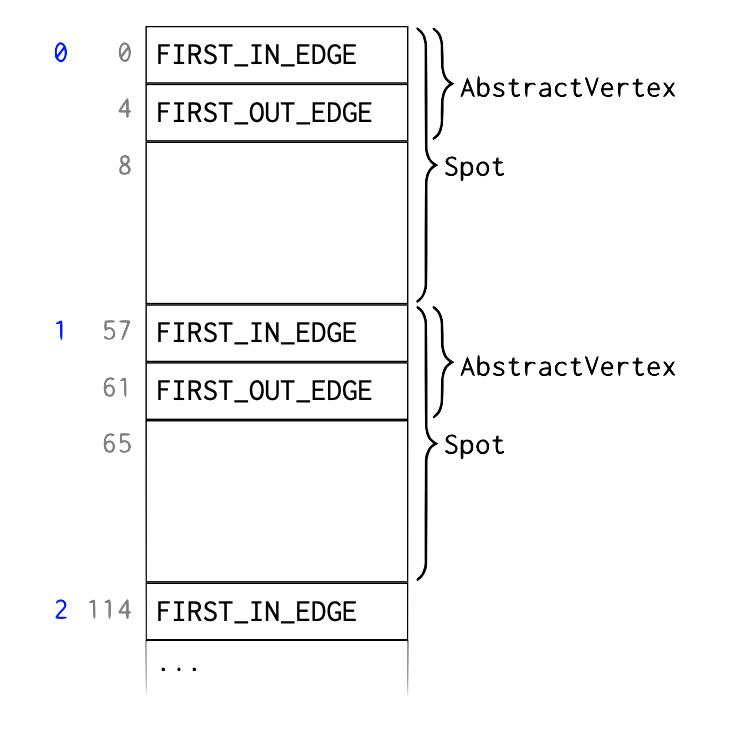
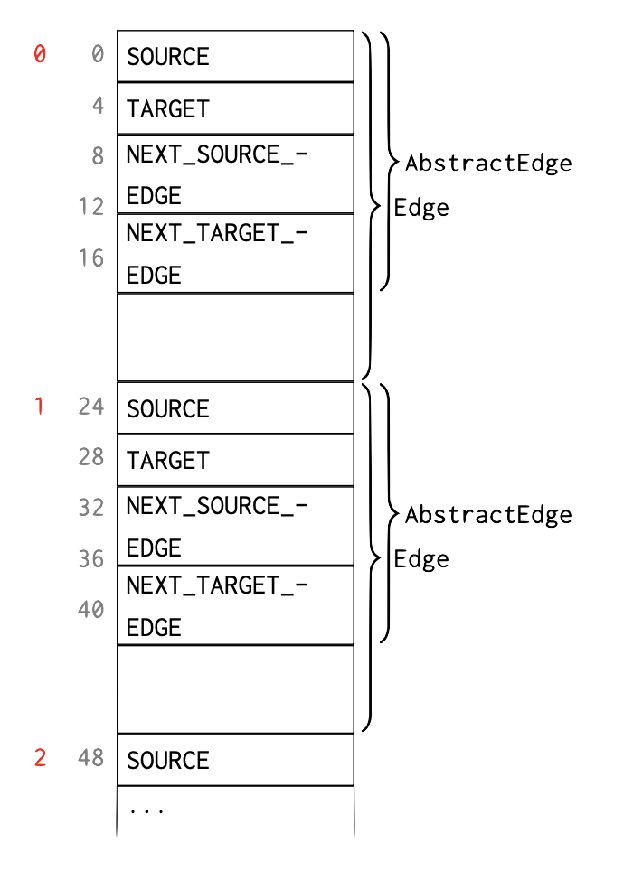
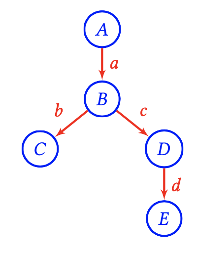
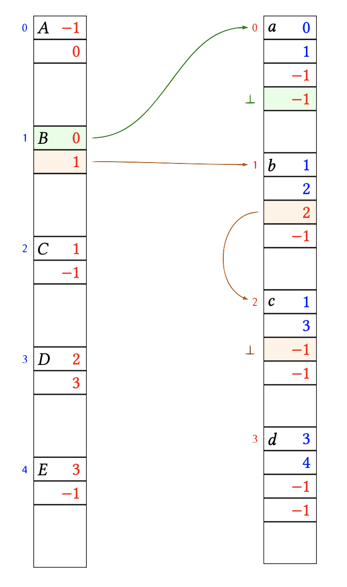
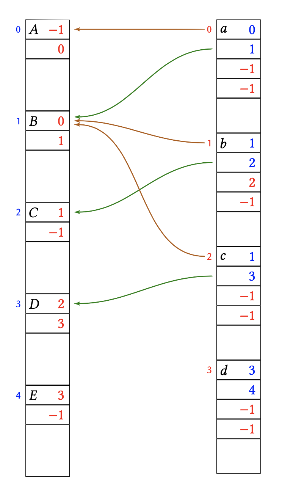
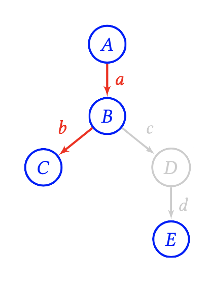
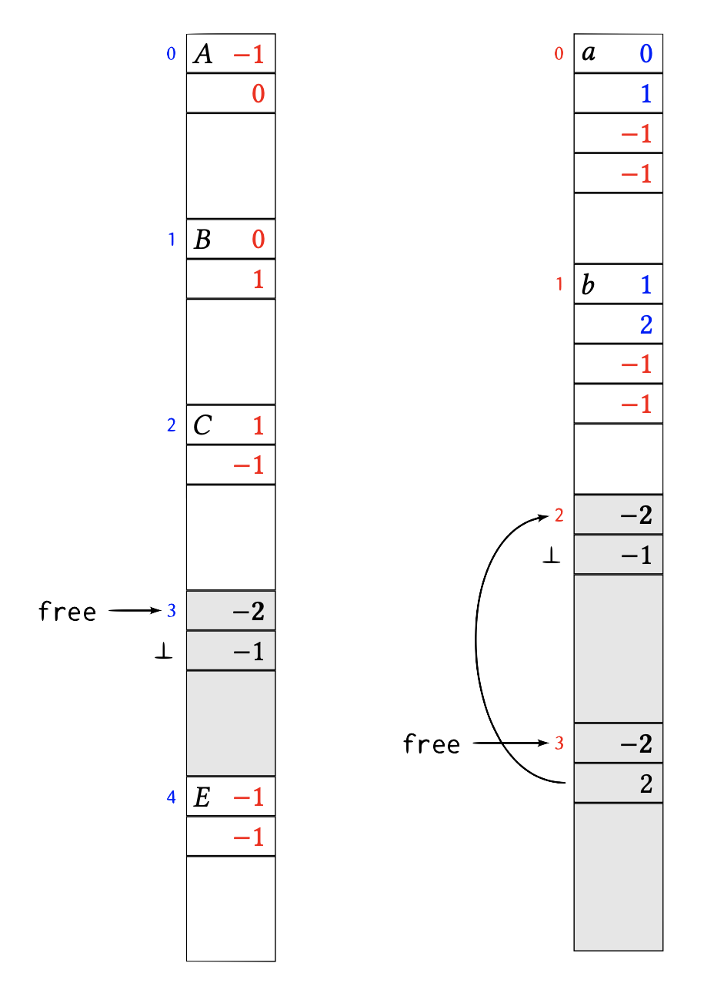
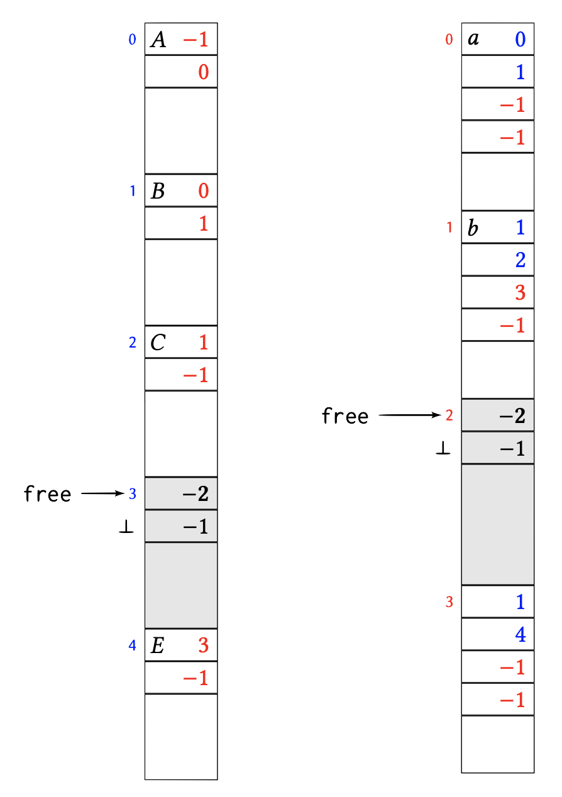

# The graph data structure of Mastodon.

The *mastodon-graph* Java package can be used to implement directed graphs with small memory footprint.
Vertices and edges are not stored as individual objects. Instead vertex and edge data is laid out in a primitive `byte[]` array and accessed via proxy objects. 
This page describes some internals of the [*trackmate-graph* package](https://github.com/mastodon-sc/mastodon-graph).

## Memory layout.

Each vertex and each edge maps to a contiguous portion of a `byte[]` array.
The size of a portion (*elements*) is fixed for a particular `AbstractVertex` or `AbstractEdge` subclass. 
Each *element* starts with a fixed part that represents the graph structure and then additional payload used by the subclass to describe some vertex attributes, _etc_.

There is one `byte[]` array that stores all vertices, and one `byte[]` array that stores all edges.
References between these arrays are in the form of *element indices*. 
Whether these are indices refer to elements in the vertex or in the edge memory array is clear from the context.

### Vertex layout.

The following diagram illustrates the layout of vertices in a `byte[]` array:

{width="50%"}

In the left-most column, *element indices* are shown (in blue), followed by byte indices (in grey). In the example, each element of the `AbstractVertex` subclass `Spot` requires 57 bytes to store. 
The data for the _i_ th `Spot` starts at byte _i_ * 57.
The fixed `AbstractVertex` part comprises element indices `FIRST_IN_EDGE` and `FIRST_OUT_EDGE`, occupying 4 bytes each. 
The remaining 49 bytes are `Spot` attributes.

`FIRST_IN_EDGE` is the element index (in the edge memory array) of the first *incoming* edge, _i.e._, an edge pointing to this vertex. 
The remaining incoming edges of the same vertex are stored as a linked list in the edge memory as described below. 
If this vertex does not have any incoming edges `FIRST_IN_EDGE` is -1.

Similarly, `FIRST_OUT_EDGE` is the element index of the first *outgoing* edge, _i.e._, an edge starting from this vertex. 
The remaining outgoing edges of the same vertex are stored as a linked list in the edge memory as described below. If this vertex does not have any outgoing edges
`FIRST_OUT_EDGE` is -1.

### Edge layout.

The following diagram illustrates the layout of edges in a `byte[]`
array:

{width="50%"}

In the left-most column, *element indices* are shown (in red), followed by byte indices (in grey). In the example, each element of the `AbstractEdge` subclass `Edge` requires 24 bytes to store. 
The data for the _i_ th `Edge` starts at byte _i_ * 24.
The fixed `AbstractEdge` part comprises element indices `SOURCE`, `TARGET`, `NEXT_SOURCE_EDGE`, and `NEXT_TARGET_EDGE`, occupying 4 bytes each. 
The remaining 8 bytes are `Edge` attributes.

-   `SOURCE` is the element index (in the vertex memory array) of the vertex from which this edge starts.
-   `TARGET` is the element index (in the vertex memory array) of the vertex to which this edge points.
-   `NEXT_SOURCE_EDGE` is the element index (in the edge memory array) of the next outgoing edge of the source vertex, , the next edge that has the same `SOURCE`. 
If there is no such edge then `NEXT_SOURCE_EDGE` is -1.
-   `NEXT_TARGET_EDGE` is the element index (in the edge memory array) of the next incoming edge of the target vertex, , the next edge that has the same `TARGET`. 
If there is no such edge then `NEXT_TARGET_EDGE` is -1.

### Example

Consider the following example graph comprising vertices _A, B, C, D, E_
and edges _a, b, c, d_.

{width="25%"}

This is laid out in memory as follows

{width="50%"}

The links between vertex *B* and its adjacent edges *a*, *b*, *c* have been highlighted.
Let's look at that in more detail: 
Vertex _B_ is stored at element index 1 in the vertex memory array.
_B_ has one incoming edge _a_. 
The edge _a_ is stored at element index _0_ in the edge memory array.
Therefore the `FIRST_IN_EDGE` field of _B_ is _0_. 
Apart from _a_, the vertex _B_ has no further incoming edges. 
Therefore, the `NEXT_TARGET_EDGE` field of _a_ is -1, _i.e._, the list of edges entering _B_ terminates here.

_B_ has two outgoing edges _b, c_. 
The edge _b_ is stored at element index 1 in the edge memory array. 
Therefore the `FIRST_OUT_EDGE` field of _B_ is 1. 
The next outgoing edge of _B_ is _c_ which is stored at element index 2.
Therefore, the `NEXT_SOURCE_EDGE` field of _b_ is 2. 
After _c_, the vertex _B_ has no further outgoing edges. 
Therefore, the `NEXT_SOURCE_EDGE` field of _c_ is -1, i.e., the list of edges leaving _B_ terminates here.

Below is the same memory layout again, this time highlighting the references from edges _a, b, c_ back to the vertex memory array.

{width="50%"}

For example, edge _c_ is leaving vertex _B_ (index 1) and entering vertex _D_ (index 3). 
Therefore the `SOURCE` field of _c_ is 1, and the `TARGET` field of _c_ is 3.

## Free-list of unallocated elements.

The vertex and edge memory arrays can only ever grow. 
When elements are released, they are simply marked as free for re-use. 
Assume that in the above example vertex _D_ is deleted, as well as it's adjacent edges _c, d_, leaving this:

{width="25%"}

After removing _c, d, D_ the memory layout looks like this:

{width="50%"}

The element 3 in the vertex memory array as well as elements 2 and 3 in the edge memory array have been marked as free. 
This is done by putting the magic number "-2" into the first 4 bytes of the element.
In vertices and edges the first 4 bytes are always occupied by a (positive) index or a −1 index list terminator. 
Therefore, occupied and free blocks cannot be confused.
The next 4 bytes of a freed element are the index of the next freed element in the (same) memory array, or _-1_ if there is no next freed element. 
Each memory array remembers the index `free` of the first freed element.

Newly freed elements are enqueued at `free`, that is, at the head of the free-list.
So in the above example, edge element 2 was freed first, followed by edge element 3.

The next edge element will be allocated at head of the free-list and the `free` index move to the next element. 
For example, assume that a new edge is created from _B_ to _E_:

{width="50%"}

If `free` is -1, then no more freed elements are available and the underlying memory array has to grow to fit newly added elements.
