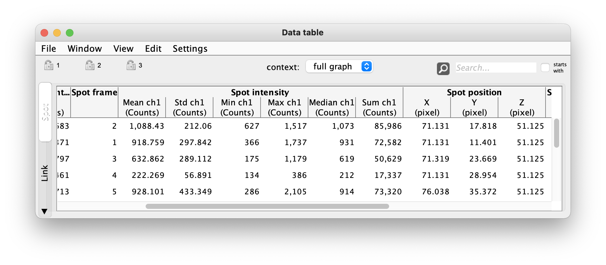

# Mastodon numerical features.

This chapter describes how the feature values currently available in Mastodon are calculated. We also gives information about their dimension, units, _etc_.

## Feature dimensions.

In Mastodon, feature values are expressed when possible in physical units. Each feature projection as a _dimension_ (in the physics meaning) from which we compute the _units_ of the values. For instance, if a feature value as the dimension `LENGTH` and the spatial units is μm, then the values of this feature will be in μm. Mastodon only has physical units for space. For time, the frame interval is always equal to the dummy `1 frame`. This is why you will find all units involving time expressed in frames. Each feature projection has a dimension, and the features report what are the dimension of their projections in the feature computation dialog. The table below lists all the feature dimensions currently supported in Mastodon, and give examples of the derived units when the spatial units are μm.

| **Dimension**       | **Name**   | **Example units** | **Description**                                              |
| ------------------- | ---------- | ----------------- | ------------------------------------------------------------ |
| `NONE`              | None       | ø                 | Used for dimensionless quantities, such as frame position, number of things, _etc_ |
| `LENGTH`            | Length     | µm                | For quantities about the length of objects. For instance radius or distance between objects. |
| `POSITION`          | Position   | µm                | Dimension for feature that report a position. Different from `LENGTH` so that for objects with small lengths at large positions, quantities are plotted separately. |
| `TIME`              | Time       | frame             | For quantities that report a delay, a duration or the timing of an event. Because Mastodon does not deal with physical units for time, quantities formed with the time dimension always use the frame unit. |
| `VELOCITY`          | Velocity   | µm/frame          | For quantities that report a speed or a velocity.            |
| `RATE`              | Rate       | /frame            | For quantities that report a change per units of time.       |
| `ANGLE`             | Angle      | Radians           | Measures of angles. In Mastodon, all angles are in radians.  |
| `STRING`            | NA         | ø                 | For non-numeric features.                                    |
| `INTENSITY`         | Intensity  | Counts            | For quantities based on pixel values. For instance the mean intensity within a spot. |
| `INTENSITY_SQUARED` | Intensity² | Counts²           | For quantities based on pixel intensity squared. For instance the variance of the mean within a spot. |
| `QUALITY`           | Quality    | ø                 | This dimension is used by spot detectors. There is a special feature called Detection quality, that stores for each spot they detect automatically a measure of quality or confidence in their detection. |
| `COST`              | Cost       | ø                 | This dimension is used by spot linking algorithms. There is a special feature called Link cost used in the estimation phase. It stores for each link the cost that the linker computes for it in the estimation phase. These costs are then used in the association phase to retrieve the best set of links. |

## Spot features.

### Spot intensity.

This feature has six projections per channel:
- Mean
- Std
- Min 
- Max
- Median
-  Sum

These 6 projections are multiplied by the number of channels or sources in the image. You will find the projection names appended by `ch 1`, `ch 2`, _etc_, as exemplified below on an image with one channel.

{width="600px" align="center"}

The values are floating point numbers, with the dimension `INTENSITY`.
These projections give the mean, max, min, ... intensity at over all the pixels inside the spot ellipsoid. 
Like all features related to measuring pixel intensity, they take a long time to compute over large models.

## Spot center intensity.

Computes the intensity at the center of spots by taking the mean of pixel intensity weigthted by a gaussian.
The gaussian weights are centered on the spot, and have a sigma value equal to the minimal radius of the ellipsoid divided by 2.
The image below illustrates how these weights look like inside spots and what pixels contribute the average reported by this feature.

{width="600px" align="center"}

## Spot quick mean.

This feature compute the mean intensity of the pixel inside spots using the highest level in the scale pyramid (lowest resolution) to speedup calculation.
It exists to offer a quiker way of reporting spot intensity for large models when multiple resolution level exist in the source image.
It is recommended to use the 'Spot intensity' feature described above when the best accuracy is required

## Other spot features.

| **Feature name** | **Projections** | **Description**                                                                                                                                                                                                                                              |
|------------------|-----------------|--------------------------------------------------------------------------------------------------------------------------------------------------------------------------------------------------------------------------------------------------------------|
| Spot frame       | _idem_          | The spot frame.                                                                                                                                                                                                                                              |
| Spot N links     | _idem_          | The total number of links, incoming and outgoing, of the spot.                                                                                                                                                                                               |
| Spot position    | X & Y &  Z      | The spot center position, in physical units.                                                                                                                                                                                                                 |
| Spot radius      | _idem_          | The spot radius in physical units. For spots that are ellipsoids, returns a radius using the geometric mean of the spot ellipsoid radiuses. This approximation is such that the sphere with the reported radius and the spot ellipsoid have the same volume. |
| Spot track ID    | _idem_          | The ID of the track the spot belongs to. Track IDs are positive integer numbers starting from 0.                                                                                                                                                             |

## Link features.

| **Feature name**  | **Projections**                 | **Description**                                                                                                                                                                                                                               |
|-------------------|---------------------------------|-----------------------------------------------------------------------------------------------------------------------------------------------------------------------------------------------------------------------------------------------|
| Link target IDs   | Source spot id & Target spot id | Stores the IDs of the two spots the link connects to. In Mastodon, the links are oriented: the source and target are not equivalent. By convention in Mastodon, the source spot is always the first in time, and the target the last in time. |
| Link displacement | _idem_                          | The distance between the source and target spots of the links, in physical units.                                                                                                                                                             |
| Link velocity     | _idem_                          | The velocity at the time of the link. It is calculated as the link displacement divided by the frame interval between the source and target spots (in frame units).                                                                           |

## Track features.

’Track’ is the vocable we use in Mastodon for the weakly connected components of the graph. A track is made of all the links and spots that can be reached by jumping across links in any direction. In a lineage, a track corresponds to a single cell and all its daughters, grand-daughters, etc . Track features are value that are defined for a whole track. An example would be the number of spots in a track. In Mastodon, there is no special place to store track feature values. Track feature values are stored in the spots of the tracks, and listed in spot features. By convention, their name starts with **Track** and spot features starts with **Spot**.

| **Feature name** | **Projections** | **Description**                 |
|------------------|-----------------|---------------------------------|
| Track N spots    | _idem_          | The number of spots in a track. |

## Branch-spot features.

Some of the branch-spot features relate to the hierarchy or neighborhood in the branch-graph.
Further branch-spot features are related to the branch duration and displacement.
More features are available in the [Mastodon-DeepLineage](../partC/deep_lineage.rst) extension.

| **Feature name**                 | **Projections** | **Description**                                                                                                                                                                                                                                                                                         |
|----------------------------------|-----------------|---------------------------------------------------------------------------------------------------------------------------------------------------------------------------------------------------------------------------------------------------------------------------------------------------------|
| Branch N successors              | _idem_          | Reports the number of successors of a branch spot. That is: how many branches emerge from this branch-spot. The branch-spot of a cell that divides will have a value of 2 for this feature. The end of a track will have a value of 0. The beginning of a track, 1.                                     |
| Branch depth                     | _idem_          | Report the hierarchy level of a branch. The hierarchy of a branch is how many ancestors a branch has. For instance, the first branch of a track has a level of 0. After one cell division, the two daughter branches have a level of 1, _etc_. This feature value is used to build the hierarchy graph. |
| Branch N Spots                   | _idem_          | The number of spots in a branch. The count does not include the spots at the beginning of the branch, but includes the last one. This way the sum of this feature values for all the branches of a track equals the number of spots in the track.                                                       |
| Branch duration and displacement | Displacement    | Measure the displacement of a branch, that is: the euclidean distance between the first and last spot of the branch.                                                                                                                                                                                    |
|                                  | Duration        | The time difference between the first and last spot of the branch.                                                                                                                                                                                                                                      |

## Branch-link features.

The branch-links represent a full branch from start to finish.

