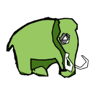

About Mastodon and this documentation.
======================================

Mastodon is a large-scale tracking and track-editing framework for large, multi-view images, such as the ones that are typically generated in the domain Development Biology or Stem-Cell Biology or Cell Biology.

Why using Mastodon?

Modern microscopy technologies such as light sheet microscopy allows live sample *in toto* 3D imaging with high spatial and temporal resolution. 
Such images will be 3D over time, possibly multi-channels and multi-view. 
Computational analysis of these images promises new insights in cellular, developmental and stem cells biology. 
However, a single image can amount to several terabytes, and in turn, the automated or semi-automated analysis of these large images can generate a vast amount of annotations. 
The challenges of big data are then met twice: first by dealing with a very large image, and second with generating large annotations from this image. 
They will make interacting and analyzing the data especially difficult.

**Mastodon** is our effort to provide a tool that can harness these challenges. 

This pages centralize the user and developer documentation for Mastodon.
It is divided in four parts, that group sections by interest.

**A.** The first part, *Using mastodon* contains tutorials, aimed at end-users and focused on cell tracking. 
They are meant to guide users with the Mastodon software and cover three applications of cell tracking in Mastodon:

  -   automated cell or particle tracking;
  -   manual curation and correction of tracking results;
  -   manual and semi-automatic tracking.

This also where we introduce all the user-oriented features, such as numerical features, tags, navigation facilities, data export *etc*.
If you are new to Mastodon, it is best starting with this part, and reading the tutorial in order.

**B.** The second part contains tables that summarize the main keyboard shortcuts of Mastodon.
They are put in a separate section to facilitate browsing to them quickly.

**C.** The third path documents the various plugins, extensions and miscellaneous functionality of Mastodon.
Some of the features documented there are already shipped with Mastodon, others are distributed via optional update sites.
They are all based on the extension mechanisms described in the next part.

**D.** The fourth part is aimed at developers, that want to extend Mastodon.
Mastodon, like `TrackMate <https://imagej.net/plugins/trackmate/>`_, is a software platform meant to be extended by you so that new features and algorithms can be added to it in a relatively simpler        manner. This part detail the plugin interface of Mastodon and the discovery mechanism.

**E.** The last part is made of technical information that serve as a reference for the specificities of algorithms and features currently implemented in Mastodon.

.. image:: https://img.shields.io/badge/License-CC_BY_4.0-lightgrey.svg
   :target: https://creativecommons.org/licenses/by/4.0/
`Mastodon documentation <https://mastodon.readthedocs.io/>`_ © 2022 by `Jean-Yves Tinevez & contributors <https://github.com/mastodon-sc/mastodon-documentation/graphs/contributors>`_ is licensed under `CC BY 4.0 <https://creativecommons.org/licenses/by/4.0/>`_

.. Mastodon documentation master file, created by
   sphinx-quickstart on Sun Nov  6 11:11:53 2022.
   You can adapt this file completely to your liking, but it should at least
   contain the root `toctree` directive.

Table of content.
==================================================

.. toctree::
   :caption: A. Using Mastodon
   :maxdepth: 2

   docs/partA/getting_started.md
   docs/partA/manual_editing.md
   docs/partA/inspecting_large_datasets.md
   docs/partA/numerical_features_tags_the_table_view.md
   docs/partA/semi_automated_tracking.md
   docs/partA/selection_creator.md
   docs/partA/scripting_mastodon.md

.. toctree::
   :caption: B. Keyboard shortcuts tables
   :maxdepth: 2

   docs/partB/table_bdv_navigation_keys.md
   docs/partB/table_bdv_edition_keys.md
   docs/partB/table_trackscheme_navigation_keys.md
   docs/partB/table_trackscheme_edition_keys.md
   docs/partB/table_table_navigation_keys.md
   docs/partB/table_focus_navigation.md
   docs/partB/table_mastodon_selection_keys.md

.. toctree::
    :caption: C. Mastodon functionalities 
    :maxdepth: 3

    docs/partC/existing_plugins.md
    docs/partC/deep_lineage/readme.md
    docs/partC/csv-importer.md
    docs/partC/stats-on-nearest-neighbors.md
    docs/partC/track-image.md

.. toctree::
   :caption: D. Extending Mastodon
   :maxdepth: 2

   docs/partD/mastodon_data_structures.md
   docs/partD/create_custom_mastodon_plugins.md
   docs/partD/custom_mastodon_simple_features.md

.. toctree::
   :caption: E. Technical information
   :maxdepth: 4

   docs/partE/numerical_features.md
   docs/partE/mastodon_graph_data_structure.md
   docs/partE/convex_polytopes.md
   docs/partE/org/mastodon/mamut/package-index.rst

Documentation tools.
==================================================

* :ref:`search`

